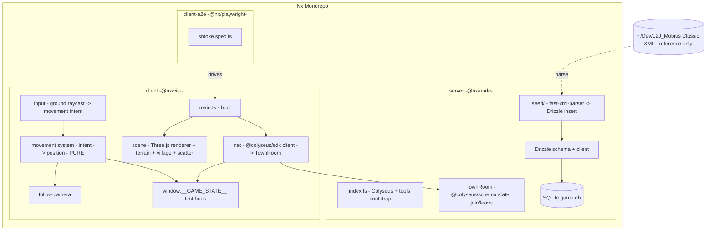

# Phase 1+2 — Foundation & World Design

**Spec**: `.specs/features/phase-1-2-foundation-world/spec.md`
**Status**: Draft

---

## Architecture Overview

An Nx monorepo with two deployable projects (`server`, `client`), one shared
DB/seed layer inside `server`, and an `client-e2e` Playwright project. The
server is the future home of all authority; in this feature it only hosts a stub
`TownRoom`. The client owns rendering and input, and — *for this feature only* —
a client-local movement system that is written as pure logic so it migrates to
the server in Phase 3 unchanged.



### Server-authority migration boundary (flagged)

Phase 2 movement is deliberately client-local. To keep the Phase 3 migration
clean, movement is split into three layers with a hard rule about where each
goes later:

| Layer | This feature (Phase 2) | Phase 3 destination |
| ----- | ---------------------- | ------------------- |
| **Input** (`raycast` → `{targetX, targetZ}` intent) | Client | Stays client; the intent becomes a network message to the room |
| **Movement system** (`step(state, intent, dt) → newState`) — pure, no Three.js, no DOM | Client (called in the render loop) | Lifts verbatim into `TownRoom` tick; client stops calling it locally |
| **Rendering + camera** (apply position to mesh, follow cam) | Client | Stays client; reads authoritative position from room state instead of local state |

**Design rules that make this real:**
- The movement system imports nothing from Three.js, the DOM, or the Colyseus
  SDK — only plain numbers/types. (Enables Phase-3 reuse + cheap unit tests.)
- The client renders from a single `playerState` object. In Phase 2 that object
  is produced locally by the movement system; in Phase 3 it is produced by room
  state sync. The renderer does not care which.
- The `TownRoom` schema already reserves a player position shape so Phase 3 adds
  authority without reshaping the wire format.

---

## Code Reuse Analysis

This is a greenfield repo, so "reuse" is primarily external libraries + the L2J
reference data, plus internal sharing between server and seed.

### Existing Components to Leverage

| Component | Location | How to Use |
| --------- | -------- | ---------- |
| L2J Classic npc XML | `~/Dev/L2J_Mobius/L2J_Mobius_Classic_1.0/dist/game/data/stats/npcs/*.xml` | Parse (reference only) for mob/NPC stats; never import code |
| L2J Classic skills XML | `.../stats/skills/00000-00099.xml` (Power Strike id 3) | Parse for skill definition |
| L2J Classic experience.xml | `.../stats/players/experience.xml` | Parse for XP curve |
| L2J TI spawns | `.../spawns/TalkingIsland/TalkingIslandMonsters.xml` | Placement *reference* for world layout coordinates |
| Drizzle schema | `server/src/db/schema.ts` (new) | Single source of table defs; both seed and runtime import it |

### Integration Points

| System | Integration Method |
| ------ | ------------------ |
| Colyseus client ↔ server | `@colyseus/sdk` `client.joinOrCreate("town")` → `TownRoom` registered via `@colyseus/tools` |
| Seed ↔ DB | `fast-xml-parser` reads XML → mapped objects → Drizzle `insert` into `better-sqlite3` |
| Client scene ↔ test harness | `window.__GAME_STATE__` published by the client; Playwright reads it |
| Nx targets | `nx test|build|lint|e2e` per project; root `npm run dev` orchestrates server+client |

---

## Components

### Nx Workspace (infra)

- **Purpose**: Host two projects + e2e with shared TS config and task caching.
- **Location**: repo root (`nx.json`, `tsconfig.base.json`, `package.json`).
- **Interfaces**: Nx targets `build`, `lint`, `test`, `e2e`; root script
  `dev`.
- **Dependencies**: Nx 23, `@nx/node`, `@nx/vite`, `@nx/playwright`.
- **Reuses**: n/a (greenfield).

### Colyseus Server Bootstrap (server)

- **Purpose**: Start the Colyseus server and register the stub room.
- **Location**: `server/src/index.ts`, `server/src/app.config.ts`.
- **Interfaces**: `@colyseus/tools` `listen(config)`; registers `"town"` →
  `TownRoom`. Dev runner: `tsx`.
- **Dependencies**: `colyseus`, `@colyseus/tools`.
- **Reuses**: n/a.

### TownRoom (server)

- **Purpose**: Stub authoritative room — accepts join/leave, holds schema state.
- **Location**: `server/src/rooms/TownRoom.ts`, `server/src/rooms/schema/*.ts`.
- **Interfaces**:
  - `onJoin(client, options): void` — register a player into state.
  - `onLeave(client, consented): void` — remove player from state.
  - `state: TownState { players: MapSchema<PlayerState> }` where
    `PlayerState { x: number; y: number; z: number }` (position shape reserved
    for Phase 3 authority).
- **Dependencies**: `colyseus`, `@colyseus/schema`.
- **Reuses**: n/a. **Note:** no movement message handling yet (out of scope).

### Drizzle Schema + DB Client (server / db)

- **Purpose**: Define and open the SQLite tables shared by seed and runtime.
- **Location**: `server/src/db/schema.ts`, `server/src/db/client.ts`,
  `server/drizzle.config.ts`.
- **Interfaces**: exported table objects `monsters`, `npcs`, `skills`,
  `experience`; `getDb(path): BetterSQLite3Database`.
- **Dependencies**: `drizzle-orm`, `better-sqlite3`, `drizzle-kit`.
- **Reuses**: n/a.

### L2J XML Parsers (seed)

- **Purpose**: Pure functions turning L2J XML strings into typed records.
- **Location**: `server/src/seed/parsers/{npc,skill,experience}.parser.ts`.
- **Interfaces**:
  - `parseMonsters(xml: string, ids: number[]): MonsterRecord[]`
  - `parseNpcs(xml: string, ids: number[]): NpcRecord[]`
  - `parsePowerStrike(xml: string): SkillRecord`
  - `parseExperience(xml: string): ExperienceRow[]`
  - Each throws a descriptive error when a required field is missing.
- **Dependencies**: `fast-xml-parser`.
- **Reuses**: table types from `db/schema.ts`.

### Seed Runner (seed)

- **Purpose**: Orchestrate parse → insert; idempotent.
- **Location**: `server/src/seed/seed.ts` (run via `nx run server:seed` / tsx).
- **Interfaces**: `runSeed({ dataDir, dbPath }): SeedReport`. Resets seeded
  tables, inserts parsed records, returns counts.
- **Dependencies**: parsers, Drizzle client.
- **Reuses**: parsers + schema.

### Client Boot + Net (client)

- **Purpose**: Boot the app, connect to the room, publish connection state.
- **Location**: `client/src/main.ts`, `client/src/net/room.ts`.
- **Interfaces**: `connect(endpoint): Promise<Room>`; sets
  `window.__GAME_STATE__.connected`.
- **Dependencies**: `@colyseus/sdk`.
- **Reuses**: n/a.

### World Scene (client)

- **Purpose**: Procedural low-poly world rendering.
- **Location**: `client/src/scene/{renderer,terrain,village,scatter}.ts`.
- **Interfaces**:
  - `generateTerrain(seed, opts): TerrainData` — pure: vertices/indices/heights
    for a flat-shaded heightmap; `sampleHeight(x, z): number`.
  - `buildVillage(opts): SceneObjectSpec[]` — ground patch + 5 buildings +
    peace-zone marker positions.
  - `scatterProps(seed, terrain, opts): PropSpec[]` — deterministic trees/rocks.
  - `createRenderer(canvas): { scene, render() }` — assembles meshes (flat
    shading via `flatShading: true` / non-indexed geometry).
- **Dependencies**: `three`.
- **Reuses**: terrain sampler used by both scatter and movement (height lookup).

### Input → Movement Intent (client)

- **Purpose**: Translate ground clicks into a movement target.
- **Location**: `client/src/input/click-to-move.ts`.
- **Interfaces**: `raycastGround(ev, camera, terrainMesh): {x,z} | null`;
  emits `MovementIntent { targetX, targetZ }`.
- **Dependencies**: `three` (Raycaster).
- **Reuses**: terrain mesh.

### Movement System (client now, server later) — PURE

- **Purpose**: Advance player toward target at fixed speed (the migratable core).
- **Location**: `client/src/movement/movement-system.ts` (pure module, no three/DOM).
- **Interfaces**:
  - `step(state: PlayerMoveState, intent: MovementIntent | null, dt: number, speed: number): PlayerMoveState`
  - Stops within epsilon; no-op when at target; ignores `null` intent.
- **Dependencies**: none (plain math).
- **Reuses**: shared `PlayerMoveState`/`MovementIntent` types (candidate to move
  to a shared location in Phase 3).

### Follow Camera (client)

- **Purpose**: L2-style camera tracking the player at a fixed offset.
- **Location**: `client/src/camera/follow-camera.ts`.
- **Interfaces**: `computeCameraPosition(playerPos, offset): Vec3` (pure) +
  `applyTo(camera, playerPos)`.
- **Dependencies**: `three` for application; pure offset math is dependency-free.
- **Reuses**: n/a.

### Test Hook (client)

- **Purpose**: Publish logical state for Playwright (no pixel assertions).
- **Location**: `client/src/test-hook.ts`.
- **Interfaces**: `window.__GAME_STATE__ = { connected: boolean, player: {x,y,z}, ready: boolean }`,
  updated each frame.
- **Dependencies**: none.
- **Reuses**: movement state + net state.

---

## Data Models

Drizzle (SQLite). Field names mirror authentic L2J Classic attributes so values
are traceable to source XML.

### `monsters`

```typescript
interface Monster {
  npcId: number      // L2J npc id (PK), e.g. 20001
  name: string       // "Gremlin"
  level: number      // 1
  type: string       // "Monster"
  race: string       // "FAIRY" | "ANIMAL" | "HUMANOID"
  exp: number        // acquire.exp -> 44
  sp: number         // acquire.sp -> 0
  hp: number         // vitals.hp -> 41.145
  mp: number         // vitals.mp -> 44.247
}
```

### `npcs`

```typescript
interface Npc {
  npcId: number      // PK, e.g. 30004
  name: string       // "Katerina"
  title: string      // "Grocer"
  type: string       // "Merchant" | "Teleporter"
  level: number      // 70
}
```

### `skills`

```typescript
interface Skill {
  skillId: number    // PK -> 3
  name: string       // "Power Strike"
  maxLevel: number   // toLevel -> 9
  operateType: string// "A1"
  targetType: string // "ENEMY"
  castRange: number  // 40
  reuseDelay: number // 3000
  mpConsumeL1: number// level-1 mpConsume -> 9
}
```

> Per-level skill scaling (power/mp per level) is deferred to Phase 5 when the
> skill is actually executed; this feature seeds the definition + level-1 cost.

### `experience`

```typescript
interface ExperienceRow {
  level: number          // PK, 1..91
  xpToNextLevel: number  // "tolevel" attr; L2=68, L3=364, L10=48230
  trainingRate: number   // "trainingRate" attr
}
```

**Relationships**: All four tables are independent reference data for this
feature (no FKs needed yet). Monsters reference skill ids in L2J XML, but we do
not model that join until combat (Phase 4/5).

---

## Error Handling Strategy

| Error Scenario | Handling | User Impact |
| -------------- | -------- | ----------- |
| L2J data dir missing | Seed throws with the expected path | Seed fails fast; clear console message |
| Required XML attr missing/malformed | Parser throws naming the entity id + field | Seed aborts; no garbage rows written |
| Seed re-run on populated DB | Reset seeded tables in a transaction before insert | Idempotent DB; no duplicates |
| Client cannot reach server | `connect()` catch sets `__GAME_STATE__.connected=false` | Page still renders the world; hook present for tests |
| Click misses terrain | `raycastGround` returns `null`; intent unchanged | Player keeps walking to prior target / stays put |
| Movement target reached | `step` no-ops within epsilon | No camera/position jitter |

---

## Risks & Concerns

| Concern | Location (file:line) | Impact | Mitigation |
| ------- | -------------------- | ------ | ---------- |
| Hard dependency on an external absolute path (`~/Dev/L2J_Mobius/...`) for the seed | seed config | Seed breaks on another machine / CI | Make `dataDir` a configurable env/arg with a documented default; commit a tiny XML *fixture* subset under `server/src/seed/__fixtures__/` so seed/data tests never depend on the external tree |
| Movement logic accidentally coupling to Three.js would block Phase-3 server migration | `client/src/movement/*` | Phase 3 rework, violates AD server-authority | Lint/architecture rule: movement system imports only plain types; verified by it being unit-tested with no DOM/three import |
| WebGL canvas not DOM-testable; over-reliance on e2e | `client-e2e/*` | Flaky/expensive tests | Push correctness into pure unit-testable modules (terrain, scatter, movement, camera); e2e asserts only DOM + `__GAME_STATE__` |
| Raw L2 coordinates are huge (precision/float issues in Three.js) | `scene/terrain.ts` | Z-fighting / jitter far from origin | Map L2 reference coords into a local near-origin metric space (logged assumption) |
| `better-sqlite3` is a native module (node-gyp build) on Node 24 | `server` deps | Install/build friction | Node 22+ supported per stack; pin versions from the locked stack; document rebuild if Node changes |
| Seed/data tests sharing one DB file would serialize/flake | `server` seed tests | Slow/flaky gate | Each seed test uses a fresh temp/in-memory SQLite DB → parallel-safe (see Parallelism Assessment) |

---

## Tech Decisions (only non-obvious ones)

| Decision | Choice | Rationale |
| -------- | ------ | --------- |
| Movement system placement in Phase 2 | Client-local **pure** module, explicit Phase-3 server migration boundary | Honors absolute server authority while keeping Phase 2 single-player; pure logic lifts to the room tick unchanged |
| Seed test data source | Committed XML fixture subset + optional run against real L2J tree | Removes external-path/CI fragility while still proving the parser on authentic markup |
| Keltir identity | Bearded Keltir (20481) | The Keltir actually spawned in TI; swappable by id |
| NPCs to seed | Katerina (Grocer 30004) + Roxxy (Gatekeeper 30006) | Canonical TI NPCs; merchant + utility roles requested |
| World coordinate space | Local near-origin metric world; L2 coords are placement reference only | Avoids float precision issues; geodata is out of scope |
| Flat shading approach | `flatShading: true` on materials over non-indexed geometry | Cheapest authentic low-poly look, no assets |

> **Project-level decisions:** Cross-cutting choices from this feature are
> recorded in `.specs/STATE.md` `## Decisions` as AD-001..AD-010 (locked
> architectural decisions handed down for this feature) and AD-011..AD-013
> (conventions established here). Feature-local choices stay in the table above.
