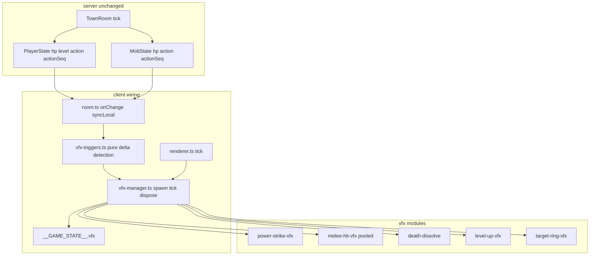

# Phase 13 — Combat & World VFX Design

**Spec**: `.specs/features/phase-13-combat-vfx/spec.md`
**Status**: Draft

---

## Architecture Overview

Phase 13 is a **client-only render layer**. The server continues to own combat
outcomes (AD-001); existing `action`/`actionSeq` (AD-015) and replicated HP/level
fields are the only triggers. Work splits across:

1. **VFX modules** — procedural one-shot / pooled effects under `client/src/scene/vfx/`.
2. **VFX manager** — tracks previous HP/level/action per entity, spawns effects,
   ticks active instances, publishes hook counters.
3. **Wiring** — `room.ts` forwards state deltas; `renderer.ts` ticks manager + target
   ring follow; mob/player avatars accept dissolve controllers.
4. **Visual gate** — `vfx-lab.html` + `scripts/shoot-vfx.mjs`.



---

## Approach Exploration

| Approach | Trigger wiring | Pros | Cons | |
| -------- | -------------- | ---- | ---- | - |
| **A — Central VFX manager + pure triggers (RECOMMENDED)** | `vfx-triggers.ts` compares snapshots; manager spawns | Testable deltas; one tick loop; matches `create-vfx.md` | New module surface | ✅ |
| B — Scatter triggers inside `room.ts` / `mobs.ts` | Ad-hoc calls at each site | Fewer files | Hard to test; duplicate dedupe logic | |
| C — Server `vfxEvent` broadcast | New schema messages | Explicit events | Violates "no server change" scope; AD-015 already sufficient | |

**Recommendation: Approach A** — cheapest test layer, no server diff.

---

## Code Reuse Analysis

### Existing Components to Leverage

| Component | Location | How to Use |
| --------- | -------- | ---------- |
| Placeholder flash | `client/src/scene/skill-flash.ts` | Replace with `power-strike-vfx.ts`; migrate tests |
| Cast duration | `libs/game-core/src/animation/entity-action.ts` | `ACTION_DURATION_MS[Cast]` = 800 ms |
| Die duration / latch | `client/src/scene/mobs.ts` `removeMob` | Hook dissolve at die latch; keep 1200 ms removal |
| Player die | `client/src/scene/player-avatar.ts` | Dissolve on `die` clip from action signal |
| Target id | `client/src/test-hook.ts` `targetMobId` | Ring visibility + Power Strike endpoint |
| Cooldown sync | `client/src/net/room.ts` `syncLocal` | Level-up + actionSeq triggers; remove cooldown-only flash |
| Mob HP sync | `client/src/net/room.ts` `syncMobFromState` | Forward HP to manager |
| Visual gate pattern | `client/character-lab.ts`, `scripts/shoot-character.mjs` | Clone for `vfx-lab` / `shoot-vfx.mjs` |
| Test hook | `client/src/test-hook.ts` | Add `vfx` counters object |

### Integration Points

| System | Integration Method |
| ------ | ---------------- |
| Colyseus room state | `onChange` on local player + each mob → delta structs |
| Renderer loop | `tick(dt)` calls `vfxManager.tick` after mob visuals |
| Playwright e2e | Poll `__GAME_STATE__.vfx.meleeHitCount` after `__attack__` |

---

## Components

### `vfx-lifecycle.ts`

- **Purpose**: Shared tags, dispose helper, object counting, optional pool base.
- **Location**: `client/src/scene/vfx/vfx-lifecycle.ts`
- **Interfaces**:
  - `countTaggedVfx(scene, tag): number`
  - `disposeObject3D(root: THREE.Object3D): void`
  - `createPool<T>(size, factory): Pool<T>`
- **Dependencies**: three
- **Reuses**: Pattern from `skill-flash.ts` `FLASH_TAG` counting

### `vfx-triggers.ts`

- **Purpose**: Pure functions: given prev/current snapshots, return spawn intents.
- **Location**: `client/src/scene/vfx/vfx-triggers.ts`
- **Interfaces**:
  - `detectHpHit(prevHp, nextHp): boolean`
  - `detectLevelUp(prevLevel, nextLevel): boolean`
  - `detectActionEdge(prev, next, clip): boolean`
  - `buildPowerStrikeIntent(playerPos, mobPos, targetMobId): SpawnIntent | null`
- **Dependencies**: `game-core` `AnimationClip`
- **Reuses**: `EntityAction` mapping from `player-avatar.ts`

### `vfx-manager.ts`

- **Purpose**: Owns prev-state maps, calls triggers, spawns modules, ticks active FX.
- **Location**: `client/src/scene/vfx/vfx-manager.ts`
- **Interfaces**:
  - `createVfxManager(scene): VfxManager`
  - `syncPlayerVfx(state, pos)`, `syncMobVfx(id, hp, pos, action, actionSeq)`
  - `setTargetMobId(id | null)`, `tick(dt, nowMs)`, `dispose()`
  - `getHookSnapshot(): GameStateVfx`
- **Dependencies**: all vfx modules, `vfx-triggers`, test-hook
- **Reuses**: `getGameState()` for target id

### `power-strike-vfx.ts`

- **Purpose**: Arc slash + impact burst between attacker and target.
- **Location**: `client/src/scene/vfx/power-strike-vfx.ts`
- **Interfaces**: `spawnPowerStrikeVfx(scene, from, to, nowMs): void`
- **Duration**: 800 ms
- **Reuses**: Geometry layout from `createSkillFlash` (midpoint, yaw)

### `melee-hit-vfx.ts`

- **Purpose**: Pooled orange/white particle burst at victim torso.
- **Location**: `client/src/scene/vfx/melee-hit-vfx.ts`
- **Interfaces**: `spawnMeleeHitVfx(scene, pos, nowMs): void`
- **Duration**: 250 ms; pool size 8

### `death-dissolve-vfx.ts`

- **Purpose**: Opacity fade (+ slight sink) on a `THREE.Object3D` root.
- **Location**: `client/src/scene/vfx/death-dissolve-vfx.ts`
- **Interfaces**:
  - `attachDeathDissolve(root, nowMs): DissolveHandle`
  - `tickDissolve(handle, nowMs): boolean` (done?)
- **Duration**: 1200 ms (matches `ACTION_DURATION_MS[Die]`)

### `level-up-vfx.ts`

- **Purpose**: Upward gold particle burst at player feet.
- **Location**: `client/src/scene/vfx/level-up-vfx.ts`
- **Interfaces**: `spawnLevelUpVfx(scene, pos, nowMs): void`
- **Duration**: 1000 ms

### `target-ring-vfx.ts`

- **Purpose**: Persistent ground ring following targeted mob.
- **Location**: `client/src/scene/vfx/target-ring-vfx.ts`
- **Interfaces**:
  - `createTargetRing(scene): TargetRing`
  - `ring.showAt(pos)`, `ring.hide()`, `ring.follow(pos)`

### `vfx-lab.html` + `vfx-lab.ts`

- **Purpose**: Isolated effect preview for visual gate (query: `effect`, `t`).
- **Location**: `client/vfx-lab.html`, `client/src/vfx-lab.ts`
- **Reuses**: Camera/ground setup from `character-lab.ts`

### Optional: `soulshot-glint-vfx.ts` (P3)

- **Purpose**: Brief emissive pulse on weapon prop bone.
- **Trigger**: `items[1835] > 0` + attack/cast seq bump
- **Location**: `client/src/scene/vfx/soulshot-glint-vfx.ts`

### Optional: `loot-puff-vfx.ts` (P3)

- **Purpose**: Ground sparkle at mob death position.
- **Trigger**: mob `action === Die` seq bump
- **Duration**: 800 ms

---

## Data Models

```typescript
/** Published on __GAME_STATE__ (AD-009). */
export interface GameStateVfx {
  powerStrikeCount: number;
  meleeHitCount: number;
  levelUpCount: number;
  targetRingVisible: boolean;
  activeEffectCount: number;
}

export interface VfxMobSnapshot {
  id: string;
  hp: number;
  x: number;
  y: number;
  z: number;
  action: number;
  actionSeq: number;
}

export interface SpawnIntent {
  kind: 'powerStrike' | 'meleeHit' | 'levelUp' | 'lootPuff';
  position: { x: number; y: number; z: number };
  to?: { x: number; y: number; z: number };
}
```

**Relationships**: Manager holds `Map<mobId, VfxMobSnapshot>` and last player snapshot.

---

## Error Handling Strategy

| Error Scenario | Handling | User Impact |
| -------------- | -------- | ----------- |
| Power Strike with no `targetMobId` | Skip spawn | No orphan arc |
| Mob removed while ring visible | `hide()` ring | Ring disappears |
| Avatar meshes lack `material` | Dissolve walks `traverse` skipping unsupported | Capsule still fades |
| Pool exhausted | Reuse oldest slot | No crash; possible visual pop |

---

## Risks & Concerns

| Concern | Location | Impact | Mitigation |
| ------- | -------- | ------ | ---------- |
| Cooldown-only flash trigger | `room.ts:263-265` | Double or wrong-time VFX | Remove; use Cast `actionSeq` (CVFX-09) |
| HP hit on same tick as death | `handleMobKill` | Hit + dissolve overlap | Allowed by spec; short hit duration |
| `skill-flash.spec.ts` import path | `client/src/scene/` | Broken tests on delete | Migrate to `power-strike-vfx.spec.ts` in T4 |
| Frequent melee allocations | Combat loop | GPU leak | Pool in `melee-hit-vfx` (T5) |
| No ground `DropState` | Server | Optional loot puff is cosmetic only | Document; no pickup coupling |

---

## Tech Decisions

| Decision | Choice | Rationale |
| -------- | ------ | --------- |
| Server changes | **None** | AD-001; HP/level/action already replicated |
| Power Strike trigger | `cast` + `actionSeq` | AD-015; replaces cooldown proxy |
| Melee hit trigger | HP decrease | Authoritative per `create-vfx.md` |
| Target ring | Client-local from `targetMobId` | Allowed cosmetic selection |
| Effect storage | `client/src/scene/vfx/` | Project recipe standard |
| Visual style | Procedural primitives | No new binary assets required |
| Visual gate | New `vfx-lab` + `shoot-vfx.mjs` | Effects are not character poses |
| P3 optional tasks | Last tasks; phase PASS without them | ROADMAP marks optional |

> **Project-level decisions:** All choices are feature-local; no new AD entry required.
