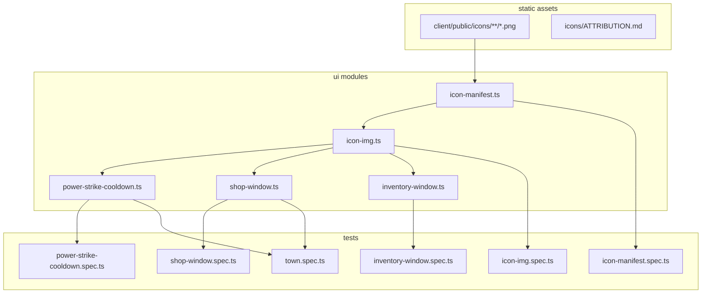

# Phase 14 — UI / 2D Iconography Design

**Spec**: `.specs/features/phase-14-ui-icons/spec.md`
**Status**: Draft

---

## Architecture Overview

Phase 14 is a **client-only DOM presentation layer**. The server continues to own
item counts, adena, skills, and shop validation (AD-001). Work splits across:

1. **Static PNG assets** — vendored under `client/public/icons/`.
2. **Icon manifest** — pure `id → path` maps + fallback constant.
3. **Icon DOM helper** — creates sized `` elements with test `data-*` attrs.
4. **HUD wiring** — hotbar, shop, inventory render icons from the helper.
5. **DOM tests** — unit specs per module + one e2e shop assertion.



No `__GAME_STATE__` extension is required — icons are DOM-testable directly (AD-009),
unlike WebGL entities.

---

## Approach Exploration

| Approach | Lookup | Pros | Cons | |
| -------- | ------ | ---- | ---- | - |
| **A — Manifest + shared `createIconImg` (RECOMMENDED)** | `icon-manifest.ts` + helper | Matches `create-icon.md`; one fallback; easy unit tests | Three small files | ✅ |
| B — Inline `` per component | Hardcoded paths in each HUD file | Fewer files | Duplicated fallback; drift risk | |
| C — CSS `background-image` sprites | Single sprite sheet | One HTTP request | Harder DOM asserts; sprite coords brittle | |

**Recommendation: Approach A** — aligns with creature-manifest precedent and
`create-icon.md`.

---

## Code Reuse Analysis

### Existing Components to Leverage

| Component | Location | How to Use |
| --------- | -------- | ---------- |
| Power Strike hotbar shell | `client/src/hud/power-strike-cooldown.ts` | Insert `` before fill overlay; keep `data-remaining-ms` + fill ratio |
| Shop panel | `client/src/ui/shop-window.ts` | Prepend icon to each `[data-shop-item-id]` row + adena row |
| Inventory panel | `client/src/ui/inventory-window.ts` | Prepend icon to each row; expand `ITEM_DISPLAY_NAMES` |
| Shop/inventory tests | `client/src/ui/*.spec.ts` | Extend with `img[src]` / `data-icon-*` asserts |
| E2E shop flow | `client-e2e/src/town.spec.ts` | Add DOM icon assert after `shopOpen` |
| Seeded item names | `server/src/seed/__fixtures__/items_subset.xml`, `monsters.xml` drops | Ground display names + P3 id list |
| Skill id anchor | `client/src/combat-input.ts` (`skillId: 3`) | Manifest key for Power Strike |

### Integration Points

| System | Integration Method |
| ------ | ------------------ |
| Vite static assets | Files under `client/public/icons/` served at `/icons/...` |
| Game boot | `main.ts` already mounts HUD — no new mount calls |
| Room sync | Unchanged — `renderShopWindow` / `renderInventoryWindow` called from `room.ts` as today |
| Server / DB | No schema or API changes |

---

## Components

### Icon manifest

- **Purpose**: Map `skillId` / `itemId` to public icon URLs with one fallback.
- **Location**: `client/src/ui/icon-manifest.ts`
- **Interfaces**:
  - `getSkillIconPath(skillId: number): string`
  - `getItemIconPath(itemId: number): string`
  - `FALLBACK_ICON: '/icons/placeholder.png'`
  - `SKILL_ICONS: Record<number, string>` (exported for tests)
  - `ITEM_ICONS: Record<number, string>` (exported for tests)
- **Dependencies**: None (pure data)
- **Reuses**: Seeded ids from shop catalog + L2J fixture names

**P1 manifest entries (canonical paths):**

| Id | Kind | Path | L2J / game name |
| -- | ---- | ---- | --------------- |
| 3 | skill | `/icons/skills/power-strike.png` | Power Strike |
| 57 | item | `/icons/items/adena.png` | Adena |
| 17 | item | `/icons/items/wooden-arrow.png` | Wooden Arrow |
| 1060 | item | `/icons/items/healing-potion.png` | Healing Potion |
| 1835 | item | `/icons/items/soulshot.png` | Soulshot (No-grade) |
| 2369 | item | `/icons/items/squires-sword.png` | Squire's Sword |

### Icon DOM helper

- **Purpose**: Create consistent `` elements with manifest lookup, sizing, and test hooks.
- **Location**: `client/src/ui/icon-img.ts`
- **Interfaces**:
  - `createIconImg(options: { kind: 'skill' \| 'item'; id: number; alt: string; sizePx: number }): HTMLImageElement`
  - `isFallbackIconPath(src: string): boolean` (optional test helper)
- **Dependencies**: `icon-manifest.ts`
- **Reuses**: DOM `document.createElement('img')` pattern from existing UI modules

**Dataset contract (for tests):**

| Attribute | When |
| --------- | ---- |
| `data-icon-skill-id` | `kind === 'skill'` |
| `data-icon-item-id` | `kind === 'item'` |
| `data-icon-fallback="true"` | `src === FALLBACK_ICON` |

### Power Strike hotbar (modify)

- **Purpose**: Show skill icon under cooldown overlay.
- **Location**: `client/src/hud/power-strike-cooldown.ts`
- **Changes**: On first `mountPowerStrikeCooldown`, append `createIconImg({ kind: 'skill', id: 3, alt: 'Power Strike', sizePx: 48 })` with `position:absolute; inset:0; object-fit:contain; z-index:0`; fill stays `z-index:1`.
- **Dependencies**: `icon-img.ts`
- **Reuses**: Existing cooldown math (`POWER_STRIKE_REUSE_MS`, `data-remaining-ms`)

### Shop window (modify)

- **Purpose**: Item + adena icons in catalog rows.
- **Location**: `client/src/ui/shop-window.ts`
- **Changes**: Before label in each row, `row.prepend(createIconImg(...))`; adena row gets inline 24px Adena icon.
- **Dependencies**: `icon-img.ts`
- **Reuses**: `KATERINA_SHOP_ITEMS`, existing buy/sell handlers

### Inventory window (modify)

- **Purpose**: Stack icons beside counts and equipped label context.
- **Location**: `client/src/ui/inventory-window.ts`
- **Changes**: Prepend 32px icon per row; expand `ITEM_DISPLAY_NAMES` for shop/loot ids.
- **Dependencies**: `icon-img.ts`
- **Reuses**: `WEAPON_ITEM_IDS`, equip flow

---

## Data Models (if applicable)

```typescript
// icon-manifest.ts — illustrative
export const FALLBACK_ICON = '/icons/placeholder.png';

export const SKILL_ICONS: Record<number, string> = {
  3: '/icons/skills/power-strike.png',
};

export const ITEM_ICONS: Record<number, string> = {
  57: '/icons/items/adena.png',
  17: '/icons/items/wooden-arrow.png',
  1060: '/icons/items/healing-potion.png',
  1835: '/icons/items/soulshot.png',
  2369: '/icons/items/squires-sword.png',
  // P3: loot ids appended in T8
};
```

No server models change. Display names for alt text are client-local maps aligned with
L2J fixture names.

---

## Error Handling Strategy

| Error Scenario | Handling | User Impact |
| -------------- | -------- | ----------- |
| Unmapped `itemId` / `skillId` | `FALLBACK_ICON` + `data-icon-fallback` | Generic placeholder, readable label |
| Missing PNG on disk (dev mistake) | Browser broken-image icon | Prevented by T1 vendoring all manifest paths before wiring |
| `createIconImg` invalid size | Clamp to min **16** px | Small but visible icon |
| Re-mount hotbar | Idempotent — skip second icon insert | No duplicate imgs |

---

## Risks & Concerns

| Concern | Location | Impact | Mitigation |
| ------- | -------- | ------ | ---------- |
| License hygiene at launch | `client/public/icons/` | AD-004 blocker if proprietary art ships | `ATTRIBUTION.md` + pre-live placeholder tracking (`game-designer` rule 2) |
| Shop re-render drops listeners | `shop-window.ts:80` innerHTML rebuild | Buy buttons already re-created each render — unchanged pattern | Regression tests ICON-16 |
| Inventory name map incomplete | `inventory-window.ts:6` | Wrong alt text for loot | Expand map in T6; fallback alt uses `itemDisplayName` |
| `create-icon.md` example uses `skillId: 0` | Skill doc typo | Wrong manifest key if copied blindly | Spec locks **skillId 3** (ICON-01) |

---

## Tech Decisions (only non-obvious ones)

| Decision | Choice | Rationale |
| -------- | ------ | ----------- |
| No `__GAME_STATE__.icons` hook | DOM queries only | AD-009: HUD is DOM-testable; hook adds noise |
| No sprite atlas | Individual PNGs | Simpler authoring; matches `create-icon.md` |
| Adena icon in shop only (not fake inventory stack) | Shop adena row decoration | `adena` is a player scalar, not `itemCounts[57]` today |
| P3 loot icons optional task | T8 after P1 green | ROADMAP lower priority |
| Visual icon sheet | Optional T9, not Verifier-blocking | Unlike AD-017 3D gate; DOM tests are primary proof |

> **Project-level decisions:** No new AD required — pattern is feature-local and documented
> in `create-icon.md`. If a second HUD surface needs icons later, reuse this manifest.

---

## Asset Plan

**Directory layout:**

```
client/public/icons/
  ATTRIBUTION.md
  placeholder.png
  skills/
    power-strike.png
  items/
    adena.png
    wooden-arrow.png
    healing-potion.png
    soulshot.png
    squires-sword.png
    # P3: magic-ring.png, thread.png, ...
```

**Style guidance:** Flat or lightly shaded 2D icons, saturated reads on dark HUD
backgrounds (`rgba(16,14,24)` inventory, `rgba(20,16,10)` shop). Consistent stroke
weight across the set. Pre-live placeholders may be simple geometric glyphs if CC0
sourcing is slow — track in `ATTRIBUTION.md`.

**L2J reference (names only, AD-003/AD-004):** Item ids and names from
`items_subset.xml` + mob `dropLists` in `server/src/seed/__fixtures__/monsters.xml`.
Never rip L2 `.utx` textures.
