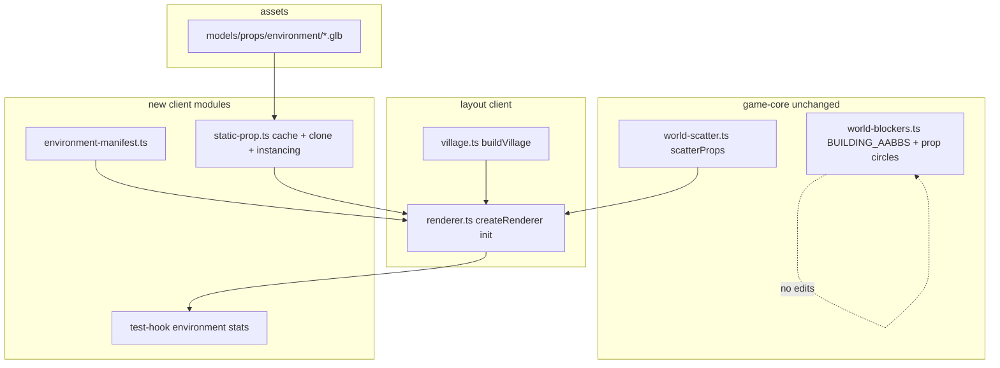

# Phase 15 — Environment Art Upgrade Design

**Spec**: `.specs/features/phase-15-environment-art/spec.md`
**Status**: Draft

---

## Architecture Overview

Phase 15 is a **client-only static mesh layer**. No server, schema, or `game-core`
walkability changes (AD-001, Phase 9). The existing **layout producers** stay intact:

- `buildVillage()` → `SceneObjectSpec[]` (`client/src/scene/village.ts`)
- `scatterProps()` → `PropSpec[]` (`libs/game-core/src/world-scatter.ts`, re-exported by `client/src/scene/scatter.ts`)

Only the **mesh builders** in `renderer.ts` (`addBox`, `addTree`, `addRock`) are
replaced by a static GLB pipeline. Collision remains `BUILDING_AABBS` + `getPropBlockers()`
in `libs/game-core/src/world-blockers.ts` — visual scale tuning must not imply blocker edits.



---

## Approach Exploration

| Approach | Static mesh strategy | Pros | Cons | |
| -------- | -------------------- | ---- | ---- | - |
| **A — `static-prop.ts` + manifest (RECOMMENDED)** | Dedicated cache/clone/instancing; `environment-manifest.ts` | Clean separation from `AnimationMixer`; matches `create-prop.md` | New module surface | ✅ |
| B — Reuse `loadGltfTemplate` from `mesh-character.ts` | Same cache as rigged assets | Less code | Couples static props to skeleton loader; confusing API | |
| C — Procedural primitives with textures | No GLBs | Smaller payload | Violates ROADMAP + AD-017 direction; still looks placeholder | |

**Scatter instantiation sub-choice:**

| Sub-approach | Pros | Cons | Choice |
| ------------ | ---- | ---- | ------ |
| `InstancedMesh` per kind (tree/rock) | Few draw calls for 80 props | Slightly more setup | **Default (ENV-22)** |
| `Object3D.clone()` per prop | Simpler | 80 nodes | Acceptable fallback if instancing blocked |

**Recommendation: Approach A** with `InstancedMesh` for scatter when implementation is straightforward.

---

## Code Reuse Analysis

### Existing Components to Leverage

| Component | Location | How to Use |
| --------- | -------- | ---------- |
| Village layout | `client/src/scene/village.ts` | Keep `buildVillage` + `BUILDING_LAYOUT`; only swap mesh factory |
| Scatter data | `libs/game-core/src/world-scatter.ts` | Same `scatterProps` call in `renderer.ts` (seed 42, count 80) |
| Building blockers | `libs/game-core/src/world-blockers.ts` | **Do not edit** — regression tests only |
| GLTF load pattern | `client/src/scene/creature/mesh-character.ts` | Mirror URL-keyed `Map<string, Promise<>>` cache semantics in `static-prop.ts` |
| Creature manifest pattern | `client/src/scene/creature/creature-manifest.ts` | Parallel `environment-manifest.ts` for static entries |
| Test hook | `client/src/test-hook.ts` | Add `environment` object; set from renderer after init |
| Visual gate scripts | `scripts/shoot-vfx.mjs`, `scripts/shoot-character.mjs` | Clone pattern for `shoot-environment.mjs` |
| Primitive fallbacks | `renderer.ts` `addBox`/`addTree`/`addRock` | Keep as private fallbacks on load failure |
| Game-designer recipe | `.cursor/skills/game-designer/references/create-prop.md` | Asset sourcing + anti-patterns |

### Integration Points

| System | Integration Method |
| ------ | ------------------ |
| `createRenderer` | Async init: `await loadEnvironmentTemplates()` then add meshes; set `environment.loaded` |
| Playwright e2e | Poll `__GAME_STATE__.environment` after `ready` (AD-009) |
| Nx build | GLBs under `client/public/` copied by Vite unchanged |
| Walkability | Zero integration — blockers precomputed from layout/scatter math |

---

## Components

### `static-prop.ts`

- **Purpose**: Load, cache, clone, and optionally instance static GLB scenery.
- **Location**: `client/src/scene/static-prop.ts`
- **Interfaces**:
  - `loadGltfStaticTemplate(url, loader?): Promise<StaticPropTemplate>`
  - `cloneStaticProp(template, opts?: { scale?, yOffset?, rotationY? }): THREE.Object3D`
  - `createInstancedScatter(template, placements: ScatterPlacement[]): THREE.InstancedMesh`
  - `clearGltfStaticTemplateCache(): void`
- **Dependencies**: `three`, `GLTFLoader`
- **Reuses**: Cache idiom from `mesh-character.ts` (no mixer, no `SkeletonUtils`)

### `environment-manifest.ts`

- **Purpose**: Data-driven paths and tuning for buildings 0–4, tree, rock, peace marker.
- **Location**: `client/src/scene/environment-manifest.ts`
- **Interfaces**:
  - `getBuildingPropEntry(index: 0|1|2|3|4): BuildingPropEntry`
  - `getScatterPropEntry(kind: 'tree' | 'rock'): ScatterPropEntry`
  - `getPeaceZoneMarkerEntry(): PeaceZonePropEntry`
  - `listEnvironmentModelPaths(): string[]` — for existence tests
- **Dependencies**: None (pure data)
- **Reuses**: Manifest pattern from `creature-manifest.ts` / `npc-manifest.ts`

### `environment-renderer.ts` (optional thin module)

- **Purpose**: Encapsulate `placeBuildings`, `placeScatter`, `placePeaceMarker` extracted from `renderer.ts` if file grows; otherwise inline in `renderer.ts`.
- **Location**: `client/src/scene/environment-renderer.ts` (create only if `renderer.ts` diff exceeds ~80 lines)
- **Interfaces**:
  - `buildEnvironmentMeshes(deps): Promise<EnvironmentSceneResult>`
- **Dependencies**: `static-prop.ts`, `environment-manifest.ts`, `village`, `scatter`
- **Reuses**: Existing `SceneObjectSpec` / `PropSpec` types

### `environment-lab.html` + `shoot-environment.mjs`

- **Purpose**: Visual gate — elevated camera town overview for human review (ENV-19/20).
- **Location**: `client/environment-lab.html`, `scripts/shoot-environment.mjs`
- **Interfaces**:
  - `window.__SHOT_READY__ = true` when scene posed
  - Env: `LAB_BASE`, `LAB_OUT`, optional `LAB_CAMERA=overview`
- **Dependencies**: Prebuilt client preview (`nx run client:preview`, AD-014)
- **Reuses**: `shoot-vfx.mjs` Playwright loop

### Test hook extension

- **Purpose**: Publish logical environment stats for unit/e2e (ENV-16–18).
- **Location**: `client/src/test-hook.ts`
- **Interfaces**:

```typescript
interface EnvironmentCategoryState {
  count: number;
  renderKind: 'mesh' | 'primitive';
}

interface GameStateEnvironment {
  buildings: EnvironmentCategoryState;
  scatter: EnvironmentCategoryState;
  peaceZone: EnvironmentCategoryState;
  loaded: boolean;
}
```

- **Dependencies**: Renderer calls `setEnvironment(...)` after init completes
- **Reuses**: `GameState` pattern from mobs/npcs

---

## Data Models

### `BuildingPropEntry`

```typescript
interface BuildingPropEntry {
  model: string;       // e.g. '/models/props/environment/Building_0.glb'
  scale: number;       // uniform scale to fit BUILDING_LAYOUT w×d×h
  yOffset: number;     // extra Y after centre placement
  yRotation: number;   // radians
}
```

### `ScatterPropEntry`

```typescript
interface ScatterPropEntry {
  model: string;
  scaleMultiplier: number; // multiplied by PropSpec.scale
}
```

### `PeaceZonePropEntry`

```typescript
interface PeaceZonePropEntry {
  model: string;
  scale: number;
  yOffset: number;
}
```

**Relationships**: Manifest indices align with `BUILDING_LAYOUT` array order in
`world-blockers.ts` / `village.ts` (same five rows).

---

## Asset Plan

| Slot | Suggested source | Target file | Notes |
| ---- | ---------------- | ----------- | ----- |
| Buildings 0–4 | KayKit Medieval Builder / Village pack | `Building_0.glb` … `Building_4.glb` | May rotate/reuse variants if pack < 5 meshes |
| Tree | Quaternius nature or KayKit | `Tree.glb` | Single mesh; instanced in field |
| Rock | Quaternius nature or KayKit | `Rock.glb` | ~27 rocks at seed 42 (every 3rd scatter) |
| Peace marker | KayKit banner/pillar or simple custom low-poly | `PeaceMarker.glb` | Subtle — not neon debug green |

Vendor `LICENSE.txt` beside GLBs. Pre-live placeholders tracked per game-designer golden rule 2.

---

## Error Handling Strategy

| Error Scenario | Handling | User Impact |
| -------------- | -------- | ----------- |
| GLB 404 / parse error | Log once; use primitive fallback for that category | Town still renders; hook shows `renderKind: 'primitive'` |
| Manifest index out of range | Throw in dev; manifest is fixed 0–4 | Build/test failure — fail fast |
| Instancing unsupported (old GPU) | Fall back to clones | Slightly higher draw calls; acceptable |
| Partial template load (buildings ok, tree fails) | Per-category fallback | Mixed mesh + primitive scene |

---

## Risks & Concerns

| Concern | Location | Impact | Mitigation |
| ------- | -------- | ------ | ---------- |
| Accidental layout edit while tuning art | `village.ts`, `world-scatter.ts` | Desyncs blockers + tests | Spec forbids; `village.spec.ts` / `scatter.spec.ts` gate |
| Mesh bounds exceed AABB footprint | `renderer.ts` placement | Visual overlap; pathing unchanged but looks wrong | Manifest scale tuning + visual gate ENV-20 |
| `renderer.ts` already large (~615 lines) | `client/src/scene/renderer.ts` | Hard to review | Extract `environment-renderer.ts` if diff > ~80 lines |
| Async GLB init vs sync `createRenderer` | `renderer.ts` | `ready` before props appear | Await templates before `setReady(true)`; hook `environment.loaded` |
| Prop blockers use scatter x,z only | `world-blockers.ts` | Tree GLB wider than circle radius looks walk-through | Radii unchanged per create-prop collision note; acceptable MVP |

---

## Tech Decisions

| Decision | Choice | Rationale |
| -------- | ------ | --------- |
| Static vs rigged pipeline | Separate `static-prop.ts` | No mixer; clear `create-prop.md` contract |
| Layout data | Frozen | `create-prop.md` + Phase 9 blocker alignment |
| Scatter draw strategy | `InstancedMesh` per kind (P3) | 80 props; optional clone fallback |
| Ground patch | Keep primitive box | Out of ROADMAP scope |
| Server / game-core diff | None | Render-only phase |
| Visual gate artifact | `town-overview.png` | Props judged as a set |

> **Project-level decisions:** No new AD required — static GLB props extend AD-017
> (license-clean meshes) to environment art; AD-005 remains superseded.

---

## Testing Strategy (summary for Tasks)

| Layer | What to test |
| ----- | ------------ |
| Unit (`static-prop`, manifest, environment placement) | ENV-01–14, ENV-22; mock `GLTFLoader` |
| Unit (`village`, `scatter`) | Regression — unchanged outputs |
| Unit (`game-core` blockers) | Regression — no edits |
| E2e | ENV-16–18 after town load |
| Visual | ENV-19–21 via `shoot-environment.mjs` |
| Server | Regression only |

WebGL meshes are **not** pixel-asserted (AD-009).
