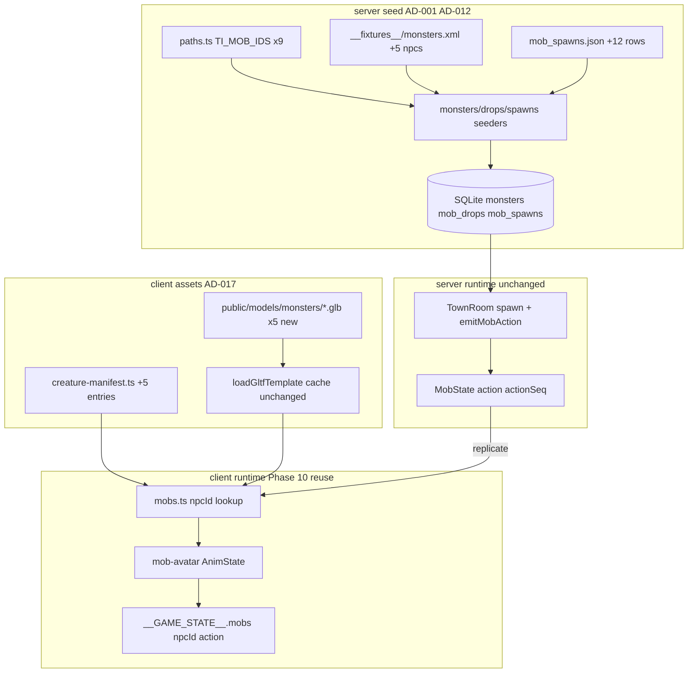

# Phase 16 — Talking Island Mob Expansion (+5) Design

**Spec**: `.specs/features/phase-16-ti-mob-expansion/spec.md`
**Status**: Draft

---

## Architecture Overview

Phase 16 is a **data + asset extension** of Phase 10. No new renderer architecture,
no `game-core` animation changes, no `MobState` schema changes (action signal already
exists). Work splits into three tracks that merge at the gate:

1. **Server seed** — extend `TI_MOB_IDS`, fixture XML, `mob_spawns.json`, seed tests.
2. **Client manifest + assets** — five new GLBs, five `CreatureEntry` rows, LICENSE.
3. **Verification** — spawn placement guards, room-integration on a new high-HP mob,
   e2e field-walk + kill on a new type.



**Constraints honored:** AD-001 (server authority), AD-012 (fixture seed tests), AD-014
(deterministic room/e2e harness), AD-017 (rigged GLB + visual gate), AD-018 (walkable
spawns outside peace zone).

---

## Approach Exploration

| Approach | Strategy | Pros | Cons | |
| -------- | -------- | ---- | ---- | - |
| **A — Extend Phase 10 pipeline (RECOMMENDED)** | Seed + manifest + GLB per mob; reuse clone backend | Proven; minimal risk; matches ROADMAP | Five asset ingest cycles | ✅ |
| B — Procedural code-built mobs | `gen-glb-assets.py` for all five | No external pack dependency | Lower fidelity; more tuning | Fallback per mob only |
| C — DB-driven manifest | Store model path in SQLite | Single source of truth | Visual config on server; out of MVP pattern | |

**Recommendation: Approach A** with **B as fallback** when a pack lacks a silhouette
(Elder Wolf distinct from Wolf).

---

## Spawn Ring Layout

Hand-mapped `(x,z)` in local metric space (AD-013). Progression: walk **east/south**
from village (origin) into harder rings. Peace zone rectangle: **x,z ∈ [−20, 20]**.

### Ring map (existing + new)

```
                    N (-z)
                      │
    Ring 0 (peace)    │   x,z ∈ [-20,20] — no mob spawns
                      │
    Ring 1 (lv1)      │   Gremlin (existing), Elpy (NEW)
                      │
    Ring 2 (lv1–3)    │   Bearded Keltir (existing), Elder Keltir (NEW)
                      │
    Ring 3 (lv4–5)    │   Wolf (existing), Giant Toad (NEW)
                      │
    Ring 4 (lv5)      │   Elder Wolf (NEW)
                      │
    Ring 5 (lv5–6)    │   Goblin (existing), Orc (NEW)
                      ▼
                    S (+z field / east-south band)
```

### Proposed spawn coordinates (`mob_spawns.json` additions)

| npcId | Name | Ring | x | z | Notes |
| ----- | ---- | ---- | --- | --- | ----- |
| 20432 | Elpy | 1 | 22 | −16 | Just east of peace edge |
| 20432 | Elpy | 1 | 24 | −22 | East-south starter |
| 20432 | Elpy | 1 | −22 | −18 | West-south (outside peace) |
| 20544 | Elder Keltir | 2 | 28 | −28 | Near Keltir cluster |
| 20544 | Elder Keltir | 2 | 42 | −26 | |
| 20544 | Elder Keltir | 2 | 33 | −32 | |
| 20121 | Giant Toad | 3 | 52 | −28 | South field / "swamp-adjacent" |
| 20121 | Giant Toad | 3 | 48 | −32 | |
| 20442 | Elder Wolf | 4 | 64 | −48 | Between wolf and goblin bands |
| 20442 | Elder Wolf | 4 | 68 | −44 | |
| 20130 | Orc | 5 | 86 | −54 | Outer field humanoid |
| 20130 | Orc | 5 | 90 | −58 | |

**Existing 11 rows unchanged** unless walkability audit finds a violation (then nudge
only offending coordinates).

**Validation:** New unit test `server/src/seed/spawn-placement.spec.ts` (or extend
`spawns.seeder.spec.ts`) imports spawn fixture + `isInPeaceZone` + `isWalkable` from
`@nj/game-core` and asserts TIMOB-11/12/30.

---

## GLB Sourcing Strategy (per `create-monster.md`)

Fidelity-first; license relaxed pre-live (AD-004). **Never** byte-copy an existing
character/mob GLB onto a new name (`visual-gate.mjs` dedup).

| npcId | Output GLB | Primary source | Clip map family | Scale target (bbox h) |
| ----- | ---------- | -------------- | --------------- | --------------------- |
| 20432 | `Elpy.glb` | Quaternius Ultimate Monsters `Big/glTF/Bunny.gltf` | New map after inspect (likely `Idle/Walk/Attack/Death` or `Bite_Front`) | ~0.45 m (L2 h 4.5) |
| 20544 | `ElderKeltir.glb` | Ultimate Monsters `Big/glTF/Monkroose.gltf` OR Ultimate Animated Animals deer variant | `QUATERNIUS_DEER_CLIP_MAP` if tracks match; else new map | ~1.0 m |
| 20442 | `ElderWolf.glb` | `gen-glb-assets.py` quadruped variant **or** second canid from Animals pack | `QUATERNIUS_WOLF_CLIP_MAP` if tracks match | ~0.95 m (slightly larger than Wolf) |
| 20121 | `GiantToad.glb` | Ultimate Monsters `Big/glTF/Frog.gltf` | New `QUATERNIUS_FROG_CLIP_MAP` after inspect | ~1.0 m (wide) |
| 20130 | `Orc.glb` | Ultimate Monsters `Big/glTF/Orc.gltf` | `ULTIMATE_MONSTER_CLIP_MAP` or Big-Orc-specific map after inspect | ~2.0 m |

### Ingest workflow (each mob)

1. Copy/transform via `scripts/import-pack-assets.mjs` (extend script) or
   `npx @gltf-transform/cli copy` + `optimizeTextures` pattern from importer.
2. Inspect track names (`create-character.md` step 2 node one-liner).
3. Add/export clip map constant in `creature-manifest.ts` if new family.
4. Tune `scale`, `feetOffsetY`, `hpBarYOffset` in `character-lab.html?mob=<npcId>`.
5. Run `node scripts/visual-gate.mjs` — must PASS before merge.
6. Run `LAB_MODEL=monsters/<File> node scripts/shoot-character.mjs` for idle/attack/die.

### `import-pack-assets.mjs` extension (Implementer)

Add a `// ── Phase 16 TI mobs ──` block:

```js
copyGltf(join(MONSTERS, 'Big/glTF/Bunny.gltf'), join(OUT.monsters, 'Elpy.glb'));
copyGltf(join(MONSTERS, 'Big/glTF/Monkroose.gltf'), join(OUT.monsters, 'ElderKeltir.glb'));
copyGltf(join(MONSTERS, 'Big/glTF/Frog.gltf'), join(OUT.monsters, 'GiantToad.glb'));
copyGltf(join(MONSTERS, 'Big/glTF/Orc.gltf'), join(OUT.monsters, 'Orc.glb'));
// ElderWolf: gen-glb-assets.py --preset elder-wolf (distinct from Wolf.glb)
```

Update `LICENSE.txt` with sources. Run `optimizeAll()` for texture shrink.

---

## Code Reuse Analysis

### Existing Components to Leverage

| Component | Location | How to Use |
| --------- | -------- | ---------- |
| `TI_MOB_IDS` | `server/src/seed/paths.ts` | Append five ids |
| Monster/drop parsers | `server/src/seed/parsers/*.ts` | Unchanged — filter by extended id list |
| Fixture seed pattern | `server/src/seed/__fixtures__/` | Add XML nodes (AD-012) |
| `mob_spawns.json` | `server/src/seed/__fixtures__/mob_spawns.json` | Append 12 rows |
| `parseMobSpawns` | `server/src/seed/parsers/spawns.parser.ts` | Unchanged |
| Seed test pattern | `monsters.seeder.spec.ts`, `drops.seeder.spec.ts`, `spawns.seeder.spec.ts` | Add per-mob cases |
| `creature-manifest.ts` | `client/src/scene/creature/creature-manifest.ts` | +5 entries |
| `loadGltfTemplate` + clone | `client/src/scene/creature/mesh-character.ts` | No API change |
| `mobs.ts` / `mob-avatar.ts` | `client/src/scene/` | No architecture change |
| `emitMobAction` | `server/src/rooms/TownRoom.ts` | No change — works for any `npcId` |
| Combat test helpers | `TownRoom.spec.ts` `OUT_OF_PEACE`, `placePlayerAndMobForCombat` | Pin Orc at outer spawn |
| E2E helpers | `client-e2e/src/mob-combat.ts`, `peace-zone.ts` | New field-walk helper |
| Visual gate | `scripts/visual-gate.mjs` | Auto-discovers new GLBs |
| Character lab | `client/src/character-lab.ts` | `?mob=<npcId>` already supported (Phase 10) |
| Game-designer skill | `.cursor/skills/game-designer/references/create-monster.md` | Per-mob ingest checklist |

### Integration Points

| System | Integration Method |
| ------ | ------------------ |
| SQLite seed | `runSeed` transaction resets seeded tables (AD-011) |
| Colyseus room | Spawn manager reads `mob_spawns` — new rows auto-spawn |
| Client renderer | `getCreatureEntry(mob.npcId)` — new rows auto-render |
| `__GAME_STATE__` | Already exposes `npcId` + `action` per mob |
| Nx gate | `nx affected -t test lint` + `nx e2e client-e2e` |

---

## File Touch List

| File | Action |
| ---- | ------ |
| `server/src/seed/paths.ts` | Extend `TI_MOB_IDS` (9 ids) |
| `server/src/seed/__fixtures__/monsters.xml` | +5 `<npc>` nodes with dropLists |
| `server/src/seed/__fixtures__/mob_spawns.json` | +12 spawn rows |
| `server/src/seed/seeders/monsters.seeder.spec.ts` | +5 stat tests; idempotent count 9 |
| `server/src/seed/seeders/drops.seeder.spec.ts` | +5 drop anchor tests |
| `server/src/seed/seeders/spawns.seeder.spec.ts` | All nine ids; count ≥20; peace/walkable |
| `server/src/seed/spawn-placement.spec.ts` | **New** — TIMOB-11/12/30 guards |
| `client/public/models/monsters/Elpy.glb` | **New** asset |
| `client/public/models/monsters/ElderKeltir.glb` | **New** asset |
| `client/public/models/monsters/ElderWolf.glb` | **New** asset |
| `client/public/models/monsters/GiantToad.glb` | **New** asset |
| `client/public/models/monsters/Orc.glb` | **New** asset |
| `client/public/models/monsters/LICENSE.txt` | Document five sources |
| `client/src/scene/creature/creature-manifest.ts` | +5 entries; optional new clip maps |
| `client/src/scene/creature/creature-manifest.spec.ts` | `SEEDED_NPC_IDS` → 9 |
| `client/src/scene/mobs.spec.ts` | One test for new npcId mesh (TIMOB-24) |
| `server/src/rooms/TownRoom.spec.ts` | Room test vs Orc/Elder Wolf (TIMOB-26/27) |
| `client-e2e/src/ti-mob-expansion.spec.ts` | **New** — TIMOB-28/29 |
| `scripts/import-pack-assets.mjs` | Phase 16 copy block |
| `scripts/gen-glb-assets.py` | Optional Elder Wolf preset |
| `.specs/ROADMAP.md` | Flip Phase 16 on Verifier PASS (not Implementer) |

**No touch:** `mesh-character.ts` API, `MobState` schema, `game-core` animation,
`combat-resolver.ts` formulas.

---

## Data Models

### Extended `TI_MOB_IDS`

```typescript
export const TI_MOB_IDS = [
  20001, 20481, 20120, 20003, // existing
  20432, 20544, 20442, 20121, 20130, // Phase 16
] as const;
```

### Manifest row shape (example — values finalized after GLB inspect)

```typescript
20432: {
  model: '/models/monsters/Elpy.glb',
  clipMap: QUATERNIUS_SMALL_QUAD_CLIP_MAP, // name TBD after inspect
  scale: 0.35,
  feetOffsetY: 0,
  hpBarYOffset: 0.55,
},
20130: {
  model: '/models/monsters/Orc.glb',
  clipMap: ULTIMATE_MONSTER_CLIP_MAP, // or BIG_ORC_CLIP_MAP
  scale: 0.95,
  feetOffsetY: 0.5,
  hpBarYOffset: 2.2,
},
```

---

## Error Handling Strategy

| Scenario | Handling |
| -------- | -------- |
| GLB load failure | Capsule fallback per Phase 10 |
| Missing clip track | `play()` no-op; caught by visual gate |
| Spawn in peace zone | Seed unit test fails (TIMOB-11) |
| Spawn on slope/blocker | Walkability test fails (TIMOB-12) |
| Dedup GLB copy | `visual-gate.mjs` FAIL — replace asset |
| Pack missing on CI machine | Commit vendored GLBs; importer is dev-time only |

---

## Risks & Concerns

| Concern | Impact | Mitigation |
| ------- | ------ | ---------- |
| Byte-identical Elder Wolf / Wolf | visual-gate FAIL | `gen-glb-assets.py` distinct mesh |
| Blob Orc already Goblin | Wrong silhouette + dedup | Use `Big/Orc.gltf` only |
| Monkroose clips ≠ Deer map | Missing animations | Inspect; dedicated clip map |
| Outer spawns unwalkable | Mobs stuck / invalid AI | `isWalkable` seed test |
| E2e only sees Gremlin near spawn | TIMOB-28 false negative | Explicit field-walk to x>50 |
| Seed fixture drift from L2J | Wrong combat values | Anchor table in spec; per-mob tests |
| 23 mob mixers perf | Jank | Acceptable for slice; tick only live mobs |

---

## Tech Decisions

| Decision | Choice | Rationale |
| -------- | ------ | --------- |
| No new AD | Reuse AD-015/017 scope | Mobs already covered; extension is bestiary data |
| Spawn validation location | Dedicated `spawn-placement.spec.ts` | Keeps seeder spec focused; imports game-core |
| E2e file | New `ti-mob-expansion.spec.ts` | Isolates field-walk from generic combat specs |
| Room test mob | Orc (20130) | High HP; aggressive; outer ring |
| Idempotent monster count | `9` in test assertion | Was `4` |

---

## Asset Ingest Notes (Implementer)

Follow `create-monster.md` deltas A–D for **each** of the five mobs. Phase 10
backend already implements A/C; this phase is B (manifest rows) + D (per-family maps)
+ shared steps 1–2–7–8.

**L2J reference path (dev default, not CI):**
`~/Dev/L2J_Mobius/L2J_Mobius_Classic_1.0/dist/game/data/stats/npcs/`

| File | npcIds |
| ---- | ------ |
| `20400-20499.xml` | 20432, 20442 |
| `20500-20599.xml` | 20544 |
| `20100-20199.xml` | 20121, 20130 |

Spawns reference:
`dist/game/data/spawns/TalkingIsland/TalkingIslandMonsters.xml`
