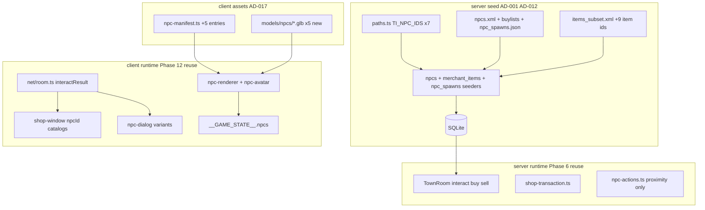

# Phase 17 — Talking Island NPC Expansion (+5) Design

**Spec**: `.specs/features/phase-17-ti-npc-expansion/spec.md`
**Status**: Draft

---

## Architecture Overview

Phase 17 is a **data + asset + UI extension** of Phases 6 and 12. No new Colyseus
messages, no `NpcState` schema changes, no server combat changes. Work splits into
four tracks that merge at the gate:

1. **Server seed** — extend `TI_NPC_IDS`, fixture NPC XML, buylists, spawns, items;
   generalize merchant seeder.
2. **Client assets** — five new human GLBs + `npc-manifest.ts` rows (reuse KayKit rig).
3. **Client interaction** — npcId-keyed shop catalog; dialog variants for Warehouse /
   VillageMasterFighter; fix greet `npcId` wiring.
4. **Verification** — spawn placement guards, Lector room buy, e2e seven-NPC mesh poll.



**Constraints honored:** AD-001 (server shop authority), AD-012 (fixture seed tests),
AD-013 (local coords), AD-014 (deterministic harness, e2e poll at join), AD-017
(rigged GLB + two-layer visual gate), AD-018 (spawn vs `isBlocked`).

---

## Approach Exploration

| Approach | Strategy | Pros | Cons | |
| -------- | -------- | ---- | ---- | - |
| **A — Extend Phase 6/12 pipeline (RECOMMENDED)** | Seed + manifest + GLB per NPC; generalize shop UI | Proven; minimal server diff | Five asset ingest cycles | ✅ |
| B — DB-driven shop catalog on `interactResult` | Server sends listings to client | Single source of truth | Violates Phase 6 display/server split; more wire payload | |
| C — Single shared merchant GLB | One human mesh tinted per role | Fast | Fails AD-017 fidelity + visual dedup gate | |

**Recommendation: Approach A.**

---

## Village NPC Placement

Hand-mapped `(x,z)` in local metric space (AD-013). Peace zone:
**x,z ∈ [−20, 20]** (`libs/game-core/src/peace-zone.ts`). Building blockers from
`BUILDING_AABBS` in `libs/game-core/src/world-blockers.ts` (Phase 9).

### Layout diagram (top-down, +z = north)

```
        z=10  ·····································
              ·    [Roxxy 30006]   (4,10)        ·
        z=4   ·  [Jackson] (-16,4)                ·
              ·         [Silvia] (-8,2)           ·
        z=0   ·                    [Wilford] (16,0)·
              ·                                   ·
        z=-2  · [Lector] (-14,-2)                  ·
              ·                                   ·
        z=-4  ·        [Bitz] (2,-4)              ·
              ·  [Katerina] (-6,-8)               ·
       z=-8   ·····································
             x=-18      -8        0        8    18

  [Building AABBs] = shaded blockers (not drawn); spawns avoid isBlocked + 0.8m margin
```

### Spawn table (authoritative for seed fixture + tests)

| npcId | Name | x | z | L2J Gludio hint (reference only) |
| ----- | ---- | --- | --- | -------------------------------- |
| 30001 | Lector | −14 | −2 | (−86385, 243267) weapon row west cluster |
| 30002 | Jackson | −16 | 4 | (−86733, 242918) armor row |
| 30003 | Silvia | −8 | 2 | (−83789, 240799) accessories near grocer band |
| 30004 | Katerina | −6 | −8 | *(unchanged Phase 6)* |
| 30005 | Wilford | 16 | 0 | (−81512, 243424) warehouse east band |
| 30006 | Roxxy | 4 | 10 | *(unchanged Phase 6)* |
| 30026 | Bitz | 2 | −4 | (−83326, 242964) trainer central |

**Minimum pairwise distance** among all seven ≥ **2.5 m** (interact radius 3.0 m).

### Placement validation helper (new)

Add `isNpcSpawnBlocked(x, z, margin = 0.8)` in `libs/game-core/src/world-blockers.ts`
(or `npc-placement.ts` re-exporting `isBlocked`):

```typescript
export function isNpcSpawnBlocked(x: number, z: number, margin = 0.8): boolean {
  // Expand each building AABB by margin on XZ; reuse isBlocked for props
}
```

Unit test `libs/game-core/src/npc-placement.spec.ts` asserts TINPC-12/13 for all
seven fixture coordinates.

---

## GLB Sourcing Strategy (`game-designer` → `create-character.md` NPC note)

Fidelity-first; CC0 KayKit Adventurers pack (already vendored under
`client/public/models/characters/`). **Copy** into `client/public/models/npcs/` with
**distinct filenames** per npcId — never alias the same bytes to multiple logical NPCs
(`visual-gate.mjs` dedup).

| npcId | Name | Output GLB | Source | Silhouette intent | Clip map |
| ----- | ---- | ---------- | ------ | ------------------- | -------- |
| 30001 | Lector | `Lector.glb` | `Knight.glb` | Armored weapon merchant | `KAYKIT_CLIP_MAP` + `cast: 'Interact'` |
| 30002 | Jackson | `Jackson.glb` | `Barbarian.glb` | Bulky armor merchant | same |
| 30003 | Silvia | `Silvia.glb` | `Rogue_Hooded.glb` | Light accessory dealer | same |
| 30005 | Wilford | `Wilford.glb` | `Hooded.glb` | Cloaked warehouse keeper | same |
| 30026 | Bitz | `Bitz.glb` | `Rogue.glb` | Lean fighter trainer | same |

**Existing (unchanged):** Katerina → `Mage.glb`; Roxxy → `Roxxy.glb` (Quaternius).

### Ingest workflow (each new NPC)

1. `cp client/public/models/characters/<Source>.glb client/public/models/npcs/<Name>.glb`
2. Inspect animation track names (`create-character.md` step 2 one-liner).
3. Add `npc-manifest.ts` row: `scale` ~0.84–1.0, `feetOffsetY` tuned in lab.
4. `node scripts/visual-gate.mjs` — must PASS.
5. `LAB_NPC=30001 node scripts/shoot-character.mjs` (extend lab if needed) — idle + `cast`.
6. Append `client/public/models/npcs/LICENSE.txt` (KayKit CC0).

### Visual gate (two layers — blocking)

1. **Structural:** `node scripts/visual-gate.mjs` (dedup, rigged human, non-empty clips).
2. **Fidelity:** `character-lab.html?npc=<npcId>` + `scripts/shoot-character.mjs`;
   reviewer confirms weapon ≠ armor ≠ accessory ≠ warehouse ≠ trainer silhouettes.

---

## Shop & Dialog UI Design

### npcId-keyed shop catalogs (`client/src/ui/shop-window.ts`)

Replace Katerina-only constants with:

```typescript
export const SHOP_CATALOGS: Record<number, readonly ShopItemDisplay[]> = {
  30004: KATERINA_SHOP_ITEMS,
  30001: LECTOR_SHOP_ITEMS,   // items 1, 4, 13
  30002: JACKSON_SHOP_ITEMS,  // 21, 28, 1121
  30003: SILVIA_SHOP_ITEMS,   // 116, 112, 118
};

export interface ShopRenderOptions {
  npcId: number;
  merchantName: string;
  // ...existing fields
}
```

`renderShopWindow` selects catalog + title from `npcId`. Buy/sell handlers already
pass `npcId` to server (AD-001).

### Dialog variants (`client/src/ui/npc-dialog.ts`)

Introduce `NpcDialogVariant: 'helper' | 'warehouse' | 'trainer'`.

| Variant | npcIds | Title suffix | Actions |
| ------- | ------ | ------------ | ------- |
| `helper` | 30006 (Roxxy) | Newbie Helper | Heal, Starter Kit (live) |
| `warehouse` | 30005 | Warehouse Keeper | Deposit / Withdraw — `disabled`, label "Coming soon" |
| `trainer` | 30026 | Grand Master | Change Class — `disabled`, "Coming soon" |

`openNpcUiForInteract` (`npc-interaction.ts`) routing:

```typescript
if (type === 'Merchant' || npcId === KATERINA_NPC_ID) → shop
else if (type === 'Warehouse') → warehouse dialog
else if (type === 'VillageMasterFighter') → trainer dialog
else if (type === 'Teleporter' || npcId === ROXXY_NPC_ID) → helper dialog
```

### Server (`TownRoom.ts`)

- `handleInteract` — unchanged; returns `type` from DB.
- `handleBuy`/`handleSell` — unchanged; listing lookup already keyed by `(npcId, itemId)`.
- `handleNpcAction` — **unchanged** Roxxy-only; warehouse/trainer buttons do not emit
  `npcAction` until a future phase.

### Client greet fix (`client/src/net/room.ts`)

Replace `fireNpcGreet(KATERINA_NPC_ID)` inside `openShop` with
`fireNpcGreet(message.npcId)` (TINPC-29).

---

## Seed Pipeline Changes

### `server/src/seed/paths.ts`

```typescript
export const TI_NPC_IDS = [
  30001, 30002, 30003, 30004, 30005, 30006, 30026,
] as const;
```

### Fixture files (AD-012)

| File | Change |
| ---- | ------ |
| `__fixtures__/npcs.xml` | +5 `<npc>` nodes (minimal stats block like existing 30004/30006) |
| `__fixtures__/buylist_30001.xml` | Subset from L2J `3000101.xml` (items 1, 4, 13) |
| `__fixtures__/buylist_30002.xml` | Subset from `3000201.xml` (21, 28, 1121) |
| `__fixtures__/buylist_30003.xml` | Subset from `3000301.xml` (116, 112, 118) |
| `__fixtures__/npc_spawns.json` | +5 rows (table above) |
| `__fixtures__/items_subset.xml` | +9 item nodes for shop SKUs |

### Parser / seeder generalization

**`buylist.parser.ts`:** Accept `(xml, npcId, itemIds[], itemNames)` — remove
Katerina-only hardcode; keep `SHOP_ITEM_IDS` per merchant in seeder.

**`merchant-items.seeder.ts`:** Loop merchants:

```typescript
const MERCHANT_BUYLISTS = [
  { npcId: 30004, file: 'buylist_30004.xml', items: [1060, 1835, 17] },
  { npcId: 30001, file: 'buylist_30001.xml', items: [1, 4, 13] },
  // ...
] as const;
```

Rename existing fixture `buylist_30004.xml` if currently named differently
(current code reads `buylist_30004.xml` — verify fixture filename matches).

---

## Code Reuse Analysis

### Existing Components to Leverage

| Component | Location | How to Use |
| --------- | -------- | ---------- |
| `TI_NPC_IDS` | `server/src/seed/paths.ts` | Extend to 7 ids |
| `parseNpcs` | `server/src/seed/parsers/npcs.parser.ts` | Unchanged filter |
| `parseMerchantBuylist` | `server/src/seed/parsers/buylist.parser.ts` | Parameterize npcId + item set |
| `seedNpcSpawns` | `server/src/seed/seeders/npc-spawns.seeder.ts` | Fixture JSON append |
| `canInteract` / `buyItem` | `npc-actions.ts`, `shop-transaction.ts` | Unchanged |
| `TownRoom` handlers | `server/src/rooms/TownRoom.ts` | Load new spawns automatically |
| `getNpcEntry` | `client/src/scene/creature/npc-manifest.ts` | +5 rows |
| `npc-avatar` / `npc-renderer` | `client/src/scene/` | Auto-pick manifest |
| `openNpcUiForInteract` | `client/src/npc-interaction.ts` | Extend routing |
| `__GAME_STATE__.npcs` | `client/src/test-hook.ts` | Assert length 7 |
| E2E helpers | `client-e2e/src/town.spec.ts` | `walkTowardInPeaceZone`, `expect.poll` |
| Room test harness | `TownRoom.spec.ts` | `deliver()`, `NJ_AUTOSIM=0` |
| Visual gate | `scripts/visual-gate.mjs` | Auto-discovers new GLBs |
| Game-designer skill | `.cursor/skills/game-designer/references/create-character.md` | Per-NPC ingest |

### Integration Points

| System | Integration Method |
| ------ | ------------------ |
| SQLite seed | `runSeed` transaction (AD-011) |
| Colyseus room | `initializeNpcs()` reads all `npc_spawns` rows |
| Client renderer | `syncNpc` uses `getNpcEntry(npcId)` |
| Nx gate | `nx affected -t test lint` + `nx e2e client-e2e` |

---

## File Touch List

| File | Action |
| ---- | ------ |
| `server/src/seed/paths.ts` | Extend `TI_NPC_IDS` (7 ids) |
| `server/src/seed/__fixtures__/npcs.xml` | +5 NPC nodes |
| `server/src/seed/__fixtures__/buylist_30001.xml` | New |
| `server/src/seed/__fixtures__/buylist_30002.xml` | New |
| `server/src/seed/__fixtures__/buylist_30003.xml` | New |
| `server/src/seed/__fixtures__/npc_spawns.json` | +5 spawn rows |
| `server/src/seed/__fixtures__/items_subset.xml` | +9 items |
| `server/src/seed/parsers/buylist.parser.ts` | Parameterize npcId + item whitelist |
| `server/src/seed/seeders/merchant-items.seeder.ts` | Multi-merchant loop |
| `server/src/seed/seeders/npcs.seeder.spec.ts` | Per-npc metadata tests (new or extend) |
| `server/src/seed/seeders/merchant-npc-spawns.seeder.spec.ts` | Extend spawn + merchant tests |
| `libs/game-core/src/world-blockers.ts` | `isNpcSpawnBlocked` helper |
| `libs/game-core/src/npc-placement.spec.ts` | Peace + blocker asserts (TINPC-12/13) |
| `server/src/rooms/TownRoom.spec.ts` | Lector buy + distance reject |
| `client/public/models/npcs/Lector.glb` | New (from Knight) |
| `client/public/models/npcs/Jackson.glb` | New (from Barbarian) |
| `client/public/models/npcs/Silvia.glb` | New (from Rogue_Hooded) |
| `client/public/models/npcs/Wilford.glb` | New (from Hooded) |
| `client/public/models/npcs/Bitz.glb` | New (from Rogue) |
| `client/public/models/npcs/LICENSE.txt` | Update sources |
| `client/src/scene/creature/npc-manifest.ts` | +5 entries |
| `client/src/scene/creature/npc-manifest.spec.ts` | Seven-id coverage |
| `client/src/ui/shop-window.ts` | npcId catalogs + dynamic title |
| `client/src/ui/shop-window.spec.ts` | Lector/Jackson/Silvia rows |
| `client/src/ui/npc-dialog.ts` | Warehouse + trainer variants |
| `client/src/ui/npc-dialog.spec.ts` | Stub button tests |
| `client/src/npc-interaction.ts` | Routing for Warehouse / Trainer |
| `client/src/npc-interaction.spec.ts` | Routing cases |
| `client/src/net/room.ts` | Pass `npcId` to shop render; greet fix |
| `client-e2e/src/town.spec.ts` or `ti-npc-expansion.spec.ts` | Seven mesh + Lector buy |
| `scripts/shoot-character.mjs` | `LAB_NPC` support if missing |
| `client/src/character-lab.ts` | `?npc=` for new ids (if needed) |

---

## Error Handling Strategy

| Error Scenario | Handling | User Impact |
| -------------- | -------- | ----------- |
| Buy out of range | Server rejects; state unchanged | No gold loss |
| Buy insufficient adena | `buyItem` returns `ok: false` | No-op |
| Unknown merchant item | No listing row → reject | No-op |
| Warehouse/trainer stub click | Button `disabled`; no network send | "Coming soon" visible |
| GLB load failure | Capsule fallback (`npc-renderer`) | NPC visible as placeholder |
| Seed missing npc in XML | Parser throws at seed time | CI fails fast |

---

## Risks & Concerns

| Concern | Location | Impact | Mitigation |
| ------- | -------- | ------ | ---------- |
| KayKit copy dedup in visual-gate | `scripts/visual-gate.mjs` | FAIL if same source copied without mesh differentiation | Use **different** source GLBs per npcId (table above); tune `scale` |
| `fireNpcGreet(KATERINA_NPC_ID)` hardcode | `client/src/net/room.ts:409` | Wrong greet on new merchants | Fix in T14 (TINPC-29) |
| Shop window Katerina-only catalog | `shop-window.ts` | New merchants show wrong items | npcId-keyed catalogs (T13) |
| `items` table missing shop SKUs | `items.parser.ts` | Equip on bought weapon fails later | Extend `items_subset.xml` in T3 |
| E2E slow walks | `town.spec.ts` | AD-014 violation if walking all NPCs | Poll all 7 at join (TINPC-31/32); walk only for Lector buy |
| Roxxy `npcAction` coupling | `TownRoom.handleNpcAction` | Accidental warehouse actions | Stub buttons disabled; no new server actions |

---

## Tech Decisions

| Decision | Choice | Rationale |
| -------- | ------ | --------- |
| Merchant item count | 3 per shop | Phase 6 parity |
| Spawn placement | Hand-fixed coords + automated guard tests | AD-013; L2J coords reference-only |
| Warehouse/trainer UX | Disabled dialog buttons | Safe stub without server storage |
| Asset pack | KayKit Adventurers (existing) | License-clean; rig already integrated |
| Placement helper | `isNpcSpawnBlocked` in game-core | Shared with future NPC phases |

> No new AD required — conforms to AD-001, AD-012, AD-013, AD-014, AD-017, AD-018.

---

## Speed Contract (AD-014) — Design Mandates

| Layer | Mandate |
| ----- | ------- |
| Room-integration | `NJ_AUTOSIM=0`; advance via `simulate()` / `deliver()`; **no** `waitForNextSimulationTick` sleeps |
| Unit/room per-test timeout | ≤ **30 s**; flag >10 s as defect |
| E2E | `expect.poll` with intervals `[50–1000]` ms; **no** `page.waitForTimeout` |
| E2E per-test timeout | ≤ **60 s** |
| E2E NPC mesh ACs | Assert at join — **no** walk required for TINPC-31–33 |
| Gate | `nx affected` + Nx cache enabled |
