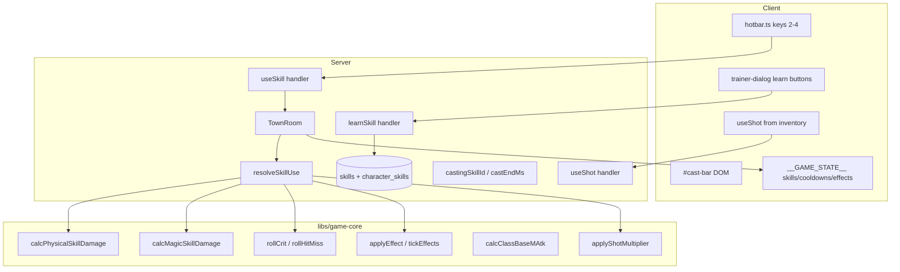

# Phase 20 — Skills & Combat Depth Design

**Spec**: `.specs/features/phase-20-skills-combat/spec.md`
**Status**: Draft

---

## Architecture Overview

Phase 20 replaces the monolithic Power Strike path with a **data-driven skill
pipeline**: L2J XML → SQLite (`skills`, `class_skill_tree`, `character_skills`) →
pure resolvers in `@nj/game-core` → `resolveSkillUse` in `combat-resolver` →
`TownRoom` tick (cast queue + effect expiry). Client sends intents only; DOM shows
hotbar, cast bar, trainer learn list.



### Tick order (`TownRoom.simulate`) — Phase 20 delta

1. Player movement.
2. **Effect expiry** — `tickActiveEffects(nowMs)` on players + mobs.
3. **Cast resolution** — players with `castEndMs <= now` → `resolveSkillUse` (magic/buff/debuff).
4. Mob AI.
5. **Instant skills** — `skillPending` → `resolveSkillUse` (physical instant).
6. Player basic attacks (with shot + crit + miss).
7. Mob attacks (respect Weakness debuff).
8. **Cast interrupt check** — damage to casting players cancels cast (handled inline on damage apply).
9. Respawns.

Injectable `nowMs` + `combatRng` unchanged (AD-010, AD-014).

---

## Code Reuse Analysis

### Existing Components to Leverage

| Component | Location | How to Use |
| --------- | -------- | ---------- |
| `calcPhysicalSkillDamage` | `libs/game-core/src/combat/melee-damage.ts` | Physical skills unchanged formula |
| `resolvePowerStrike` | `server/src/rooms/combat-resolver.ts` | Template for `resolveSkillUse`; deprecate |
| `applyConsumable` pattern | `libs/game-core/src/consumable/` + TownRoom `useItem` | Mirror for `useShot` |
| `calcClassBasePAtk` | `libs/game-core/src/class/class-combat.ts` | Physical skills + Might buff |
| `lookupStrBonus` | `libs/game-core/src/class/stat-bonus.ts` | Add `lookupIntBonus` sibling |
| Trainer dialog stub | `client/src/ui/npc-dialog.ts` | Extend `trainer` variant with learn list |
| Power Strike VFX | `client/src/scene/vfx/` | Reuse for skill 3; generic cast VFX for magic |
| Soulshot glint | `client/src/scene/vfx/soulshot-glint-vfx.ts` | Trigger on shot consume |
| Phase 17 NPC pipeline | `server/src/seed/` + `npc-interaction.ts` | Add 2 folk NPCs |
| Room test harness | `server/src/rooms/TownRoom.spec.ts` | `tick()`/`deliver()` AD-014 |

### Integration Points

| System | Integration Method |
| ------ | ------------------ |
| Colyseus schema | Extend `PlayerState` with `knownSkillIds`, `skillCooldownEnds`, `castingSkillId`, `castEndMs` |
| SQLite | New tables + extend `skills`; migration in `db/client.ts` |
| L2J fixtures | AD-012 trimmed XML under `server/src/seed/__fixtures__/skills/` |
| Client `wireRoom` | onChange for new PlayerState fields → `__GAME_STATE__` |

---

## Architecture Decisions

### Decision 1: Generalized resolver vs per-skill functions

| Option | Pros | Cons | Decision |
| ------ | ---- | ---- | -------- |
| **A — Single `resolveSkillUse` by `effectKind`** | One tick path; data-driven | Larger function | **Selected** |
| B — Per-skill switch | Easy anchors | Does not scale | Rejected |

### Decision 2: Cast timing model

| Option | Pros | Cons | Decision |
| ------ | ---- | ---- | -------- |
| **A — Server `castEndMs`; client mirrors for bar** | AD-001; interruptible | Slight UI lag | **Selected** |
| B — Client timer triggers resolve | Violates authority | — | Rejected |

### Decision 3: Cooldown schema encoding

| Option | Pros | Cons | Decision |
| ------ | ---- | ---- | -------- |
| **A — Parallel arrays `knownSkillIds[]` + `skillCooldownEndMs[]` (index-aligned, max 8)** | Colyseus-friendly | Fixed cap | **Selected** |
| B — MapSchema per skill | Flexible | Heavier wire | Deferred |

### Decision 4: Shot activation

| Option | Pros | Cons | Decision |
| ------ | ---- | ---- | -------- |
| **A — `useShot` arms private `armedShotKind` consumed on next hit** | Simple; testable | Not full auto-shot | **Selected** |
| B — Auto-shot toggle | Authentic L2 UX | UI scope | Phase 28 |

### Decision 5: Folk trainer scope

| Option | Pros | Cons | Decision |
| ------ | ---- | ---- | -------- |
| **A — Seed Gwinter + Baulro only** | Proves folk path | Incomplete roster | **Selected** |
| B — Wait for Phase 24 | Fewer NPCs | Blocks skill learn demo | Rejected |

---

## Database Schema

### `skills` (extend existing)

| Column | Type | Notes |
| ------ | ---- | ----- |
| `skill_id` | INTEGER PK | |
| `name` | TEXT | |
| `max_level` | INTEGER | |
| `operate_type` | TEXT | A1/A2 |
| `target_type` | TEXT | ENEMY / SELF / … |
| `cast_range` | INTEGER | L2 units ÷10 → world m |
| `reuse_delay` | INTEGER | ms |
| `mp_consume_l1` | INTEGER | |
| `power_l1` | INTEGER | physical/magic power |
| `hit_time` | INTEGER | ms; **0 = instant** |
| `is_magic` | BOOLEAN | |
| `effect_kind` | TEXT | `physical_damage` \| `magic_damage` \| `buff_self` \| `debuff_enemy` |
| `abnormal_time` | INTEGER | seconds; buff/debuff duration |
| `buff_multiplier` | REAL | e.g. 1.08 Might |
| `debuff_multiplier` | REAL | e.g. 0.88 Weakness |

### `class_skill_tree` (new)

| Column | Type |
| ------ | ---- |
| `class_id` | INTEGER |
| `skill_id` | INTEGER |
| `skill_level` | INTEGER |
| `get_level` | INTEGER |
| `level_up_sp` | INTEGER |
| `auto_get` | BOOLEAN |
| PK (`class_id`, `skill_id`, `skill_level`) |

### `character_skills` (new)

| Column | Type |
| ------ | ---- |
| `character_id` | TEXT FK |
| `skill_id` | INTEGER |
| `skill_level` | INTEGER |
| PK (`character_id`, `skill_id`) |

### `class_templates` (extend)

| Column | Type |
| ------ | ---- |
| `base_m_atk` | REAL | from L2J `baseMAtk` (Phase 20 migration) |

---

## Components

### `libs/game-core` — combat extensions

- **`calcMagicSkillDamage(attacker, defender, power, options)`** — `91 × (mAtk+power)/mDef × randomMod`
- **`calcClassBaseMAtk(template, level)`** — `floor(baseMAtk × intBonus(INT) + level)`
- **`lookupIntBonus` / `lookupDexBonus`** — from extended `statBonus` fixture
- **`rollHitMiss(attacker, defender, rng)`** — boolean miss
- **`rollCrit(critRate, rng)`** — boolean crit
- **`applyShotMultiplier(damage, shotKind)`** — ×2 if armed
- **`active-effects.ts`** — `ActiveEffect`, `tickEffects`, `getPAtkMultiplier`, `getMobDamageMultiplier`

### `server` — `skill-resolver.ts` (new, or extend combat-resolver)

```typescript
interface SkillUseResult {
  damage: number;
  mpCost: number;
  killed: boolean;
  cooldownEndMs: number;
  startedCast?: boolean;
  effectApplied?: string;
}
```

**`resolveSkillUse(params)`** branches on `skill.effectKind`:

| Kind | Behavior |
| ---- | -------- |
| `physical_damage` | Instant; range; MP; cooldown; damage; shot + crit |
| `magic_damage` | If `hitTime>0`: set cast state; else instant magic |
| `buff_self` | Apply `ActiveEffect` on player; MP; cooldown |
| `debuff_enemy` | Apply on target mob; MP; cooldown |

### `server` — TownRoom messages

```typescript
// learn at trainer
this.onMessage('learnSkill', (client, { skillId }) => { ... });

// generalized (replaces skillId===3 guard)
this.onMessage('useSkill', (client, { skillId }) => { ... });

// arm soulshot/spiritshot
this.onMessage('useShot', (client, { itemId }) => { ... });
```

### `server` — `PlayerCombatState` (extend)

```typescript
interface PlayerCombatState {
  // existing...
  skillPending: boolean;
  pendingSkillId: number;
  castingSkillId: number;
  castEndMs: number;
  skillCooldownEndMs: Map<number, number>; // private; mirrored to schema arrays
  armedShot: 'soul' | 'spirit' | null;
  activeEffects: ActiveEffect[];
}
```

### `client` — UI

| File | Change |
| ---- | ------ |
| `ui/hotbar.ts` (new) | Dynamic slots from `knownSkillIds`; keys 2–4 |
| `ui/cast-bar.ts` (new) | `#cast-bar` progress from `castEndMs` |
| `ui/npc-dialog.ts` | Trainer: list learnable skills + `learnSkill` |
| `ui/inventory-window.ts` | Use on soulshot/spiritshot → `useShot` |
| `combat-input.ts` | Delegate to hotbar |
| `net/room.ts` | Sync new PlayerState fields |
| `test-hook.ts` | `knownSkillIds`, cooldowns, effects, cast |

---

## Data Models

### `ActiveEffect`

```typescript
interface ActiveEffect {
  skillId: number;
  kind: 'buff' | 'debuff';
  multiplier: number; // pAtk or mob damage
  endMs: number;
}
```

### `PlayerState` additions

```typescript
@type(['number']) knownSkillIds: ArraySchema<number>;
@type(['number']) skillCooldownEndMs: ArraySchema<number>;
@type('number') castingSkillId = 0;
@type('number') castEndMs = 0;
```

`powerStrikeCooldownEndMs` deprecated — migrate tests to per-skill cooldown array.

---

## Error Handling Strategy

| Scenario | Handling | User Impact |
| -------- | -------- | ----------- |
| Unknown skillId | Reject `useSkill` | No effect |
| Not learned | Reject | No effect |
| Insufficient MP | Reject before cast starts | MP unchanged |
| On cooldown | Reject | No effect |
| Out of range at resolve | Cancel pending/cast | No damage |
| Peace zone | Reject | No effect |
| learnSkill wrong class | Reject | Dialog unchanged |
| No trainer proximity | Reject learn | — |

---

## Risks & Concerns

| Concern | Location | Impact | Mitigation |
| ------- | -------- | ------ | ---------- |
| `resolvePowerStrike` deeply wired in tests | `TownRoom.spec.ts`, `combat-resolver.spec.ts` | Large test churn | Task T6 migrates anchors; keep 71-damage assertions |
| `powerStrikeCooldownEndMs` on schema | `TownState.ts`, client HUD | Breaking wire | Deprecate in T8; alias slot 0 for skill 3 during migration |
| Colyseus array sync for cooldowns | `PlayerState` | Index drift | Fixed max 8; index = `knownSkillIds` position |
| Monster lacks `mDef` | `monsters` table | Wrong magic damage | `mDef = pDef` assumption documented in spec |
| Room test time for 4000ms cast | `TownRoom.spec.ts` | Slow tests? | Advance `nowMs` by 4000 synchronously — no sleep (AD-014) |
| Phase 5 client hardcodes skill 3 | `combat-input.ts` | Regression | Hotbar reads `knownSkillIds` |

---

## Tech Decisions

| Decision | Choice | Rationale |
| -------- | ------ | --------- |
| Skill tree SP gate | Free learn | Phase 27 SP |
| Shot multiplier | 2× | L2J `Formulas` |
| Max known skills on wire | 8 | Hotbar 3 + headroom |
| Folk NPCs seeded | 30027, 30033 | Minimal folk path |
| INT fixture | Extend statBonus with INT/DEX columns | Mirrors STR pattern |

---

## Requirement Traceability (Design)

| AC range | Primary module |
| -------- | -------------- |
| SKILL20-01–08 | seed parsers + schema |
| SKILL20-09–14 | character repository + migration |
| SKILL20-15–20 | TownRoom learn + client trainer |
| SKILL20-21–26 | combat-resolver physical |
| SKILL20-27–32 | cast queue + magic damage |
| SKILL20-33–37 | useShot + multiplier |
| SKILL20-38–42 | active-effects |
| SKILL20-43–46 | crit/evasion pure |
| SKILL20-47–52 | client hotbar + wireRoom |
