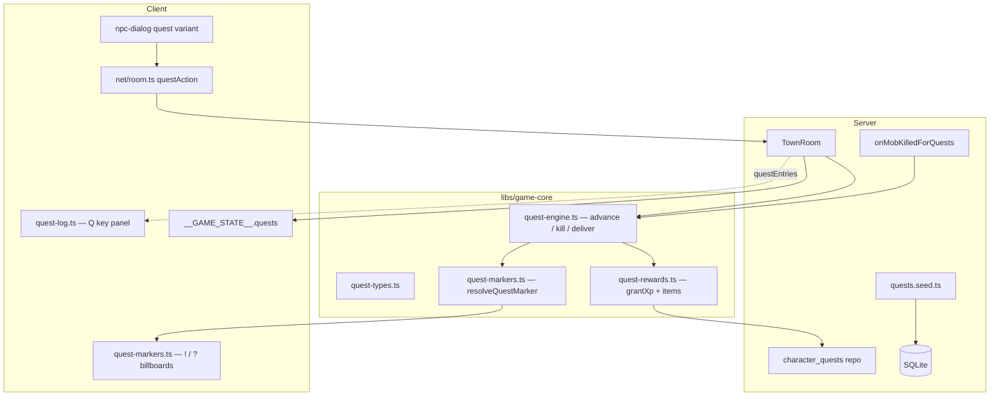

# Phase 21 — Quests & Tutorial Design

**Spec**: `.specs/features/phase-21-quests/spec.md`
**Status**: Draft

---

## Architecture Overview

Phase 21 adds a **data-driven quest pipeline** parallel to the skill pipeline
(Phase 20): L2J scripts → fixture JSON/SQLite seed → pure quest engine in
`@nj/game-core` → `TownRoom` handlers + combat kill hooks → replicated
`PlayerState.questEntries` → client quest log + markers.



### Tick / event order (`TownRoom`) — Phase 21 delta

Existing tick order (Phase 20) unchanged. Quest hooks are **event-driven**:

1. `onJoin` / `onReconnect` → load `character_quests`; auto-start **255**.
2. `interact` → shop / helper / trainer / **quest dialog** branch.
3. `questAction` → `advanceQuestTalk` / accept / complete.
4. Mob death (inside `resolvePlayerAttack` / `resolveSkillUse` kill path) →
   `onMobKilledForQuests(sessionId, mobNpcId)`.
5. Quest item grant on kill (deterministic) → `addQuestItem` before drop RNG.
6. On `completeQuest` → `grantQuestRewards` + strip quest items + persist.

Injectable `nowMs` + `questRng` only where non-quest drops already use RNG (quest
drops themselves are deterministic per spec).

---

## Code Reuse Analysis

### Existing Components to Leverage

| Component | Location | How to Use |
| --------- | -------- | ---------- |
| `grantXp` | `libs/game-core/src/progression/xp.ts` | Quest XP rewards |
| `applyKillRewards` | `server/src/rooms/combat-resolver.ts` | Call quest hook after kill |
| `character-repository` | `server/src/db/character-repository.ts` | Extend for `character_quests` + quest item flags |
| `shop-transaction` sell guard | `server/src/rooms/shop-transaction.ts` | Reject `is_quest_item` sells |
| `npc-dialog` | `client/src/ui/npc-dialog.ts` | Add `quest` variant + actions |
| `npc-interaction` | `client/src/npc-interaction.ts` | Quest interact branch |
| `test-hook` | `client/src/test-hook.ts` | Add `GameState.quests` |
| `wireRoom` | `client/src/net/room.ts` | Sync `questEntries`; send `questAction` |
| Room test harness | `server/src/rooms/TownRoom.spec.ts` | `tick()`/`deliver()` AD-014 |
| Seed fixture pattern | `server/src/seed/__fixtures__/` AD-012 | `quests/*.json` |
| `TI_NPC_IDS` | `server/src/seed/paths.ts` | Stub giver validation |

### Integration Points

| System | Integration Method |
| ------ | ------------------ |
| Colyseus schema | `QuestEntryState` nested schema on `PlayerState.questEntries` |
| SQLite | Tables `quests`, `quest_objectives`, `quest_rewards`, `character_quests`; `items.is_quest_item` column |
| L2J reference | Parse script constants into JSON fixtures (no Java runtime) |
| Client markers | Reuse NPC world position from `GameState.npcs`; billboard in `quest-markers.ts` |

---

## Architecture Decisions

### Decision 1: Pure engine vs per-quest classes

| Option | Pros | Cons | Decision |
| ------ | ---- | ---- | -------- |
| **A — Data-driven `quest-engine`** | One test surface; seed adds quests | Complex objectives need expressive defs | **Selected** |
| B — Port 17 L2J Java classes | Literal behavior | Unmaintainable; violates AD-003 | Rejected |

### Decision 2: Quest giver stubbing

| Option | Pros | Cons | Decision |
| ------ | ---- | ---- | -------- |
| **A — `stubGiverNpcId` column per quest** | Phase 24 swaps spawns without quest id churn | Names don't match L2J | **Selected** |
| B — Spawn 20+ new NPCs now | Authentic | Scope creep into Phase 24 | Rejected |

### Decision 3: Marker replication

| Option | Pros | Cons | Decision |
| ------ | ---- | ---- | -------- |
| **A — Client derives from `questEntries` + defs** | No extra wire; per-player correct | Client must load quest defs (sync subset via hook) | **Selected** |
| B — Server sets `NpcState.marker` | Simple client | Wrong for multiplayer (per-player markers) | Rejected |

### Decision 4: Dialog + shop coexistence

| Option | Pros | Cons | Decision |
| ------ | ---- | ---- | -------- |
| **A — Interact opens chooser when merchant + quest** | Katerina/Jackson usable | Extra click | **Selected** |
| B — Quest replaces shop | Breaks Phase 6 | — | Rejected |

---

## Components

### `quest-engine` (pure)

- **Purpose**: Validate and apply quest transitions and objective progress.
- **Location**: `libs/game-core/src/quest/quest-engine.ts`
- **Interfaces**:
  - `canStartQuest(def, state, playerLevel, completedIds): boolean`
  - `startQuest(state, questId): QuestRuntimeState`
  - `advanceTalk(state, def, npcId): QuestRuntimeState`
  - `onMobKilled(state, def, mobNpcId): QuestRuntimeState`
  - `onDeliver(state, def, npcId, inventory): QuestRuntimeState`
  - `completeQuest(state, def): { state, rewards }`
- **Dependencies**: `QuestDefinition`, `QuestRuntimeState` types
- **Reuses**: Immutable state updates (pattern from `active-effects.ts`)

### `quest-rewards` (pure)

- **Purpose**: Compute inventory/XP/adena deltas from reward rows.
- **Location**: `libs/game-core/src/quest/quest-rewards.ts`
- **Interfaces**:
  - `applyQuestRewards(rewards, player, curve): RewardResult`
- **Reuses**: `grantXp` from progression module

### `quest-markers` (pure)

- **Purpose**: Map `(npcId, questEntries, defs)` → `none | available | in_progress | completable`
- **Location**: `libs/game-core/src/quest/quest-markers.ts`
- **Interfaces**:
  - `resolveQuestMarker(npcId, entries, defs): QuestMarkerKind`
  - `resolveNpcMarkers(npcId, ...): QuestMarkerKind` (highest priority wins)

### Quest seed

- **Purpose**: Load 17 quest definitions + objectives + rewards into SQLite.
- **Location**: `server/src/seed/seeders/quests.seeder.ts`, `server/src/seed/__fixtures__/quests/`
- **Interfaces**:
  - `seedQuests(db, dataDir): number`
- **Reuses**: `parseQuests` from fixture JSON; AD-012 portable fixtures

### `character_quests` repository

- **Purpose**: CRUD per-character quest progress.
- **Location**: `server/src/db/character-repository.ts` (extend)
- **Interfaces**:
  - `loadCharacterQuests(db, characterId): QuestRuntimeState[]`
  - `saveCharacterQuest(db, characterId, entry): void`
- **Dependencies**: Drizzle schema + `character_quests` table

### `TownRoom` quest handlers

- **Purpose**: Wire intents, persistence, replication.
- **Location**: `server/src/rooms/TownRoom.ts`, `server/src/rooms/quest-handlers.ts` (new)
- **Interfaces**:
  - `handleQuestAction(sessionId, { npcId, action })`
  - `onMobKilledForQuests(sessionId, mobNpcId)`
  - `buildQuestDialog(sessionId, npcId)`
- **Reuses**: Proximity gate from `npc-actions.ts`; `handleInteract` extension

### Client `quest-log`

- **Purpose**: DOM panel for active/completed quests.
- **Location**: `client/src/ui/quest-log.ts`
- **Interfaces**:
  - `mountQuestLog()`, `renderQuestLog({ entries, defs, visible })`
- **Reuses**: HUD styling from `shop-window.ts`

### Client `quest-markers`

- **Purpose**: Render `!`/`?` above NPC world positions.
- **Location**: `client/src/scene/quest-markers.ts`
- **Interfaces**:
  - `syncQuestMarkers(npcs, entries, defs): void`
- **Reuses**: Three.js sprite/billboard pattern from target ring

---

## Data Models

### `QuestDefinition` (seed + in-memory cache)

```typescript
interface QuestDefinition {
  questId: number;
  name: string;
  minLevel: number;
  stubGiverNpcId: number; // TI_NPC_IDS member
  steps: QuestStepDef[];
  rewards: QuestRewardDef[];
  autoStart: boolean; // true for 255 only
}

type QuestObjectiveKind = 'TALK' | 'KILL' | 'KILL_COUNT' | 'COLLECT' | 'DELIVER';

interface QuestObjectiveDef {
  kind: QuestObjectiveKind;
  npcId?: number; // talk/deliver target (stub id)
  mobNpcId?: number;
  itemId?: number;
  count: number;
  description: string;
}

interface QuestStepDef {
  objectives: QuestObjectiveDef[];
}

interface QuestRewardDef {
  xp?: number;
  adena?: number;
  itemId?: number;
  count?: number;
}
```

### `QuestRuntimeState` (DB + schema)

```typescript
interface QuestRuntimeState {
  questId: number;
  status: 'in_progress' | 'completed';
  step: number;
  counters: number[]; // parallel to active step objectives
}
```

### Colyseus `QuestEntryState`

```typescript
class QuestEntryState extends Schema {
  @type('number') questId = 0;
  @type('string') status = 'in_progress';
  @type('number') step = 0;
  @type(['number']) counters = new ArraySchema<number>();
}
```

`PlayerState.questEntries = new ArraySchema<QuestEntryState>()`.

### SQLite

```sql
CREATE TABLE quests (
  quest_id INTEGER PRIMARY KEY,
  name TEXT NOT NULL,
  min_level INTEGER NOT NULL,
  stub_giver_npc_id INTEGER NOT NULL,
  auto_start INTEGER NOT NULL DEFAULT 0
);
CREATE TABLE quest_objectives (
  id INTEGER PRIMARY KEY AUTOINCREMENT,
  quest_id INTEGER NOT NULL,
  step_index INTEGER NOT NULL,
  objective_index INTEGER NOT NULL,
  kind TEXT NOT NULL,
  mob_npc_id INTEGER,
  npc_id INTEGER,
  item_id INTEGER,
  count INTEGER NOT NULL,
  description TEXT NOT NULL
);
CREATE TABLE quest_rewards (
  id INTEGER PRIMARY KEY AUTOINCREMENT,
  quest_id INTEGER NOT NULL,
  xp INTEGER NOT NULL DEFAULT 0,
  adena INTEGER NOT NULL DEFAULT 0,
  item_id INTEGER,
  item_count INTEGER NOT NULL DEFAULT 0
);
CREATE TABLE character_quests (
  character_id TEXT NOT NULL,
  quest_id INTEGER NOT NULL,
  status TEXT NOT NULL,
  step INTEGER NOT NULL,
  counters_json TEXT NOT NULL,
  PRIMARY KEY (character_id, quest_id)
);
-- items table migration:
ALTER TABLE items ADD COLUMN is_quest_item INTEGER NOT NULL DEFAULT 0;
```

---

## Error Handling Strategy

| Error Scenario | Handling | User Impact |
| -------------- | -------- | ----------- |
| `questAction` out of range / wrong NPC | Ignore (no-op) | Button appears only when valid |
| Complete without objectives | Reject; no rewards | Complete button disabled client-side; server double-check |
| Sell quest item | `shop-transaction` error code | Sell rejected |
| Level too low | `canStartQuest` false | Dialog shows level requirement text |
| Re-accept completed | No-op | No quest offer |

---

## Risks & Concerns

| Concern | Location | Impact | Mitigation |
| ------- | -------- | ------ | ---------- |
| `TownRoom` already large | `TownRoom.ts` | Hard to extend | Extract `quest-handlers.ts` in T6 |
| Merchant + quest interact clash | `npc-interaction.ts` | Confusing UX | Chooser dialog (Decision 4) |
| Q00158 Nerkas not in bestiary | spawn-manager | Missing mob | One-off quest spawn in `quest-handlers` when step active |
| Multiplayer marker leakage | client markers | Wrong ! on other players' quests | Derive from local `questEntries` only (Decision 3) |
| Quest item id collisions | seed | Wrong rewards | Fixture tests per item id |

---

## Tech Decisions (feature-local)

| Decision | Choice | Rationale |
| -------- | ------ | --------- |
| Quest drop RNG | Deterministic 100% | AD-010; simplifies room tests |
| Counters encoding | JSON in DB; number array on wire | Compact replication |
| Tutorial reward class split | `classId` archetype mystic vs fighter | Matches Phase 19 archetypes |
| `questAction` payload | `{ npcId, action: string }` | Extensible for multi-button dialogs |
| Defs on client | Read-only copy via `__GAME_STATE__.quests.defs` subset (id, name, objectives text) | Markers + log without second fetch |

> **Project-level:** If quest engine location in `game-core` becomes standard for
> all narrative logic, record as AD-NNN during implementation when warranted.
