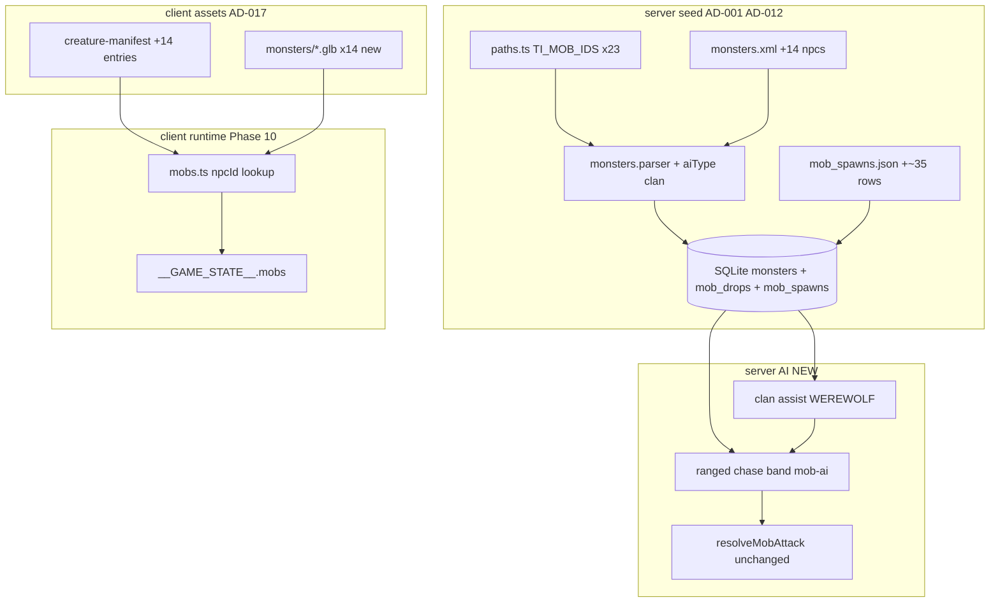

# Phase 22 — Complete TI Bestiary Design

**Spec**: `.specs/features/phase-22-ti-bestiary/spec.md`
**Status**: Draft

---

## Architecture Overview

Phase 22 extends Phase 10/16 with **fourteen** new mobs and **two** server AI capabilities
(ranged + social aggro). No new client renderer architecture; no `MobState` schema changes.



**Constraints honored:** AD-001, AD-012, AD-014, AD-017, AD-018; post-MVP test gate
(no Playwright).

---

## Approach Exploration

| Approach | Strategy | Pros | Cons | |
| -------- | -------- | ---- | ---- | - |
| **A — Extend Phase 16 pipeline + minimal AI (RECOMMENDED)** | Seed/manifest/GLB per mob; extend `monsters` + parser for `aiType`/`clan`; ranged + social in `mob-ai.ts` | Proven asset path; AI localized | 14 ingest cycles | ✅ |
| B — Hardcode npcId lists in AI | `if (npcId===20006)` in TownRoom | Faster | Unmaintainable; breaks seed-driven model | |
| C — Full L2J AI port | Faction hate, SetHateRace | Authentic | Out of scope; heavy | |

**Recommendation: Approach A.** ORC/GOBLIN clan assist deferred; only WEREWOLF social in
this phase (ROADMAP).

---

## Data Model Extension

### `monsters` table (Drizzle migration)

```typescript
// New nullable columns on existing monsters table
aiType: text('ai_type'),           // 'ARCHER' | null (melee default)
clan: text('clan'),                // 'WEREWOLF' | 'ORC' | 'GOBLIN' | null
clanHelpRange: integer('clan_help_range'), // L2 units; 0 = none
preferredAttackRange: integer('preferred_attack_range'), // L2 distance units; default = attackRange
```

**Parser changes** (`monsters.parser.ts`):

- Read `ai/@_type` → `aiType`
- Read `ai/clanList/clan` (first clan) → `clan`
- Read `ai/@_clanHelpRange` → `clanHelpRange`
- Read `stats/attack/@_distance` → `preferredAttackRange` (fallback: `attack.range`)

**MobRuntime extension** (`spawn-manager.ts`):

```typescript
aiType: string | null;
clan: string | null;
clanHelpRangeWorld: number;
preferredAttackRangeWorld: number;
```

---

## Ranged AI (Orc Archer)

Pure helpers in `@nj/game-core` (unit-testable):

```typescript
export function shouldRangedMobAdvance(
  distance: number,
  attackRangeWorld: number,
  preferredAttackRangeWorld: number
): boolean {
  return distance > preferredAttackRangeWorld;
}

export function isInRangedAttackBand(
  distance: number,
  attackRangeWorld: number,
  preferredAttackRangeWorld: number
): boolean {
  return distance >= attackRangeWorld && distance <= preferredAttackRangeWorld;
}
```

**`mob-ai.ts` integration:**

- IF `mob.aiType === 'ARCHER'` AND has target:
  - IF `shouldRangedMobAdvance` → `moveToward` (chase)
  - ELIF `isInRangedAttackBand` → return (hold position; TownRoom `resolveMobAttack` uses range check)
  - ELSE (too close, &lt; attackRangeWorld) → optional step back **or** still attack (MVP: still attack; no kite-back required)

**Combat range:** Existing `resolveMobAttack` already checks `attackRangeWorld`; ensure
Archer `attackRangeWorld` = 4 m so attacks fire in band.

---

## Social Aggro (WEREWOLF clan)

```typescript
export function findClanAssistTargets(
  source: MobRuntime,
  peers: MobRuntime[],
  clanHelpRangeWorld: number
): MobRuntime[] {
  if (!source.clan || !source.targetSessionId) return [];
  return peers.filter(
    (p) =>
      p.id !== source.id &&
      p.hp > 0 &&
      p.clan === source.clan &&
      !p.targetSessionId &&
      horizontalDistance(source.x, source.z, p.x, p.z) <= clanHelpRangeWorld
  );
}
```

**`tickMobAi` post-target-acquire:** After setting `targetSessionId`, call assist for
`clan === 'WEREWOLF'` only; set peer `targetSessionId` to same session. One-hop per tick
(no chain reaction from newly assisted mobs in same tick — they assist next tick if still
valid).

---

## Spawn Ring Layout (interim — Phase 23 may remap)

Extends Phase 16 rings east/south (AD-013). Peace zone: **x,z ∈ [−20, 20]**.

| Ring | Level band | New mobs (npcId) | Approx distance from origin |
| ---- | ---------- | ---------------- | --------------------------- |
| 6 | 7–8 | 20131, 20006, 20326 | 95–110 m |
| 7 | 9–10 | 20132, 20343, 20093 | 115–130 m |
| 8 | 11–12 | 20096, 20098, 20342 | 135–155 m |
| 9 | 13–14 | 20016, 20101 | 160–180 m |
| 10 | 15–17 | 20103, 20106, 20108 | 185–210 m |

**~35 spawn rows** (2–4 per new mob); existing 23 rows preserved unless walkability audit
requires nudge.

Validation: extend `spawn-placement.spec.ts` for BEST22-20/21/53.

---

## GLB Sourcing Strategy (per `create-monster.md`)

Fidelity-first; never byte-copy existing mob GLBs. Primary pack: **Quaternius Ultimate
Monsters** + **Ultimate Animated Animals** where silhouettes match.

| npcId | Output GLB | Primary source hint | Notes |
| ----- | ---------- | ------------------- | ----- |
| 20131 | `OrcSoldier.glb` | Big Orc variant / Soldier mesh | Distinct from `Orc.glb` |
| 20006 | `OrcArcher.glb` | Humanoid archer or Orc + scale | Bow attachment deferred |
| 20326 | `GoblinScout.glb` | Smaller goblin / scout silhouette | Distinct from `Goblin.glb` |
| 20132 | `Werewolf.glb` | Wolf/beast biped | New family clip map |
| 20343 | `WerewolfHunter.glb` | Hunter variant | Distinct from Werewolf |
| 20093 | `OrcWarrior.glb` | Armored orc | Distinct from Soldier |
| 20096 | `OrcLieutenant.glb` | Officer variant | |
| 20098 | `OrcCaptain.glb` | Captain variant | |
| 20342 | `WerewolfChieftain.glb` | Larger beast | |
| 20016 | `StoneGolem.glb` | Golem/rock creature | |
| 20101 | `Crasher.glb` | Insectoid | |
| 20103 | `GiantSpider.glb` | Spider/arachnid | Shared spider clip map if tracks match |
| 20106 | `GiantFangSpider.glb` | Fang variant | **Must** differ from 20103 |
| 20108 | `GiantBladeSpider.glb` | Blade variant | **Must** differ from 20103/06 |

**Workflow per mob:** ingest → inspect tracks → `creature-manifest` row → character-lab
tune → `visual-gate.mjs` → `shoot-character.mjs`.

---

## Code Reuse Analysis

| Component | Location | How to Use |
| --------- | -------- | ---------- |
| `TI_MOB_IDS` | `server/src/seed/paths.ts` | Append 14 ids |
| Monster/drop/spawn parsers | `server/src/seed/parsers/` | Extend monster parser |
| Fixture pattern | `server/src/seed/__fixtures__/` | +14 npc XML nodes |
| `creature-manifest.ts` | `client/src/scene/creature/` | +14 entries |
| `mesh-character.ts` clone backend | `client/src/scene/creature/` | Unchanged |
| `mob-ai.ts` | `server/src/rooms/` | Ranged + social hooks |
| `emitMobAction` | `server/src/rooms/TownRoom.ts` | Unchanged |
| `spawn-placement.spec.ts` | `server/src/seed/` | Extend ring tiers |
| `wireRoom` / test-hook | `client/src/net/` | Extend mob npcId assertions |
| Visual gate | `scripts/visual-gate.mjs` | Auto-discovers new GLBs |
| Game-designer skill | `.cursor/skills/game-designer/` | `create-monster.md` per mob |

---

## File Touch List

| File | Action |
| ---- | ------ |
| `server/src/seed/paths.ts` | `TI_MOB_IDS` length 23 |
| `server/src/seed/__fixtures__/monsters.xml` | +14 npc nodes |
| `server/src/seed/__fixtures__/mob_spawns.json` | +~35 rows |
| `server/src/seed/parsers/monsters.parser.ts` | aiType, clan, ranges |
| `server/src/db/schema.ts` | monsters columns |
| `server/src/rooms/spawn-manager.ts` | MobRuntime fields |
| `server/src/rooms/mob-ai.ts` | Ranged + social |
| `libs/game-core/src/combat/ranged-mob-ai.ts` | Pure helpers (new) |
| `client/src/scene/creature/creature-manifest.ts` | +14 entries |
| `client/public/models/monsters/*.glb` | +14 assets |
| `scripts/import-pack-assets.mjs` | Phase 22 block |

---

## Error Handling Strategy

| Error Scenario | Handling | User Impact |
| -------------- | -------- | ----------- |
| Missing fixture npc node | Seed throws at parse | Dev/fixture fix |
| GLB load failure | Capsule fallback (Phase 10) | Wrong silhouette until fixed |
| Archer out of range | `resolveMobAttack` no-op | No damage until in band |
| Social assist on dead peer | Filter `hp > 0` | No ghost aggro |

---

## Risks & Concerns

| Concern | Location | Impact | Mitigation |
| ------- | -------- | ------ | ---------- |
| 14 GLB ingest cycle time | Asset pipeline | Long Implementer phase | Parallel `[P]` tasks; reuse spider clip family where tracks match |
| Orc visual dedup | `visual-gate.mjs` | FAIL if same bytes as Orc.glb | Distinct source meshes per orc tier |
| Ranged AI vs melee resolver | `combat-resolver.ts` | Archer never damages | Room test BEST22-47 at 6 m |
| Social aggro perf | `tickMobAi` O(n²) peers | Slow with many mobs | Filter by clan + distance bbox; TI mob count low |
| Spawn coords pre-Phase 23 | `mob_spawns.json` | Suboptimal geography | Document interim rings; Phase 23 remaps |
| Parser schema migration | Drizzle | Breaking seed | Migration + fixture-only tests (AD-012) |

---

## Tech Decisions

| Decision | Choice | Rationale |
| -------- | ------ | --------- |
| Mob count | 14 npcIds (23 total seeded) | Full TI spawn XML coverage minus 7 already seeded |
| AI metadata | DB-driven `aiType`/`clan` | Avoid hardcoded npcId lists |
| Social scope | WEREWOLF only | ROADMAP; Orc/Goblin clans seeded but assist deferred |
| Ranged scope | ARCHER type only | Orc Archer explicit in ROADMAP |
| Test gate | No Playwright | Post-MVP AD-010; wireRoom replaces e2e |
| Spawn placement | Interim rings 6–10 | Phase 23 preferred but not blocking |

---

## Test Anchors (Implementer)

| AC group | Primary test file |
| -------- | ----------------- |
| BEST22-01–22 | `monsters.seeder.spec.ts`, `drops.seeder.spec.ts`, `spawns.seeder.spec.ts`, `spawn-placement.spec.ts` |
| BEST22-23–26 | `creature-manifest.spec.ts` |
| BEST22-45–46, 50 | `libs/game-core/src/combat/ranged-mob-ai.spec.ts`, `mob-ai.spec.ts` |
| BEST22-47–49 | `TownRoom.spec.ts` |
| BEST22-51–52 | `wireRoom.spec.ts`, `test-hook.spec.ts` |

Room tests: `NJ_AUTOSIM=0`, `tick()`/`deliver()` only (AD-014).
