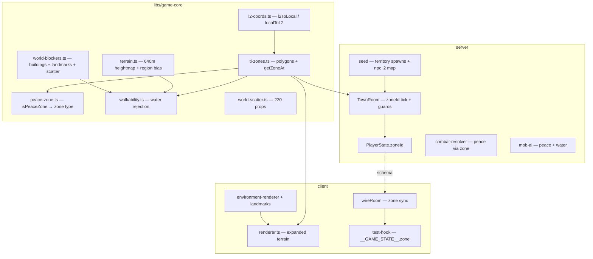

# Phase 23 — Full Talking Island World & Zones Design

**Spec**: `.specs/features/phase-23-ti-world/spec.md`
**Status**: Draft

---

## Architecture Overview

Phase 23 **supersedes the AD-006 200 m patch** with a **640 m semantic TI layout** while
keeping Phase 9 walkability (AD-018). Pure rules live in `@nj/game-core`; the server
replicates `PlayerState.zoneId`; the client renders expanded terrain, landmarks, and
`__GAME_STATE__.zone`.



**Constraints honored:** AD-001, AD-003, AD-006 (partial supersede), AD-013, AD-014,
AD-017, AD-018.

---

## Approach Exploration

| Approach | Strategy | Pros | Cons | |
| -------- | -------- | ---- | ---- | - |
| **A — Single expanded heightmap + polygon zones (RECOMMENDED)** | Bump `TERRAIN_SIZE` to 640; zone registry in game-core; territory centroids → spawns | One room; reuses Phase 9 grid; testable pure functions | Large nav grid (~630² cells) — still OK (~400k cells) | ✅ |
| B — Tiled terrain chunks | Multiple meshes + chunk loader | Closer to MMO streaming | Out of scope; complicates pathfinding | |
| C — Import L2J peace polygons verbatim | Auto-convert XML nodes | Maximum fidelity | Heavy parser; float precision noise | |

**Recommendation: Approach A.** Hand-author six named zone polygons using L2 anchor points
from `l2ToLocal`, then map each L2J spawn **territory** to a zone via centroid.

---

## L2 → Local Coordinate Module

**Location:** `libs/game-core/src/l2-coords.ts`

```typescript
export const L2_ANCHOR = { x: -84300, y: 243400 } as const;
export const L2_TO_LOCAL_SCALE = 0.01;

export function l2ToLocal(l2x: number, l2y: number): { x: number; z: number };
export function localToL2(x: number, z: number): { x: number; y: number };
```

**Rules (AD-013):**

- Village logical origin `(0, 0)` maps to `L2_ANCHOR` (not Roxxy's exact tile).
- `localZ = -(l2y - anchor.y) * scale` so L2 north (−Δy from village) maps to negative Z
  (consistent with existing field spawns using `z < 0` east of village).

---

## Zone Registry

**Location:** `libs/game-core/src/ti-zones.ts`

```typescript
export type ZoneType = 'peace' | 'combat' | 'fishing' | 'water';

export interface TiZone {
  id: string;
  displayName: string;
  type: ZoneType;
  /** Convex polygon vertices in local XZ (metres), closed implicitly */
  polygon: ReadonlyArray<{ x: number; z: number }>;
}

export interface ZoneHit {
  zoneId: string;
  displayName: string;
  type: ZoneType;
}

export function getZoneAt(x: number, z: number): ZoneHit;
export function isWaterZone(x: number, z: number): boolean;
export function listTiZones(): readonly TiZone[];
```

### Named zones (polygon centres approximate)

| zoneId | displayName | type | Anchor (x, z) | Notes |
| ------ | ----------- | ---- | --------------- | ----- |
| `ti_village` | Talking Island Village | peace | (0, 0) | Union of L2J peace zone footprint (~90×80 m) |
| `eastern_fields` | Eastern Fields | combat | (−110, 29) | Starter–mid mob bands |
| `obelisk` | Obelisk of Victory | combat | (−155, 58) | Quest landmark (Q00104, Q00155) |
| `elven_ruins` | Elven Ruins | combat | (−281, 87) | Mid/high mobs + spiders |
| `harbor` | Talking Island Harbor | fishing | (−224, 287) | Shore band; dock prop |
| `cave_of_souls` | Cave of Souls | combat | (−242, 254) | Northern cliff cave mouth |
| *(fallback)* | Wilderness | combat | — | Any point outside polygons |

**Overlap resolution:** If a point lies in multiple polygons, choose the zone with the
**smallest bounding-box area**; tie-break lexicographic `zoneId`.

**Harbor water:** A child polygon inside `harbor` with `type: 'water'` (dock basin).

**`peace-zone.ts` migration:**

```typescript
export function isInPeaceZone(x: number, z: number): boolean {
  return getZoneAt(x, z).type === 'peace';
}
```

Remove `PEACE_ZONE` rectangle export (update tests to polygon samples).

---

## Terrain Expansion

**Location:** `libs/game-core/src/terrain.ts`

| Constant | Old | New |
| -------- | --- | --- |
| `TERRAIN_CONFIG.size` | 200 | **640** |
| `TERRAIN_CONFIG.segments` | 64 | **128** |
| `heightScale` | 10 | 10 (unchanged) |

**Region height bias** (additive noise multiplier per zone at sample time):

| Zone | Bias |
| ---- | ---- |
| `ti_village` | Flattened ±0.3 m (plateau) |
| `harbor` / `water` | −1.5 m depression toward coast |
| `elven_ruins` / `cave_of_souls` | +2 m rocky rise |
| `eastern_fields` | Default noise |

Implementation: `sampleHeight(x,z)` multiplies noise by `regionFactor(getZoneAt(x,z).zoneId)`.

**Nav grid:** `walkability-grid.ts` recomputes at new bounds; expect ~630×630 cells — bake
once per server boot (unchanged pattern).

---

## Territory → Zone Map

Parse `TalkingIslandMonsters.xml` territory names; assign `zoneId` by **territory centroid**
(nearest named zone anchor) with manual overrides for ambiguous bands:

| Territory prefix / name pattern | zoneId |
| ------------------------------- | ------ |
| `gludio32_1725_*` (village-adjacent) | `eastern_fields` or `ti_village` border |
| `gludio31_1725_*` | `eastern_fields` |
| `gludio31_1624_*` | `elven_ruins` |
| `gludio31_1625_*` | `cave_of_souls` / `elven_ruins` (centroid &lt; 250 m from ruins → ruins) |
| Northern high-Y territories (y &gt; 248000) | `harbor` / `cave_of_souls` |

**Spawn scatter algorithm** (`server/src/seed/territory-spawns.ts`):

1. For each XML `<spawn>` block, compute territory centroid in L2 → `l2ToLocal`.
2. Resolve `zoneId` via `territoryZoneMap`.
3. For each `<npc count="N">`, place `N` points with **seeded RNG** inside territory
   polygon (reject until walkable + not peace/water) — store in `mob_spawns.json`.
4. Preserve `respawnSec` from XML (`27` default).

**Gremlin/Goblin (20001/20003):** 4 rows near `eastern_fields` / village edge (tutorial).

---

## NPC Re-home

**Location:** `server/src/seed/__fixtures__/npc_spawns.json`

Each Phase 17 NPC: `l2ToLocal` from `Gludio.xml` exact `(x,y)` → `(x,z)`; clamp if inside
building blocker (shift +2 m along outward normal). All must land in `ti_village` peace.

| npcId | L2 (x, y) | Expected local (approx) |
| ----- | --------- | ----------------------- |
| 30004 Katerina | (−84165, 240670) | (−8.7, 27.3) |
| 30006 Roxxy | (−84311, 244305) | (−10.1, −9.1) |
| 30001 Lector | (−86322, 241215) | (−20.2, 21.9) |

---

## Server Zone Replication

**Schema** (`server/src/rooms/schema/PlayerState.ts`):

```typescript
@type('string') zoneId: string = 'ti_village';
```

**TownRoom tick:** after movement + Y snap, `player.zoneId = getZoneAt(player.x, player.z).zoneId`.

**Combat / AI:** replace `isInPeaceZone` imports with zone type checks (keep helper).

**Water:** `isWalkable` rejects when `isWaterZone(to.x, to.z)`.

---

## Client

| File | Change |
| ---- | ------ |
| `renderer.ts` | Import expanded `TERRAIN_CONFIG`; widen path preview |
| `environment-renderer.ts` | Landmark props + expanded scatter |
| `environment-manifest.ts` | `landmarks: LandmarkEntry[]` |
| `test-hook.ts` | `GameState.zone: { id: string; type: string; displayName: string }` |
| `wireRoom` / `room.ts` | Map `player.zoneId` → hook |

**Landmark GLBs** (`client/public/models/props/landmarks/`):

| File | Zone | Scale note |
| ---- | ---- | ---------- |
| `Obelisk.glb` | obelisk | Tall pillar ~8 m |
| `ElvenRuins.glb` | elven_ruins | Broken arch cluster |
| `RuinsArch.glb` | elven_ruins | Secondary ruin piece |
| `HarborDock.glb` | harbor | Pier + posts |
| `CaveEntrance.glb` | cave_of_souls | Rock mouth |
| `FieldShrine.glb` | eastern_fields | Small roadside shrine |

Static props only (`static-prop.ts`); visual gate + `shoot-environment.mjs map-overview`.

---

## Blockers

| Category | Source |
| -------- | ------ |
| Village buildings | Updated `BUILDING_LAYOUT` centres (same w×d) |
| Landmarks | `LANDMARK_AABBS` / circles (dock, ruins, obelisk) |
| Scatter trees/rocks | `getPropBlockers()` with new scatter params |
| Water | Not blockers — `isWaterZone` handles movement |

---

## Code Reuse Analysis

| Component | Location | How to Use |
| --------- | -------- | ---------- |
| `sampleHeight` / `isWalkable` / A* | `libs/game-core` | Extend bounds + water check |
| `peace-zone.ts` | game-core | Delegate to `getZoneAt` |
| `spawn-placement.spec.ts` | server seed | Extend zone assertions |
| `spawn-manager.ts` | server | Unchanged spawn load |
| `static-prop.ts` / env renderer | client | Landmark pattern from Phase 15 |
| `territory-spawns` (new) | server seed | Centroid scatter |
| `visual-gate.mjs` | scripts | Auto-discovers new GLBs |

---

## Components

### `l2-coords.ts`

- **Purpose:** Deterministic L2J ↔ local metric conversion (AD-013).
- **Location:** `libs/game-core/src/l2-coords.ts`
- **Interfaces:** `l2ToLocal`, `localToL2`, constants.
- **Reuses:** None (new).

### `ti-zones.ts`

- **Purpose:** Named zone polygons + point lookup.
- **Location:** `libs/game-core/src/ti-zones.ts`
- **Dependencies:** `l2-coords` for anchor authoring.
- **Reuses:** Point-in-polygon util (inline or `game-core` geometry).

### `territory-spawns.ts`

- **Purpose:** Build `mob_spawns.json` from L2J XML + zone map.
- **Location:** `server/src/seed/territory-spawns.ts`
- **Dependencies:** `l2-coords`, `getZoneAt`, `isWalkable`, seeded RNG.
- **Reuses:** `spawns.parser` types.

### Landmark manifest + renderer hook

- **Purpose:** Place six static GLBs; expose `__GAME_STATE__.environment.landmarks`.
- **Location:** `client/src/scene/environment-manifest.ts`, `landmark-renderer.ts`
- **Reuses:** Phase 15 `static-prop.ts`.

---

## Error Handling Strategy

| Error Scenario | Handling | User Impact |
| -------------- | -------- | ----------- |
| Spawn fails walkability after 20 retries | Seed script throws with territory name | `nx test server` fails fast |
| GLB missing | Primitive fallback box + `renderKind: 'primitive'` | Visible placeholder |
| Move into water | Server rejects step | Character stops at shore |
| Zone polygon gap | `wilderness` combat zone | Still playable |

---

## Risks & Concerns

| Concern | Location | Impact | Mitigation |
| ------- | -------- | ------ | ---------- |
| Nav grid size 630² | `walkability-grid.ts` | Slower bake (~4× cells) | One-time boot bake; unit test cap bake time &lt; 3 s |
| Peace tests use hardcoded coords | `TownRoom.spec.ts` | Break on layout shift | Centralize `ZONE_TEST_COORDS` constants in spec |
| Building/NPC overlap after NPC re-home | `world-blockers.ts` | Blocked interact | `isNpcSpawnBlocked` gate in TIW23-34 |
| Phase 22 ring tiers obsolete | `spawn-placement.spec.ts` | Test failure | Replace ring table with zone-tier table |
| `PEACE_ZONE` rectangle removed | many imports | Compile break | Keep `isInPeaceZone` shim |

---

## Tech Decisions

| Decision | Choice | Rationale |
| -------- | ------ | --------- |
| World size | 640 m | Fits harbor + ruins with 0.01 scale |
| Zone shape | Hand convex polygons | L2J NPoly without XML importer |
| Cave of Souls | Northern combat pocket | ROADMAP name; TI-adjacent coast |
| Fishing | Metadata only | No fishing skill in MVP |
| Player zone field | Replicated `zoneId` string | Phase 28 minimap consumes it |
| Supersede AD-006 patch | Partial — semantic layout only | Geodata still deferred |

> **Project-level:** If Verifier confirms 640 m as standard, append **AD-019** in
> `STATE.md` after PASS (Implementer/Orchestrator — not Planner).

---

## File Touch List

| File | Action |
| ---- | ------ |
| `libs/game-core/src/l2-coords.ts` | **Add** |
| `libs/game-core/src/ti-zones.ts` | **Add** |
| `libs/game-core/src/peace-zone.ts` | **Modify** — delegate to zones |
| `libs/game-core/src/terrain.ts` | **Modify** — size 640 + region bias |
| `libs/game-core/src/world-constants.ts` | **Modify** — bounds ±315 |
| `libs/game-core/src/walkability.ts` | **Modify** — water rejection |
| `libs/game-core/src/world-blockers.ts` | **Modify** — landmarks + buildings |
| `libs/game-core/src/world-scatter.ts` | **Modify** — opts defaults |
| `server/src/seed/territory-spawns.ts` | **Add** |
| `server/src/seed/__fixtures__/mob_spawns.json` | **Regenerate** |
| `server/src/seed/__fixtures__/npc_spawns.json` | **Regenerate** |
| `server/src/rooms/schema/PlayerState.ts` | **Modify** — `zoneId` |
| `server/src/rooms/TownRoom.ts` | **Modify** — zone tick |
| `server/src/rooms/combat-resolver.ts` | **Modify** — use zone peace |
| `server/src/rooms/mob-ai.ts` | **Modify** — use zone peace |
| `client/src/scene/renderer.ts` | **Modify** — expanded terrain |
| `client/src/scene/environment-manifest.ts` | **Modify** — landmarks |
| `client/src/scene/landmark-renderer.ts` | **Add** |
| `client/src/test-hook.ts` | **Modify** — `zone` |
| `client/src/net/room.ts` | **Modify** — zone wiring |
| `client/public/models/props/landmarks/*.glb` | **Add** ×6 |
| `scripts/shoot-environment.mjs` | **Modify** — map-overview shot |
