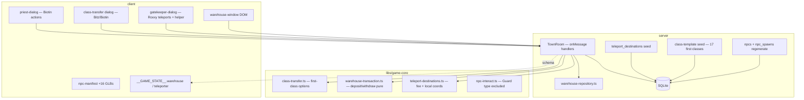

# Phase 24 — Town Services & Full NPC Roster Design

**Spec**: `.specs/features/phase-24-town-services/spec.md`
**Status**: Draft

---

## Architecture Overview

Phase 24 extends the Phase 17 NPC pipeline with **four server service modules** and
matching client dialogs. Pure rules (transfer eligibility, warehouse math, teleport
fees, placement guards) live in `@nj/game-core`; `TownRoom` owns intents and persistence
(AD-001). No `NpcState` gameplay fields added (guards remain cosmetic).



### Event order (`TownRoom`) — Phase 24 delta

Existing tick order (Phase 20/23) unchanged. New handlers are **intent-driven**:

1. `interact` → branch: Merchant / Warehouse / Teleporter / Trainer / Folk / Priest / Guard (none).
2. `warehouseDeposit` / `warehouseWithdraw` → pure transaction → persist → sync inventory + warehouse mirror.
3. `teleport` → validate fee + destination → deduct adena → set `x,z` + snap Y + update `zoneId`.
4. `classTransfer` → validate master NPC + level + options → update `classId` + vitals/stats → `grantAutoGetSkills`.
5. `npcAction` extended: `heal` | `starterKit` (Roxxy) | `resurrect` | `bless` (Biotin).

---

## Code Reuse Analysis

### Existing Components to Leverage

| Component | Location | How to Use |
| --------- | -------- | ---------- |
| `TI_NPC_IDS` + npc seeders | `server/src/seed/paths.ts`, `npcs.seeder.ts` | Extend to 25 ids |
| `buildNpcSpawnFixture` | `server/src/seed/npc-spawn-fixture.ts` | Regenerate spawns from Gludio XML |
| `learnSkill` handler | `server/src/rooms/TownRoom.ts` | Expand `TRAINER_NPC_IDS` |
| `class_templates` seed | Phase 19 `class-templates.seeder.ts` | Add first-class XML fixtures |
| `grantAutoGetSkills` | `server/src/db/character-repository.ts` | Call after class transfer |
| `applyHeal` / effects | `server/src/rooms/npc-actions.ts`, effect tick | Biotin heal + bless |
| `npc-dialog` variants | `client/src/ui/npc-dialog.ts` | Enable warehouse; add gatekeeper/priest |
| `shop-transaction` pattern | `server/src/rooms/shop-transaction.ts` | Template for warehouse pure fns |
| `l2ToLocal` | `libs/game-core/src/l2-coords.ts` | Teleport destination coords |
| `getZoneAt` | `libs/game-core/src/ti-zones.ts` | Post-teleport `zoneId` |
| Phase 17 NPC GLB pipeline | `client/public/models/npcs/` | New folk + guard assets |
| Room harness | `TownRoom.spec.ts` `tick()`/`deliver()` | AD-014 |

### Integration Points

| System | Integration Method |
| ------ | ------------------ |
| Colyseus schema | Optional parallel arrays `warehouseItemIds[]` + `warehouseItemCounts[]` on `PlayerState` (max 100) for UI sync |
| SQLite | `warehouse_items`; `teleport_destinations`; extend `class_templates` |
| Client `wireRoom` | Sync warehouse arrays; expose `__GAME_STATE__.warehouse` |
| Quests | Update `quests.json` Q153 deliver npcId → **30041** |

---

## Architecture Decisions

### Decision 1: Roxxy role split

| Option | Pros | Cons | Decision |
| ------ | ---- | ---- | -------- |
| **A — Teleport + retain helper on Roxxy** | Q255 unchanged; authentic teleporter | Busy dialog | **Selected** |
| B — Move helper to Biotin only | Cleaner Roxxy | Breaks Q255 anchors | Rejected |

### Decision 2: Mystic class transfer location

| Option | Pros | Cons | Decision |
| ------ | ---- | ---- | -------- |
| **A — Biotin (`VillageMasterPriest`)** | Matches L2J `FirstClassTransferTalk` | Two master NPCs | **Selected** |
| B — Bitz handles all classes | Single NPC | Wrong type for mystics | Rejected |

### Decision 3: Guard interaction

| Option | Pros | Cons | Decision |
| ------ | ---- | ---- | -------- |
| **A — Non-interactable static idle** | Fast; AD-014 friendly | Less flavor | **Selected** |
| B — Patrol waypoints | Authentic | Tick + test complexity | Deferred |
| C — Talk-only flavor dialog | Immersive | Extra UI | Deferred |

### Decision 4: Warehouse replication

| Option | Pros | Cons | Decision |
| ------ | ---- | ---- | -------- |
| **A — Replicate warehouse arrays on `PlayerState`** | `wireRoom` + tests easy (AD-009) | Wire overhead | **Selected** |
| B — Fetch on dialog open only | Smaller schema | Harder client tests | Rejected |

### Decision 5: Teleport scope

| Option | Pros | Cons | Decision |
| ------ | ---- | ---- | -------- |
| **A — TI destinations only (5)** | Stays in `WORLD_*` | No Gludin | **Selected** |
| B — Include Gludin | Retail-complete | Outside map; needs new zone | Post-TI |

### Decision 6: Class transfer quest items

| Option | Pros | Cons | Decision |
| ------ | ---- | ---- | -------- |
| **A — Free at level 20** | Testable; unblocks TI | Less authentic | **Selected** |
| B — Port L2J medallion quests | Authentic | Large quest scope | Post-TI |

### Decision 7: Guard GLB strategy

| Option | Pros | Cons | Decision |
| ------ | ---- | ---- | -------- |
| **A — 4 KayKit knight variants × 2 guards** | Distinct enough; AD-017 | Not 8 unique | **Selected** |
| B — 8 unique GLBs | Maximum fidelity | Asset churn | Rejected |

---

## Database Schema

### `warehouse_items` (new)

| Column | Type | Notes |
| ------ | ---- | ----- |
| `character_id` | TEXT FK | |
| `item_id` | INTEGER | |
| `count` | INTEGER | ≥ 1 |
| PK | (`character_id`, `item_id`) | |

### `teleport_destinations` (new)

| Column | Type | Notes |
| ------ | ---- | ----- |
| `npc_id` | INTEGER | Gatekeeper npcId (**30006**) |
| `destination_id` | TEXT | e.g. `obelisk` |
| `display_name` | TEXT | UI label |
| `local_x` | REAL | metres |
| `local_z` | REAL | metres |
| `fee_adena` | INTEGER | Retail fee |
| PK | (`npc_id`, `destination_id`) | |

### `class_templates` / `class_level_vitals` (extend)

Add **17** first-class rows (classIds **1, 4, 7, 11, 15, 19, 22, 26, 29, 32, 35, 39, 42, 45, 47, 50, 54, 56**) from trimmed L2J template XML fixtures (AD-012).

### `class_transfer_graph` (optional seed table)

Alternatively a pure TS map in `game-core` (preferred for unit tests):

```typescript
export const FIRST_CLASS_OPTIONS: Readonly<Record<number, readonly number[]>> = {
  0: [1, 4, 7],
  10: [11, 15],
  // …
};
```

---

## Server Modules

### `warehouse-transaction.ts` (pure)

```typescript
export interface WarehouseDepositInput {
  inventoryCount: number;
  warehouseCount: number;
  quantity: number;
  isQuestItem: boolean;
  distinctWarehouseItems: number;
  maxStacks: number; // 100
}

export function depositToWarehouse(input: WarehouseDepositInput):
  | { ok: true; inventoryCount: number; warehouseCount: number }
  | { ok: false; reason: string };
```

Mirror `withdrawFromWarehouse`. `TownRoom` calls `saveWarehouse` / `loadWarehouse` via repository.

### `class-transfer.ts` (game-core pure)

```typescript
export function getFirstClassOptions(starterClassId: number): readonly number[];
export function canTransferClass(opts: {
  currentClassId: number;
  targetClassId: number;
  level: number;
  masterKind: 'fighter' | 'priest';
}): boolean;
```

`masterKind` from NPC type: `VillageMasterFighter` → fighter starters; `VillageMasterPriest` → mystic starters.

### `TownRoom.handleClassTransfer`

1. Validate proximity to Bitz or Biotin.
2. `canTransferClass` (level ≥ 20, option list, not already first-class).
3. Load new template + vitals at current level; update `characters` + `PlayerState`.
4. `grantAutoGetSkills(db, characterId, targetClassId)`.
5. Persist; schedule debounced save.

### Teleport handler

1. Validate proximity to Roxxy (**30006**).
2. Lookup `teleport_destinations` row.
3. `adena >= fee`; player alive.
4. Set `player.x/z`, `snapEntityY`, recompute `zoneId`, deduct adena.

### Biotin `npcAction` extensions

| Action | Handler |
| ------ | ------- |
| `resurrect` | if `hp <= 0` → `hp = maxHp` |
| `heal` | `applyHeal` full |
| `bless` | apply Might **1068** via existing effect helper (Phase 20) |

---

## Client Components

### Dialog routing (`resolveNpcDialogVariant`)

| npcId / type | Variant | Actions |
| ------------ | ------- | ------- |
| 30005 / Warehouse | `warehouse` | Deposit / Withdraw enabled → open `#warehouse-window` |
| 30006 / Teleporter | `gatekeeper` | Teleport list + Heal + Starter Kit |
| 30026 / VillageMasterFighter | `trainer` | Learn skills + **Change Class** (fighter) |
| 30031 / VillageMasterPriest | `priest` | Resurrect / Heal / Bless + **Change Class** (mystic) |
| Folk | `folkTrainer` | Learn skills (unchanged) |
| Guard | — | No dialog |

### `#warehouse-window`

- Lists inventory stacks (left) and warehouse stacks (right) from `PlayerState` mirrors.
- Quantity input + Deposit / Withdraw buttons send intents.
- `__GAME_STATE__.warehouse: Record<number, number>` for tests.

### Gatekeeper dialog

- Static destination list from client constants mirroring seed fees (AD-001: server validates).
- `sendTeleport({ destinationId })` intent.

---

## NPC Asset Plan

| Group | npcIds | Asset strategy |
| ----- | ------ | -------------- |
| Folk trainers (new) | 30028–30030, 30032, 30034–30036 | KayKit Adventurers (6 distinct; no byte-copy) |
| Biotin | 30031 | KayKit Mage or Knight reskin + priest title |
| Guards | 30039–30046 | 4 KayKit Knight variants (Gilbert/Leon = A, Arnold/Abellos = B, …) |

`scripts/visual-gate.mjs` extended with `phase-24-town-npcs` entries.

---

## Error Handling Strategy

| Error Scenario | Handling | User Impact |
| -------------- | -------- | ----------- |
| Deposit quest item | Reject intent | No state change |
| Teleport broke (unwalkable dest) | Seed validation prevents; runtime clamp via `snapEntityY` | Safe landing |
| Transfer invalid class | Reject | Dialog stays open |
| Warehouse over capacity | Reject deposit | Message in dialog (optional) |
| Missing GLB | Capsule fallback + `renderKind: 'primitive'` in tests fail | Visual gate catches |

---

## Risks & Concerns

| Concern | Location | Impact | Mitigation |
| ------- | -------- | ------ | ---------- |
| 25 NPCs × greet GLB load | Client boot | Memory | Reuse cached rig per model path |
| `npc_spawns.json` regen shifts coords | Room tests | Failures | Centralize `NPC_TEST_COORDS` constants |
| Class transfer vitals jump | `class_level_vitals` | HP/MP discontinuity | Full restore on transfer (L2J-like) |
| Roxxy dialog complexity | `npc-dialog.ts` | UI bugs | Separate `gatekeeper` variant |
| Q255 Roxxy dependency | quests | Regression | TOWN24-35 room test |

---

## Tech Decisions

| Decision | Choice | Rationale |
| -------- | ------ | --------- |
| Final `TI_NPC_IDS` | 25 | ROADMAP full town roster |
| Guards | Static idle, no interact | Scope + AD-014 |
| Transfer level | 20 | L2J ClassMaster |
| Gludin teleport | Excluded | Outside world bounds |
| Priest bless | Might 1068 | Reuses Phase 20 effect engine |

---

## File Touch List

| File | Action |
| ---- | ------ |
| `server/src/seed/paths.ts` | **Modify** — `TI_NPC_IDS` ×25 |
| `server/src/seed/__fixtures__/npcs.xml` | **Modify** — +16 NPCs |
| `server/src/seed/__fixtures__/npc_spawns.json` | **Regenerate** |
| `server/src/seed/__fixtures__/players/` | **Add** — first-class template XML subset |
| `server/src/seed/seeders/class-templates.seeder.ts` | **Modify** — first classes |
| `server/src/seed/seeders/teleport-destinations.seeder.ts` | **Add** |
| `server/src/db/schema.ts` | **Modify** — warehouse + teleport tables |
| `server/src/db/warehouse-repository.ts` | **Add** |
| `libs/game-core/src/class/class-transfer.ts` | **Add** |
| `libs/game-core/src/warehouse/warehouse-transaction.ts` | **Add** |
| `libs/game-core/src/npc/npc-interact.ts` | **Modify** — exclude Guard |
| `server/src/rooms/TownRoom.ts` | **Modify** — handlers |
| `server/src/rooms/schema/PlayerState.ts` | **Modify** — warehouse arrays |
| `client/src/ui/warehouse-window.ts` | **Add** |
| `client/src/ui/npc-dialog.ts` | **Modify** — gatekeeper, priest, warehouse enabled |
| `client/src/scene/creature/npc-manifest.ts` | **Modify** — +16 entries |
| `client/public/models/npcs/*.glb` | **Add** — folk + guard variants |
| `client/src/net/room.ts` | **Modify** — intents + `__GAME_STATE__` |
| `server/src/seed/__fixtures__/quests/quests.json` | **Modify** — Q153 Arnold |
| `scripts/visual-gate.mjs` | **Modify** — phase 24 NPC shots |

---

## Requirement Traceability (Design)

| Spec AC | Design section |
| ------- | -------------- |
| TOWN24-01–10 | Seed + `buildNpcSpawnFixture` |
| TOWN24-11–16 | NPC manifest + guard non-interact |
| TOWN24-17–20 | `TRAINER_NPC_IDS` expansion |
| TOWN24-21–28 | `warehouse_items` + `warehouse-window` |
| TOWN24-29–35 | `teleport_destinations` + gatekeeper dialog |
| TOWN24-36–43 | `class-transfer.ts` + template seed |
| TOWN24-44–48 | Biotin `npcAction` extensions |
| TOWN24-49–50 | Quest fixture + gate |
