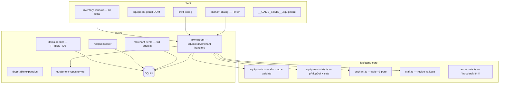

# Phase 25 — Items, Economy & Crafting Design

**Spec**: `.specs/features/phase-25-items-economy/spec.md`
**Status**: Draft

---

## Architecture Overview

Phase 25 replaces the single `equippedWeaponItemId` column with a **paper-doll
equipment model**, expands the **items master** into a TI economy catalog, and adds
three pure transaction modules in `@nj/game-core` — **equip**, **craft**, **enchant**
— orchestrated by `TownRoom` intents. Merchant buylists and mob drops feed the loop;
**Pinter (30298)** sells D-grade enchant scrolls.

Soulshots remain in the Phase 20 `useShot` / `armedShot` path (regression only this
phase). No new combat resolver architecture.



### Event order (`TownRoom`) — Phase 25 delta

Existing tick order (Phase 20/23/24) unchanged. New **intent-driven** handlers:

1. `equip { itemId }` → resolve target slot from `items.bodyPart` → swap inventory ↔
   `character_equipment` → recompute vitals → sync `PlayerState` equip arrays.
2. `unequip { slot }` → inverse of equip; reject if inventory full.
3. `craft { recipeId }` → dwarf class gate → `validateCraft` → consume ingredients +
   recipe item + MP → grant product.
4. `enchant { scrollItemId, slot }` → grade match → safe +3 cap → roll (100% ≤+3) →
   update `enchant_level` → consume scroll.

Combat tick reads `calcEffectivePAtk` / `calcPlayerPDef` with equipment + enchant +
set bonuses before damage formulas.

---

## Code Reuse Analysis

### Existing Components to Leverage

| Component | Location | How to Use |
| --------- | -------- | ---------- |
| `items` table + parser | `server/src/seed/parsers/items.parser.ts` | Extend fields + `TI_ITEM_IDS` |
| `merchant-items` seeder | `server/src/seed/seeders/merchant-items.seeder.ts` | Full buylist from fixtures |
| `validateEquip` / `applyEquip` | `server/src/rooms/equip-transaction.ts` | Generalize to all slots |
| `buyItem` / `sellItem` | `server/src/rooms/shop-transaction.ts` | Unchanged; more listings |
| `effectivePAtk` | `libs/game-core/src/combat/effective-patk.ts` | Extend with enchant |
| `calcClassBasePAtk` | `libs/game-core/src/combat/class-combat.ts` | Pattern for `calcClassBasePDef` |
| `useShot` / `armedShot` | `TownRoom.ts`, `combat-resolver.ts` | Regression; no structural change |
| `shop-window` / `inventory-window` | `client/src/ui/` | Extend equip buttons per slot |
| `npc-dialog` merchant branch | `client/src/ui/npc-dialog.ts` | Pinter + craft/enchant entry |
| Room harness | `TownRoom.spec.ts` `tick()`/`deliver()` | AD-014 |
| `wireRoom` | `client/src/net/room.ts` | Sync `equipment` on `PlayerState` |
| Phase 24 NPC pipeline | `TI_NPC_IDS`, spawn fixture | Add **30298** |

### Integration Points

| System | Integration Method |
| ------ | ------------------ |
| Colyseus schema | `equipSlotIds[]`, `equipItemIds[]`, `equipEnchantLevels[]` on `PlayerState` (length 11) |
| SQLite | `character_equipment`; `recipes`; `armor_sets`; extended `items` |
| Characters | Deprecate `equippedWeaponItemId` (migrate on load); keep column nullable during transition |
| Combat | `resolvePlayerAttack` / mob-vs-player damage read `calcPlayerPDef` |
| Client HUD | Vitals panel shows pDef; inventory shows per-slot equip actions |

---

## Components

### `equip-slots.ts` (game-core)

- **Purpose**: Map L2J `bodypart` → slot key; validate equip/unequip rules.
- **Location**: `libs/game-core/src/items/equip-slots.ts`
- **Interfaces**:
  - `bodyPartToSlot(bodyPart: string): EquipSlot | null`
  - `validateEquip(params): EquipResult` — ownership, type, slot, two-hand rules
  - `validateUnequip(params): UnequipResult`
- **Dependencies**: Item type enum
- **Reuses**: Phase 7 `equip-transaction` logic

### `equipment-stats.ts` (game-core)

- **Purpose**: Aggregate pAtk/pDef/mDef from paper doll + enchant + sets.
- **Location**: `libs/game-core/src/items/equipment-stats.ts`
- **Interfaces**:
  - `calcEffectivePAtk(base, weapon, enchantLevel)`
  - `calcPlayerPDef(base, armorPieces, enchants, setBonus)`
  - `calcArmorSetBonus(equippedItemIds): SetBonus`
- **Dependencies**: `enchant.ts`, `armor-sets.ts`
- **Reuses**: `effective-patk.ts`, class template stats

### `enchant.ts` (game-core)

- **Purpose**: Pure enchant roll + stat bonus formulas (Classic safe zone).
- **Location**: `libs/game-core/src/items/enchant.ts`
- **Interfaces**:
  - `canEnchant(item, scroll, currentLevel): EnchantReject | null`
  - `rollEnchant(currentLevel, rng): EnchantOutcome` — 100% for +1..+3
  - `enchantPAtkBonus(weaponType, bodyPart, level)`
  - `enchantPDefBonus(level)`
- **Dependencies**: Seeded RNG
- **Reuses**: L2J `EnchantItemGroups` rates (0-2 → 100%)

### `craft.ts` (game-core)

- **Purpose**: Validate dwarf craft transactions.
- **Location**: `libs/game-core/src/items/craft.ts`
- **Interfaces**:
  - `canCraft(classId, recipe, inventory, mp): CraftReject | null`
  - `applyCraft(inventory, recipe): CraftResult`
- **Dependencies**: Recipe row shape
- **Reuses**: `shop-transaction` inventory math patterns

### `equipment-repository.ts` (server)

- **Purpose**: CRUD `character_equipment`; migrate legacy weapon column.
- **Location**: `server/src/db/equipment-repository.ts`
- **Interfaces**:
  - `loadEquipment(db, characterId)`
  - `saveEquipmentSlot(db, characterId, slot, itemId, enchantLevel)`
  - `migrateLegacyWeapon(db, characterId, weaponItemId)`

### `items.seeder` / `recipes.seeder` (server)

- **Purpose**: Parse fixtures → SQLite.
- **Location**: `server/src/seed/seeders/`
- **Interfaces**: `seedItems`, `seedRecipes`, `seedArmorSets`, `seedMerchantItems` (extended)

### Client `inventory-window` + `equipment-panel`

- **Purpose**: Show all slots; Equip/Unequip per row; craft/enchant dialogs.
- **Location**: `client/src/ui/inventory-window.ts`, `equipment-panel.ts`, `craft-dialog.ts`, `enchant-dialog.ts`

---

## Data Models

### Extended `items`

```typescript
interface ItemRow {
  itemId: number
  name: string
  type: 'weapon' | 'armor' | 'accessory' | 'consumable' | 'shot' | 'recipe' | 'material' | 'etc'
  crystalType: 'NG' | 'D' | 'C' | 'B' | 'A' | 'S' | null
  pAtk: number | null
  pDef: number | null
  mDef: number | null
  randomDamage: number | null
  bodyPart: string | null
  weaponType: string | null
  enchantEnabled: boolean
  recipeId: number | null
  isStackable: boolean
  isQuestItem: boolean
}
```

### `character_equipment`

```typescript
interface CharacterEquipmentRow {
  characterId: string
  slot: EquipSlot // 11 values
  itemId: number
  enchantLevel: number // 0..3 this phase
}
```

### `recipes`

```typescript
interface RecipeRow {
  recipeId: number
  name: string
  craftLevel: number
  successRate: number // 100 for TI subset
  mpCost: number
  productItemId: number
  productCount: number
  ingredientsJson: string // [{ itemId, count }]
}
```

### `armor_sets`

```typescript
interface ArmorSetRow {
  setId: number
  requiredItemIdsJson: string
  pDefPercentBonus: number
  maxHpBonus: number
}
```

**Relationships**: `character_equipment.item_id` → `items`; `recipes.product_item_id` → `items`; craft consumes `recipe_id` via etcitem `recipe_id` column.

---

## Error Handling Strategy

| Error Scenario | Handling | User Impact |
| -------------- | -------- | ----------- |
| Equip unowned item | Reject silently (MVP) | No state change |
| Wrong bodyPart for slot | `invalid_slot` | No equip |
| Craft wrong class | `not_dwarf` | No craft |
| Missing ingredients | `missing_ingredients` | No partial consume |
| Enchant +4 attempt | `max_safe_enchant` | Dialog shows cap |
| Grade mismatch scroll | `wrong_scroll` | No enchant |
| Unequip inventory full | `inventory_full` | Stay equipped |

---

## Risks & Concerns

| Concern | Location | Impact | Mitigation |
| ------- | -------- | ------ | ---------- |
| `equippedWeaponItemId` widely referenced | `TownRoom`, client, tests | Break equip + attachment | Migration task T5; keep read fallback one phase |
| Schema array size on `PlayerState` | `TownState.ts` | Wire bloat | Fixed 11 slots; parallel arrays |
| Item parser hard-coded `ITEM_IDS` | `items.parser.ts:4` | Blocks bulk seed | Replace with file-driven id list from fixture manifest |
| Combat tests anchor naked pAtk | `combat-resolver.spec.ts` | Drift when armor affects player def | Room tests use explicit equip setup |
| Two-hand weapon slot conflict | New equip rules | Invalid dual wield | `lrhand` clears `rhand`; block `lhand` shield if `lrhand` |
| No player pDef in mob damage today | `TownRoom` mob attack | ITEM25-31 needs mob→player formula | Add `calcMobVsPlayerDamage` using player pDef |

---

## Tech Decisions

| Decision | Choice | Rationale |
| -------- | ------ | --------- |
| Equipment storage | `character_equipment` table, not JSON blob | Queryable; enchant per slot |
| Slot count | 11 simplified keys | Covers TI merchants without `hair`/`belt` |
| Enchant cap | Hard reject above +3 | ROADMAP stub; avoids break logic |
| NG enchant | Disabled | No L2J NG scroll |
| Blacksmith | Pinter **30298** new TI spawn | Phase 24 deferred |
| Set bonuses | Data-driven 2 sets, not full skill engine | Wooden/Mithril anchors suffice |
| Soulshot grade gate | Deferred strict check | Phase 20 regression priority |
| `TI_NPC_IDS` | **26** ids (+30298) | Document in paths.ts |

---

## L2J Fixture Files (AD-012)

| Fixture | Source |
| ------- | ------ |
| `items_ti.xml` | Subset of `stats/items/*.xml` for `TI_ITEM_IDS` |
| `recipes_ti.xml` | `Recipes.xml` items **1–19** |
| `Sets.xml` | Sets **0–1** only |
| `buylist_3000101.xml` etc. | Full merchant files (may trim price-only) |
| `skills_3500_3502.xml` | Set bonus skills (parse amounts) |

---

## Requirement → Component Map

| AC range | Primary module |
| -------- | -------------- |
| ITEM25-01–10 | seeders + schema |
| ITEM25-11–16 | merchant-items + npc seed |
| ITEM25-17–25 | equip-slots + equipment-repository + TownRoom |
| ITEM25-26–32 | equipment-stats + armor-sets + client HUD |
| ITEM25-33–36 | combat-resolver regression |
| ITEM25-37–42 | craft.ts + TownRoom |
| ITEM25-43–49 | enchant.ts + enchant-dialog |
| ITEM25-50–52 | drops seeder + gate |
