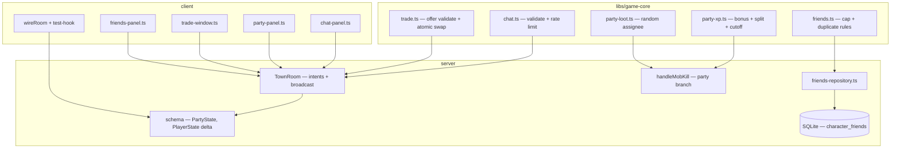

# Phase 26 — Social & Multiplayer Systems Design

**Spec**: `.specs/features/phase-26-social/spec.md`
**Status**: Draft

---

## Architecture Overview

Phase 26 adds four **intent-driven** social subsystems to the existing `TownRoom` loop.
Pure rules live in `@nj/game-core` (`chat`, `party-xp`, `trade`); `TownRoom` orchestrates
validation, replication, persistence (friends only), and hooks into `handleMobKill` for
party rewards. The client gains DOM panels for chat/party/trade/friends and extends
`wireRoom` + `__GAME_STATE__` (AD-009).

No new Colyseus room type — same `town` room, same AD-014 test harness.



### Event order (`TownRoom`) — Phase 26 delta

Existing tick order unchanged. New **message handlers** (registration in `onCreate`):

| Intent | Handler | Side effects |
| ------ | ------- | ------------ |
| `chat` | `handleChat` | rate limit → channel filter → `broadcast('chat')` |
| `partyInvite` | `handlePartyInvite` | pending invite map → `client.send('partyInvite')` |
| `partyAccept` / `partyDecline` | `handlePartyAccept/Decline` | create/join `PartyState` |
| `partyLeave` / `partyKick` | `handlePartyLeave/Kick` | mutate party, sync `partyId` |
| `tradeRequest` … `tradeConfirm` | `trade-handlers.ts` | session map, atomic swap on dual confirm |
| `friendAdd` / `friendRemove` | `friend-handlers.ts` | DB persist + `syncFriendsToPlayer` |

**Kill hook** (`handleMobKill`):

1. If killer in party → `distributePartyXp` + `distributePartyLoot` + quest credit for
   in-range members; else existing solo path (unchanged).
2. `persistCharacter` for each rewarded session.

**Disconnect** (`onLeave`): auto `partyLeave`, `tradeCancel`, refresh friends online flags.

---

## Code Reuse Analysis

### Existing Components to Leverage

| Component | Location | How to Use |
| --------- | -------- | ---------- |
| `TownRoom.onMessage` pattern | `server/src/rooms/TownRoom.ts` | Register social intents alongside combat/shop |
| `handleMobKill` | `server/src/rooms/TownRoom.ts:1589` | Branch for party XP/loot before solo `applyKillRewards` |
| `applyKillRewards` / `rollDrops` | `server/src/rooms/combat-resolver.ts` | Solo path; party uses `rollDrops` once then assigns |
| `onMobKilledForQuests` | `server/src/rooms/quest-handlers.ts` | Call per in-range party member |
| `buyItem` / inventory maps | `shop-transaction.ts`, `playerItems` | Trade swap mirrors inventory mutation patterns |
| `deliver` / `tick` harness | `server/src/rooms/TownRoom.spec.ts` | Two-session tests (AD-014) |
| `joinWithClass` / `createIsolatedTownRoom` | `TownRoom.spec.ts` | Multi-client isolation |
| `wireRoom` | `client/src/net/room.ts` | Extend `onMessage` + state callbacks |
| `test-hook` / `__GAME_STATE__` | `client/src/test-hook.ts` | Add `chat`, `party`, `trade`, `friends` |
| `characters.name` | `server/src/db/schema.ts` | Replicate as `PlayerState.characterName` |
| `isQuestItem` | `character-repository.ts` | Trade reject |

### Integration Points

| System | Integration Method |
| ------ | ------------------ |
| Colyseus schema | `PartyState` on `TownState`; `PlayerState.partyId`, `characterName` |
| SQLite | `character_friends` table + `friends-repository.ts` |
| Combat | `handleMobKill` party branch calls `game-core` distribution |
| Quests | Loop `onMobKilledForQuests` for eligible party members |
| Client HUD | New DOM panels; hotkeys deferred to Phase 28 |

---

## Components

### `chat.ts` (game-core)

- **Purpose**: Validate channel enum, text length, strip control chars; sliding-window rate limit.
- **Location**: `libs/game-core/src/social/chat.ts`
- **Interfaces**:
  - `validateChatMessage(input, rateState, nowMs): { ok: true, text } | { ok: false, error }`
  - `isInChatRange(ax, az, bx, bz, range): boolean`
- **Dependencies**: none
- **Reuses**: horizontal distance pattern from combat range checks

### `party-xp.ts` (game-core)

- **Purpose**: L2J party XP bonus table, level² split, level-gap cutoff.
- **Location**: `libs/game-core/src/social/party-xp.ts`
- **Interfaces**:
  - `calcPartyXpGrants(mobExp, members: { sessionId, level, inRange }[], highestLevel): Map<sessionId, number>`
- **Dependencies**: `grantXp` from progression module
- **Reuses**: Gremlin anchor tests from `combat-resolver.spec.ts`

### `party-loot.ts` (game-core)

- **Purpose**: Assign each rolled drop stack to random eligible member.
- **Location**: `libs/game-core/src/social/party-loot.ts`
- **Interfaces**:
  - `assignPartyDrops(drops, eligibleSessionIds, rng): Map<sessionId, DropStack[]>`
- **Reuses**: `rollDrops` output shape from combat

### `trade.ts` (game-core)

- **Purpose**: Validate offers; perform atomic two-party inventory+adena swap.
- **Location**: `libs/game-core/src/social/trade.ts`
- **Interfaces**:
  - `validateTradeOffer(offer, inventory, adena, equipment, isQuestItem): Result`
  - `executeTradeSwap(partyA, partyB): { inventoryA, inventoryB, adenaA, adenaB } | null`
- **Reuses**: `buyItem`/`sellItem` quantity validation style

### `friends.ts` (game-core)

- **Purpose**: Cap and duplicate rules (pure).
- **Location**: `libs/game-core/src/social/friends.ts`
- **Interfaces**:
  - `canAddFriend(currentCount, targetId, selfId, alreadyFriend): Result`

### `PartyState` (schema)

- **Purpose**: Replicated party membership for clients.
- **Location**: `server/src/rooms/schema/PartyState.ts`
- **Fields**: `id`, `leaderSessionId`, `memberSessionIds: string[]`
- **TownState**: `@type({ map: PartyState }) parties`

### `trade-handlers.ts` (server)

- **Purpose**: Ephemeral trade sessions (not persisted).
- **Location**: `server/src/rooms/trade-handlers.ts`
- **State**: `Map<tradeId, { a, b, offers, confirmed }>` on `TownRoom` private field
- **Reuses**: `playerItems`, `playerEquipment`, `scheduleDebouncedSave`

### `friends-repository.ts` (server)

- **Purpose**: CRUD `character_friends`.
- **Location**: `server/src/db/friends-repository.ts`
- **Reuses**: `character-repository` patterns (per-character rows)

### Client panels

| Panel | Location | Sends |
| ----- | -------- | ----- |
| Chat | `client/src/ui/chat-panel.ts` | `chat` |
| Party | `client/src/ui/party-panel.ts` | `partyInvite`, `partyAccept`, … |
| Trade | `client/src/ui/trade-window.ts` | `tradeRequest` … `tradeConfirm` |
| Friends | `client/src/ui/friends-panel.ts` | `friendAdd`, `friendRemove` |

---

## Data Models

### `character_friends`

```typescript
interface CharacterFriendRow {
  characterId: string
  friendCharacterId: string
  createdAtMs: number
}
```

**PK**: `(character_id, friend_character_id)` — one-way row per direction (A→B and B→A on
mutual add, or single row with symmetric UI — **chosen: two rows on add** for simpler
"my friends list" query).

### `PartyState` (Colyseus)

```typescript
class PartyState extends Schema {
  @type('string') id: string
  @type('string') leaderSessionId: string
  @type(['string']) memberSessionIds: ArraySchema<string>
}
```

### `PlayerState` additions

```typescript
@type('number') partyId: number = 0  // 0 = none; maps to PartyState key
@type('string') characterName: string = ''
```

### Trade session (server-only)

```typescript
interface TradeSession {
  id: string
  sessionA: string
  sessionB: string
  offerA: TradeOffer | null
  offerB: TradeOffer | null
  confirmedA: boolean
  confirmedB: boolean
}

interface TradeOffer {
  items: { itemId: number; count: number }[]
  adena: number
}
```

### `__GAME_STATE__` additions

```typescript
interface GameState {
  // ...existing
  chat: ChatLine[]           // last 20
  party: PartySnapshot | null
  trade: TradeSnapshot | null
  friends: FriendEntry[]
}

interface ChatLine {
  channel: 'all' | 'local' | 'trade' | 'party'
  text: string
  senderSessionId: string
  senderName: string
  timestampMs: number
}
```

---

## Error Handling Strategy

| Error Scenario | Handling | User Impact |
| -------------- | -------- | ----------- |
| Rate-limited chat | Silent reject (no broadcast) | Message not sent |
| Invalid party invite | No-op server-side | No party formed |
| Trade validation fail | `tradeError` message to initiator | Window shows error |
| Trade confirm race | Re-validate offers at confirm time | Swap only if still valid |
| Friend DB fail | Log + reject intent | Add friend fails |
| Disconnect mid-party | `onLeave` cleanup | Member removed from party |

---

## Risks & Concerns

| Concern | Location | Impact | Mitigation |
| ------- | -------- | ------ | ---------- |
| `handleMobKill` already complex | `TownRoom.ts:1589` | Party branch bugs affect XP economy | Extract `resolvePartyKillRewards` helper + unit tests before room wiring |
| Trade duplication exploit | New `trade-handlers.ts` | Item dup if non-atomic | Single `executeTradeSwap` pure fn; room test asserts conservation of item counts |
| Chat spam / abuse | New chat path | Room noise | Rate limit in game-core; length cap |
| Non-unique character names | `characters.name` | Friend add by name ambiguous | MVP: prefer `sessionId` / `characterId`; name lookup returns first match with warning in UI |
| `TownRoom.spec.ts` size | 4700+ lines | Slow gate risk | New `TownRoom.social.spec.ts` file for party/trade tests (AD-014 parallel-safe) |
| Party + solo quest double credit | `quest-handlers.ts` | Quest exploit | Quest handler idempotent per kill event per player |

---

## Tech Decisions

| Decision | Choice | Rationale |
| -------- | ------ | --------- |
| Party ID type | Monotonic `number` on room (`nextPartyId++`) | Fits Colyseus `MapSchema` numeric keys |
| Trade session storage | In-memory `Map` on room | Classic trade is ephemeral |
| Friend persistence | SQLite `character_friends` | Survives reconnect |
| Chat history | Client ring buffer from broadcasts | Server stateless for chat log |
| Party loot mode | Random in-range member | ROADMAP MVP; modes deferred |
| Separate social spec test file | `TownRoom.social.spec.ts` | Keeps harness maintainable |
| Kill attribution | Party bonus only if **killer** is in party | Avoids leech XP from non-party killer |

---

## Test Anchors (implementation reference)

| Scenario | Expected |
| -------- | -------- |
| Solo Gremlin kill L1 | killer `xp += 44` |
| Party 2×L1 Gremlin kill | each `xp += 28` |
| Trade A→B: 500 adena + 1835×10 for 1060×3 | Atomic swap; totals conserved |
| Local chat at distance 35 | Receiver does not get message |
| Party invite at distance 20 | Rejected (range 15) |
