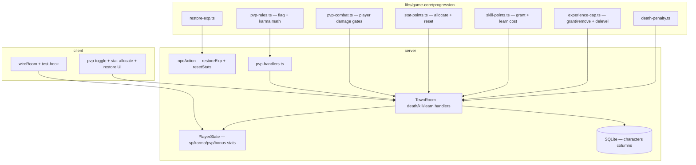

# Phase 27 — Progression Rules & PvP Design

**Spec**: `.specs/features/phase-27-progression-pvp/spec.md`
**Status**: Draft

---

## Architecture Overview

Phase 27 extends the authoritative `TownRoom` loop with **progression** and **PvP**
subsystems. Pure rules live in `@nj/game-core` (`progression/`); the server orchestrates
death/restore, SP, stat allocation, PvP flag decay, and player combat. Schema + SQLite
gain columns for `sp`, karma, stat bonuses, and `expBeforeDeath`. Client adds minimal
DOM controls (PvP toggle, stat allocate, restore button) and extends `wireRoom`.

Same `town` room; AD-014 test harness; new `TownRoom.progression.spec.ts` for heavy
room tests (keeps `TownRoom.spec.ts` lean).



### Event order (`TownRoom`) — Phase 27 delta

**Tick** (existing `simulate`):

1. Existing movement/combat/mob AI.
2. **NEW** `tickPvpFlags(now)` — clear expired `pvpFlag`.
3. Existing effect ticks.

**Death path** (`handlePlayerDeath`):

1. `emitPlayerAction(Die)`.
2. **NEW** `applyDeathPenalty({ level, xp, karma, killerKind }, curve, lossTable)` → `{ newXp, expBeforeDeath, lostExp }`.
3. **NEW** if level changed from delevel → `applyClassLevelUpReward` reverse via vitals lookup.
4. `resolvePlayerDeath` respawn position + full HP/MP (unchanged).
5. Persist `xp`, `expBeforeDeath`, `level`, vitals.

**Kill path** (`handleMobKill` / party branch):

1. Existing XP grant → **wrap** with `grantXpCapped(..., TI_LEVEL_CAP)`.
2. **NEW** `grantSp` solo or `distributePartySp` (mirrors party XP module).
3. **NEW** `applyKarmaReliefOnXp` when killer `karma < 0`.
4. **NEW** `awardStatPointOnLevelUp` when level increased.

**New message handlers**:

| Intent | Handler | Side effects |
| ------ | ------- | ------------ |
| `togglePvp` | `handleTogglePvp` | reject peace zone; set flag + endMs |
| `setTargetPlayer` | `handleSetTargetPlayer` | combat `targetPlayerSessionId` |
| `allocateStat` | `handleAllocateStat` | bonus++ / unspent-- |
| `resetStats` | `handleResetStats` | trainer proximity + adena + refund |
| `npcAction restoreExp` | `handleNpcAction` | Biotin restore branch |
| `attack` / `useSkill` (delta) | combat resolver | player target branch |

---

## Code Reuse Analysis

### Existing Components to Leverage

| Component | Location | How to Use |
| --------- | -------- | ---------- |
| `resolvePlayerDeath` | `libs/game-core/src/player-death.ts` | Keep respawn; penalty applied **before** call |
| `grantXp` | `libs/game-core/src/experience.ts` | Extend/wrap with cap + `removeXp` |
| `applyClassLevelUpReward` | `libs/game-core/src/class/class-vitals.ts` | Level-up/down vitals refresh |
| `applyKillRewards` | `server/src/rooms/combat-resolver.ts` | Extend for SP + cap |
| `distributePartyXp` | `libs/game-core/src/social/party-xp.ts` | Mirror for SP split |
| `handlePlayerDeath` | `server/src/rooms/TownRoom.ts` | Inject penalty + persistence |
| `handleLearnSkill` | `server/src/rooms/TownRoom.ts` | Add SP check/deduct |
| `handleNpcAction` | `server/src/rooms/TownRoom.ts` | Add `restoreExp` for Biotin |
| Peace zone guards | `server/src/rooms/combat-resolver.ts` | Extend to player targets |
| `isPeaceZone` / `getZoneAt` | `libs/game-core/src/world/zones.ts` | PvP toggle + damage guards |
| `TRAINER_NPC_IDS` | `client/src/scene/creature/npc-manifest.ts` | Reset stats trainer set |
| Party kill flow | `server/src/rooms/party-kill-rewards.ts` | Hook SP + cap |

### Integration Points

| System | Integration Method |
| ------ | ------------------ |
| SQLite `characters` | Migration: `sp`, `karma`, `pvp_kills`, `pk_kills`, `exp_before_death`, `unspent_stat_points`, `bonus_str`…`bonus_men` |
| `PlayerState` | Replicate new scalars for HUD/tests |
| Seed | `experience_loss` table + parser; fixture XML |
| Biotin dialog | `npc-dialog.ts` Restore XP button → `restoreExp` |
| Bitz/folk trainer dialog | Reset stats button → `resetStats` intent |

---

## Components

### `death-penalty.ts`

- **Purpose**: Pure death XP loss from L2J `experienceLoss` table.
- **Location**: `libs/game-core/src/progression/death-penalty.ts`
- **Interfaces**:
  - `calcDeathXpLoss(input, curve, lossTable): { lostExp, newXp, expBeforeDeath }`
  - `xpForLevel(level, curve): number`
  - `currentLevelExp(level, curve): number`
- **Dependencies**: `ExperienceCurveRow`, `ExperienceLossRow`
- **Reuses**: Phase 7 newbie `level ≤ 9` guard

### `experience-cap.ts`

- **Purpose**: Grant/remove XP with TI cap and delevel.
- **Location**: `libs/game-core/src/progression/experience-cap.ts`
- **Interfaces**:
  - `grantXpCapped(level, xp, add, curve, cap): XpGrantResult`
  - `removeXp(level, xp, amount, curve, opts): XpGrantResult`
- **Reuses**: `grantXp`, `levelFromCumulativeXp` from `experience.ts`

### `restore-exp.ts`

- **Purpose**: Biotin restore transaction.
- **Location**: `libs/game-core/src/progression/restore-exp.ts`
- **Interfaces**:
  - `calcRestoreExpCost(lostExp, costPerXp): number`
  - `applyRestoreExp(state, adena, opts): RestoreResult`

### `skill-points.ts`

- **Purpose**: SP grant on kill + learnSkill affordability.
- **Location**: `libs/game-core/src/progression/skill-points.ts`
- **Interfaces**:
  - `grantSp(current, amount): number`
  - `canAffordSkill(sp, levelUpSp): boolean`
  - `distributePartySp(...)` — parallel to party XP

### `stat-points.ts`

- **Purpose**: Level-up stat points, allocate, trainer reset.
- **Location**: `libs/game-core/src/progression/stat-points.ts`
- **Interfaces**:
  - `statPointsEarnedByLevel(level): number` → `max(0, level - 1)`
  - `allocateStatPoint(state, stat): StatResult`
  - `resetStatPoints(state, level): StatResult`
  - `effectiveStat(base, bonus): number`

### `pvp-rules.ts`

- **Purpose**: Flag timing, karma gain/relief, attack eligibility.
- **Location**: `libs/game-core/src/progression/pvp-rules.ts`
- **Interfaces**:
  - `applyTogglePvp(nowMs, zonePeace): ToggleResult`
  - `tickPvpFlag(nowMs, flag, endMs): 0 | 1`
  - `applyPkKarma(karma, pkCount): number`
  - `applyKarmaRelief(karma, xpGained): number`
  - `canAttackPlayer(attacker, target, zonePeace): boolean`

### `pvp-combat.ts`

- **Purpose**: Player damage using existing melee/skill formulas.
- **Location**: `libs/game-core/src/progression/pvp-combat.ts`
- **Interfaces**:
  - `resolvePlayerVsPlayerAttack(params): { damage, hit }` — reuses `calcMeleeDamage` pattern

### `pvp-handlers.ts`

- **Purpose**: TownRoom message handlers for PvP intents.
- **Location**: `server/src/rooms/pvp-handlers.ts`
- **Reuses**: `TownRoom` private maps, `playerCombat`

### Schema migration

- **Location**: `server/src/db/schema.ts` + `server/src/db/client.ts` `applySchema`
- **Characters columns**: see Data Models

---

## Data Models

### `characters` (new columns)

```typescript
// server/src/db/schema.ts — characters table additions
sp: integer('sp').notNull().default(0),
karma: integer('karma').notNull().default(0),
pvpKills: integer('pvp_kills').notNull().default(0),
pkKills: integer('pk_kills').notNull().default(0),
expBeforeDeath: integer('exp_before_death').notNull().default(0),
unspentStatPoints: integer('unspent_stat_points').notNull().default(0),
bonusStr: integer('bonus_str').notNull().default(0),
bonusDex: integer('bonus_dex').notNull().default(0),
bonusCon: integer('bonus_con').notNull().default(0),
bonusInt: integer('bonus_int').notNull().default(0),
bonusWit: integer('bonus_wit').notNull().default(0),
bonusMen: integer('bonus_men').notNull().default(0),
```

### `experience_loss` (new table)

```typescript
export const experienceLoss = sqliteTable('experience_loss', {
  level: integer('level').primaryKey(),
  percentLost: real('percent_lost').notNull(),
});
```

### `PlayerState` (replicated)

```typescript
@type('number') sp = 0;
@type('number') karma = 0;
@type('number') pvpFlag = 0;
@type('number') pvpFlagEndMs = 0;
@type('number') expBeforeDeath = 0;
@type('number') unspentStatPoints = 0;
// bonusStr…bonusMen replicated OR computed client-side from base + bonus — replicate for tests
@type('number') bonusStr = 0;
// … dex, con, int, wit, men
```

### Private combat state (not replicated)

```typescript
targetPlayerSessionId: string | null;
lastPlayerKillSessionId: string | null; // for death karma attribution
```

---

## Error Handling Strategy

| Error Scenario | Handling | User Impact |
| -------------- | -------- | ----------- |
| Insufficient adena for restore/reset | Reject intent; no state change | Dialog stays open |
| learnSkill insufficient SP | Reject; no skill row | Trainer dialog feedback |
| PvP toggle in peace zone | Reject | No flag |
| Attack invalid PvP target | 0 damage; no MP/cooldown spend for gated miss | No harm |
| allocateStat invalid / no points | Reject | — |
| XP grant at cap | Clamp level 20; still grant SP | Level bar full |

---

## Risks & Concerns

| Concern | Location | Impact | Mitigation |
| ------- | -------- | ------ | ---------- |
| `handlePlayerDeath` always full-heals | `TownRoom.ts:1695` | Biotin `resurrect` rarely used | Keep; restoreExp is separate service |
| `grantXp` has no cap today | `experience.ts` | Players could pass 20 | `grantXpCapped` wrapper; room tests |
| Combat only targets mobs | `combat-resolver.ts` | PvP needs parallel path | `targetPlayerSessionId` branch in T11 |
| `PlayerState.str` mirrors template only | `TownState.ts` | Stat bonuses invisible | Sync effective or bonus fields on allocate |
| Large `TownRoom.spec.ts` | 4700+ lines | Slow gate | New `TownRoom.progression.spec.ts` (AD-014) |
| Phase 7 death tests | `TownRoom.spec.ts` | Regression | Keep level-9 unchanged assertions |
| No `sp` column yet | `schema.ts` | Migration breaks old DBs | `applySchema` ALTER with defaults |

---

## Tech Decisions

| Decision | Choice | Rationale |
| -------- | ------ | --------- |
| TI cap constant | `TI_LEVEL_CAP = 20` in `game-core` | Single import for server + tests |
| Death penalty before respawn | Apply in `handlePlayerDeath` pre-teleport | One code path mob + PvP |
| Karma storage | Signed int `karma` (0 = innocent; negative = PK) | L2J `reputation` |
| Stat reset trainers | Bitz + folk trainers (not Biotin) | Priest ≠ stat master |
| PvP room tests file | `TownRoom.progression.spec.ts` | AD-014 file size |
| Party SP | Same split/bonus as XP | Spec PROG27-20 |
| `KARMA_EXP_LOST_MULT` | Default **1.0**; inject in unit test **1.1** for PROG27-45 | Testable without changing anchor |

> **Project-level:** If PvP flag/karma replication becomes a cross-phase contract, record
> in `STATE.md` after implementation — not required at plan time.

---

## Test Layer Map

| Layer | Files | ACs |
| ----- | ----- | --- |
| Unit `game-core` | `progression/*.spec.ts` | PROG27-01–04, 09–10, 15, 20–24, 27, 34–35, 37–38, 43, 45 |
| Seed | `experience-loss.seeder.spec.ts`, extend experience spec | PROG27-13–14 |
| Room | `TownRoom.progression.spec.ts` | PROG27-05–08, 11–12, 16–19, 25–26, 28–33, 39–42, 44, 46 |
| Client unit | `room-progression.spec.ts`, `test-hook.spec.ts` | PROG27-36, 47 |
| Gate | `nx run-many` | PROG27-48 |
