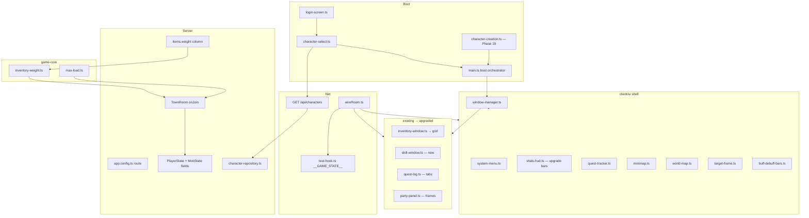

# Phase 28 — UI/UX Client Shell Design

**Spec**: `.specs/features/phase-28-ui-shell/spec.md`
**Status**: Draft

---

## Architecture Overview

Phase 28 is a **client-first shell refactor** with narrow server extensions for data the
UI must not invent (weight, character roster, effect timers, mob aggro target). Gameplay
outcomes remain server-authoritative (AD-001). All panels are **pure DOM** modules mounted
once; `wireRoom` pushes state into render functions. A central **window manager** owns
visibility, hotkeys, and `__GAME_STATE__.ui` (AD-009).



### Boot sequence (replaces `main.ts` today)

1. `initGameState()` — `connected: false`.
2. If no `nj.accountName` → mount `#login-screen`; stop.
3. Fetch `/api/characters?accountName=` → mount `#character-select-screen`.
4. On select → `connect({ characterId })` → mount renderer + `wireRoom` → register all
   panels with window manager → hide select overlay.
5. On create → mount `#character-creation` with `accountName`; on submit → POST create
   (or join with `create` + name) → select list refresh.

Canvas `#game` stays `display:none` until step 4 succeeds.

---

## Code Reuse Analysis

### Existing Components to Leverage

| Component | Location | How to Use |
| --------- | -------- | ---------- |
| `mountInventoryWindow` / `renderInventoryWindow` | `client/src/ui/inventory-window.ts` | Refactor list → grid; keep handlers + icons |
| `mountQuestLog` / `entriesFromQuestState` | `client/src/ui/quest-log.ts` | Add tabs + tracker split |
| `mountPartyPanel` | `client/src/ui/party-panel.ts` | Replace session input with member frames |
| `mountCharacterCreation` | `client/src/ui/character-creation.ts` | Add name field + account scope |
| `mountHotbar` / `renderHotbar` | `client/src/ui/hotbar.ts` | Unchanged; skill window complements |
| `mountPlayerVitalsHud` | `client/src/hud/player-vitals.ts` | Upgrade to bar fills |
| `createIconImg` / `icon-manifest` | `client/src/ui/icon-img.ts` | Grid slots, skills, effects |
| `getZoneAt` / `TI_ZONES` | `libs/game-core/src/ti-zones.ts` | Minimap zone bounds + labels |
| `WORLD_MIN/MAX` | `libs/game-core/src/world-constants.ts` | Minimap normalization |
| `wireRoom` | `client/src/net/room.ts` | Move hotkeys to window manager; sync new fields |
| `test-hook` | `client/src/test-hook.ts` | Extend `GameState` + `__GAME_STATE__.ui` |
| `SKILL_EFFECT_NAMES` | `client/src/ui/trainer-skills.ts` | Effect bar labels |
| `effectsFromBuffSkillId` | `client/src/test-hook.ts` | Superseded by `activeEffects` array |
| `app.config.ts` express | `server/src/app.config.ts` | Add `/api/characters` |
| `createCharacter` / `loadCharacter` | `server/src/db/character-repository.ts` | `accountName`, list query |
| `active-effects` | `libs/game-core/src/effects/active-effects.ts` | Serialize to schema array |
| Room test harness | `server/src/rooms/TownRoom.spec.ts` | Weight + join validation only |

### Integration Points

| System | Integration Method |
| ------ | ------------------ |
| SQLite | `characters.account_name`; `items.weight` |
| Colyseus schema | `PlayerState.inventoryWeight`, `maxLoad`, `inventorySlotsUsed`, `activeEffects[]`; `MobState.aggroTargetSessionId` |
| Express | `GET /api/characters?accountName=` |
| Join options | `{ characterId, accountName }` validated in `onJoin` |
| Client storage | `nj.accountName`, `nj.characterId` (existing key) |

---

## Components

### `window-manager.ts`

- **Purpose**: Single registry for panel ids, visibility, hotkeys, and `__GAME_STATE__.ui`.
- **Location**: `client/src/ui/window-manager.ts`
- **Interfaces**:
  - `registerPanel(id, { mount, hotkey?, onOpen?, onClose? })`
  - `togglePanel(id): boolean`
  - `closeAllExcept(exceptId?)`
  - `bindGlobalHotkeys(): void`
- **Dependencies**: `test-hook` for ui state publish
- **Reuses**: Pattern from scattered listeners in `room.ts` (consolidate)

### `login-screen.ts` / `character-select.ts`

- **Purpose**: Pre-world account + roster UX.
- **Location**: `client/src/ui/login-screen.ts`, `character-select.ts`
- **Interfaces**:
  - `mountLoginScreen(onSubmit: (name: string) => void)`
  - `mountCharacterSelect(accountName, characters, handlers)`
- **Dependencies**: `fetch` to `/api/characters`
- **Reuses**: `storeCharacterId`, `connect` from `net/room.ts`

### `inventory-window.ts` (upgrade)

- **Purpose**: 8×10 grid, paper doll, weight/slot bars.
- **Location**: `client/src/ui/inventory-window.ts`
- **Interfaces**:
  - `renderInventoryWindow({ ..., inventoryWeight, maxLoad, slotsUsed, equipment })`
  - `layoutItemsToGrid(itemCounts): GridCell[]` (pure, exported for tests)
- **Reuses**: `createIconImg`, equip handlers

### `skill-window.ts` (new)

- **Purpose**: Full known-skill list + SP + cooldown overlays.
- **Location**: `client/src/ui/skill-window.ts`
- **Interfaces**: `mountSkillWindow()`, `renderSkillWindow(options)`
- **Reuses**: `getSkillIconPath`, hotbar click → `__useSkill__`

### `quest-log.ts` + `quest-tracker.ts`

- **Purpose**: Tabbed log + pinned HUD objective chip.
- **Location**: `client/src/ui/quest-log.ts`, `quest-tracker.ts`
- **Reuses**: `entriesFromQuestState`, `quest-catalog`

### `party-panel.ts` (upgrade)

- **Purpose**: Member HP/MP frames; leader badge.
- **Interfaces**: `renderPartyPanel(members: PartyMemberView[])`
- **Reuses**: `wirePartyPanel` leave handler; invite from `target-frame`

### `minimap.ts` / `world-map.ts`

- **Purpose**: SVG/canvas minimap + modal zone map.
- **Location**: `client/src/ui/minimap.ts`, `world-map.ts`
- **Interfaces**:
  - `renderMinimap({ playerX, playerZ, zone, partyPositions })`
  - `zoneBoundsFromTiZones(): ZoneBounds[]` (pure in `minimap-zones.ts`)
- **Reuses**: `TI_ZONES`, `WORLD_MIN/MAX`

### `buff-debuff-bars.ts`

- **Purpose**: Render `activeEffects` with timers.
- **Location**: `client/src/ui/buff-debuff-bars.ts`
- **Interfaces**: `renderEffectBars(effects, nowMs)`

### `target-frame.ts`

- **Purpose**: Target + target-of-target + context actions.
- **Location**: `client/src/ui/target-frame.ts`
- **Interfaces**:
  - `renderTargetFrame({ mob?, player?, tot? })`
  - `wireTargetContextMenu(handlers)`

### `system-menu.ts`

- **Purpose**: ESC menu, logout, panel shortcuts.
- **Location**: `client/src/ui/system-menu.ts`

### Server: `inventory-weight.ts` / `max-load.ts` (game-core)

```typescript
export function calcInventoryWeight(
  items: Readonly<Record<number, number>>,
  weightByItemId: Readonly<Record<number, number>>
): number;

export function calcMaxLoad(con: number): number;

export function countInventorySlots(
  items: Readonly<Record<number, number>>
): number;
```

### Schema additions

```typescript
// PlayerState (TownState.ts)
@type('number') inventoryWeight = 0;
@type('number') maxLoad = 0;
@type('number') inventorySlotsUsed = 0;
@type(['string']) activeEffectSkillIds = new ArraySchema<string>(); // "1068:buff_self:expiresMs" encoded OR nested EffectState schema

// MobState
@type('string') aggroTargetSessionId = '';
```

**Preferred**: small `EffectState` schema `{ skillId, kind, expiresAtMs }` on `PlayerState.activeEffects` array (max 12).

---

## Data Models

### `GameStateUi`

```typescript
interface GameStateUi {
  inventoryOpen: boolean;
  skillWindowOpen: boolean;
  questLogOpen: boolean;
  systemMenuOpen: boolean;
  worldMapOpen: boolean;
}
```

### `GameStateActiveEffect`

```typescript
interface GameStateActiveEffect {
  skillId: number;
  kind: 'buff_self' | 'debuff_enemy';
  expiresAtMs: number;
}
```

### `CharacterListRow`

```typescript
interface CharacterListRow {
  id: string;
  name: string;
  level: number;
  classId: number;
}
```

**Relationships**: `GameState.ui` updated by window manager; `player.activeEffects` synced from schema in `wireRoom`.

---

## Error Handling Strategy

| Error Scenario | Handling | User Impact |
| -------------- | -------- | ----------- |
| `/api/characters` fetch fails | Show `[data-role="select-error"]`; retry button | Cannot select until server up |
| Join rejected (wrong account) | Toast on select screen; stay on select | Pick another character |
| Create name duplicate | Server message → inline error on creation form | Choose different name |
| Unknown item id in grid | Fallback icon + `Item {id}` label | Row still renders |
| Missing target mob in state | Hide target frame | No stale bar |

---

## Risks & Concerns

| Concern | Location | Impact | Mitigation |
| ------- | -------- | ------ | ---------- |
| Hotkey listeners duplicated | `room.ts` + `combat-input.ts` | Double-fires, flaky tests | T1 consolidates into window manager; remove old listeners |
| `main.ts` boot competes with `wireRoom` mounts | `main.ts` | Double mount / wrong order | Boot mounts shell only after join; `wireRoom` registers sync callbacks |
| Schema array migration for effects | `TownState.ts` | Breaks existing tests | Keep `activeBuffSkillId` one release; sync both in TownRoom tick |
| Inventory grid perf (80 DOM nodes) | `inventory-window.ts` | Slow render on every item patch | Diff render: only update changed slots |
| Minimap without WebGL | AD-009 | Less polish | SVG circles acceptable for TI slice |
| Party HP reads other players | `wireRoom` | Stale if member out of AOI | TI single room — all players in state map |
| Weight not in DB yet | `schema.ts` | Wrong bar | T2 seed + migration before UI |

---

## Tech Decisions

| Decision | Choice | Rationale |
| -------- | ------ | --------- |
| Window visibility source of truth | Window manager + mirror to `__GAME_STATE__.ui` | AD-009 test hook |
| Hotkey ownership | `window-manager` only | Fixes scattered listeners |
| Quest hotkey | **L** primary, **Q** alias | Classic + Phase 21 compat |
| Character API | REST on same port as Colyseus | `app.config.ts` already has express |
| Weight authority | Server computes, client displays | AD-001 |
| Effect replication | Structured `activeEffects[]` | Timers for buff bars |
| ToT for mobs | `aggroTargetSessionId` on `MobState` | Render-only; set in `mob-ai.ts` |
| ToT for players | Read target player's combat state via replicated `targetMobId` / session fields on `__GAME_STATE__` | Extend test-hook target fields |
| Grid layout | Pure `layoutItemsToGrid` | Deterministic unit tests |

> **Project-level decisions:** If window-manager + `GameState.ui` pattern becomes standard
> for Phase 29 audio settings, append **AD-019** to `.specs/STATE.md` during Execute when
> Implementer confirms cross-phase reuse. Not recorded at plan time.

---

## File Layout (new / heavily modified)

| File | Action |
| ---- | ------ |
| `client/src/ui/window-manager.ts` | **new** |
| `client/src/ui/login-screen.ts` | **new** |
| `client/src/ui/character-select.ts` | **new** |
| `client/src/ui/skill-window.ts` | **new** |
| `client/src/ui/quest-tracker.ts` | **new** |
| `client/src/ui/minimap.ts` | **new** |
| `client/src/ui/minimap-zones.ts` | **new** (pure zone bounds) |
| `client/src/ui/world-map.ts` | **new** |
| `client/src/ui/buff-debuff-bars.ts` | **new** |
| `client/src/ui/target-frame.ts` | **new** |
| `client/src/ui/system-menu.ts` | **new** |
| `client/src/ui/inventory-window.ts` | **modify** (grid) |
| `client/src/ui/quest-log.ts` | **modify** (tabs) |
| `client/src/ui/party-panel.ts` | **modify** |
| `client/src/hud/player-vitals.ts` | **modify** (bars) |
| `client/src/main.ts` | **modify** (boot) |
| `client/src/net/room.ts` | **modify** (sync, delegate hotkeys) |
| `client/src/test-hook.ts` | **modify** |
| `libs/game-core/src/inventory/inventory-weight.ts` | **new** |
| `server/src/db/schema.ts` | **modify** |
| `server/src/app.config.ts` | **modify** |
| `server/src/db/character-repository.ts` | **modify** |
| `server/src/rooms/schema/TownState.ts` | **modify** |
| `server/src/rooms/schema/MobState.ts` | **modify** |
| `server/src/rooms/mob-ai.ts` | **modify** (aggro target sync) |
