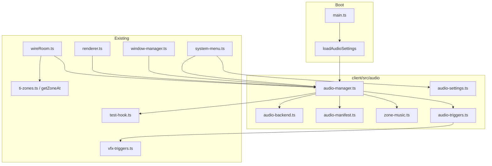

# Phase 29 — Audio & World Ambience Design

**Spec**: `.specs/features/phase-29-audio/spec.md`
**Status**: Draft

---

## Architecture Overview

Phase 29 is a **client-only render layer** (AD-001) parallel to Phase 13 VFX. An
**`AudioManager`** subscribes to the same replicated snapshots and pure edge detectors as
`vfx-manager` / `vfx-triggers.ts`. Zone music and ambient beds read **`getZoneAt`** /
`__GAME_STATE__.zone.id` from Phase 23. Volume UI extends Phase 28 **`system-menu.ts`**
(deferred stub). All playback goes through an injectable **`AudioBackend`** so Vitest uses
**`MockAudioBackend`** only (AD-009, AD-010).



### Runtime sequence

1. `main.ts` after successful `connect` → `createAudioManager({ backend: createDomAudioBackend(), settings: loadAudioSettings() })`.
2. `wireRoom` on each player sync → `audioManager.syncPlayer(snapshot)` + `syncZone(zoneId)` +
   `syncCombat(targetMobId)` (same cadence as `syncPlayerVfx`).
3. `renderer` tick → `audioManager.tickFootsteps({ x, z, zoneType, nowMs })`.
4. `window-manager` `togglePanel` → `playUiOpen` / `playUiClose` on audio manager.
5. Logout / `dispose` renderer → `audioManager.dispose()`.

---

## Code Reuse Analysis

### Existing Components to Leverage

| Component | Location | How to Use |
| --------- | -------- | ---------- |
| `detectHpHit`, `detectLevelUp`, `detectActionEdge`, `countLevelUps` | `client/src/scene/vfx/vfx-triggers.ts` | Import in `audio-triggers.ts`; do not duplicate |
| `createVfxManager` sync pattern | `client/src/scene/vfx/vfx-manager.ts` | Mirror `syncPlayer`, `syncMob`, prev-snapshot maps, hook publish |
| `getZoneAt` / `TI_ZONES` | `libs/game-core/src/ti-zones.ts` | Zone type for footsteps; zone id for music |
| `setZone` / zone in `wireRoom` | `client/src/net/room.ts` | Call `audioManager.syncZone` when `zone.id` changes |
| `syncPlayerVfx` / renderer tick | `client/src/scene/renderer.ts` | Co-locate `syncPlayerAudio` + `tickFootsteps` |
| `togglePanel` / `openPanel` | `client/src/ui/window-manager.ts` | UI open/close SFX hooks |
| `mountSystemMenu` | `client/src/ui/system-menu.ts` | Add volume sliders + mute (Phase 28 deferred) |
| `GameStateVfx` hook pattern | `client/src/test-hook.ts` | Add `GameStateAudio` + `publishAudio` |
| `shouldSoulshotGlint` | `client/src/scene/vfx/soulshot-glint-vfx.ts` | Reuse predicate for soulshot SFX |

### Integration Points

| System | Integration Method |
| ------ | ------------------ |
| Phase 23 zones | `player.zoneId` + `getZoneAt(x,z)` → `resolveZoneMusic` / `resolveZoneAmbient` |
| Phase 13 VFX | Shared triggers; audio runs in same `wireRoom` sync after VFX calls |
| Phase 28 UI shell | System menu sliders; window manager panel events |
| Static assets | `client/public/audio/**` served by Vite at `/audio/...` |
| Persistence | `localStorage` key `nj.audioSettings` |

---

## Components

### `audio-backend.ts`

- **Purpose**: Abstract playback; mock for tests, DOM wrapper for browser.
- **Location**: `client/src/audio/audio-backend.ts`
- **Interfaces**:
  - `AudioBackend.playLoop(id, url, volume, options?: { fadeMs? })`
  - `AudioBackend.playOneShot(id, url, volume)`
  - `AudioBackend.stopLoop(id, options?: { fadeMs? })`
  - `AudioBackend.stopAll()`
  - `AudioBackend.dispose()`
  - `createMockAudioBackend(): { backend, calls, reset }`
  - `createDomAudioBackend(): AudioBackend` — uses `HTMLAudioElement`, `loop=true` for loops
- **Dependencies**: none
- **Reuses**: N/A

### `audio-manifest.ts`

- **Purpose**: Stable id → URL map for all music, SFX, ambient clips.
- **Location**: `client/src/audio/audio-manifest.ts`
- **Interfaces**:
  - `AUDIO_MANIFEST: Record<AudioClipId, { url: string; kind: 'music' | 'sfx' | 'ambient' }>`
  - `getAudioUrl(id: AudioClipId): string`
- **Dependencies**: none
- **Reuses**: `client/public/` layout like `icons/` and `models/`

### `zone-music.ts`

- **Purpose**: Pure zone id → music/ambient id mapping.
- **Location**: `client/src/audio/zone-music.ts`
- **Interfaces**:
  - `resolveZoneMusic(zoneId: string): AudioClipId`
  - `resolveZoneAmbient(zoneId: string): AudioClipId | null`
- **Dependencies**: none
- **Reuses**: Phase 23 zone ids from `ti-zones.ts`

### `audio-settings.ts`

- **Purpose**: Load/save/apply volume prefs.
- **Location**: `client/src/audio/audio-settings.ts`
- **Interfaces**:
  - `loadAudioSettings(): AudioSettings`
  - `saveAudioSettings(settings: AudioSettings): void`
  - `AUDIO_SETTINGS_KEY = 'nj.audioSettings'`
- **Dependencies**: `localStorage` (jsdom in tests)

### `audio-triggers.ts`

- **Purpose**: Thin wrappers exporting audio-specific helpers; re-export VFX detectors.
- **Location**: `client/src/audio/audio-triggers.ts`
- **Interfaces**: re-export `detectHpHit`, `detectLevelUp`, `detectActionEdge`, `countLevelUps`; `shouldPlayFootstep(dist, elapsedMs, zoneType)`
- **Reuses**: `vfx-triggers.ts`

### `audio-manager.ts`

- **Purpose**: Orchestrate loops, one-shots, crossfade, combat/UI/footstep logic, hook publish.
- **Location**: `client/src/audio/audio-manager.ts`
- **Interfaces**:
  - `createAudioManager(opts: { backend: AudioBackend; settings?: AudioSettings }): AudioManager`
  - `syncPlayer(snapshot: AudioPlayerSnapshot): void`
  - `syncMob(snapshot: AudioMobSnapshot): void`
  - `syncZone(zoneId: string): void`
  - `syncCombat(targetMobId: string | null): void`
  - `tickFootsteps(pos: { x: number; z: number; zoneType: string }, nowMs: number): void`
  - `playUiOpen()`, `playUiClose()`, `playUiClick()`
  - `applySettings(settings: AudioSettings): void`
  - `getHookSnapshot(): GameStateAudio`
  - `publishHook(): void`
  - `dispose(): void`
- **Dependencies**: manifest, zone-music, triggers, test-hook
- **Reuses**: `vfx-manager.ts` prev-state pattern

### `system-menu.ts` (extend)

- **Purpose**: Music/SFX sliders + mute checkbox wired to `AudioManager.applySettings`.
- **Location**: `client/src/ui/system-menu.ts`
- **Interfaces**: extend `SystemMenuHandlers` with `onAudioSettingsChange?`; mount controls with `data-role` attributes per spec.
- **Reuses**: existing menu layout

### `window-manager.ts` (extend)

- **Purpose**: Fire UI SFX on panel visibility transitions.
- **Location**: `client/src/ui/window-manager.ts`
- **Interfaces**: optional `setAudioManager(manager)` or callback injection from `main.ts`
- **Reuses**: `togglePanel` / `openPanel` / `closePanel`

---

## Data Models

### `AudioSettings`

```typescript
interface AudioSettings {
  musicVolume: number; // 0..1, default 0.7
  sfxVolume: number;   // 0..1, default 0.8
  muted: boolean;      // default false
}
```

### `GameStateAudio` (test hook)

```typescript
interface GameStateAudio {
  currentMusicId: string | null;
  ambientId: string | null;
  sfxCounts: Record<string, number>;
  musicVolume: number;
  sfxVolume: number;
  muted: boolean;
  inCombat: boolean;
}
```

### Manifest ids (stable)

| Id | Kind | Zone / trigger |
| -- | ---- | -------------- |
| `music_town` | music | `ti_village` |
| `music_field` | music | combat zones + wilderness |
| `music_harbor` | music | `harbor`, `harbor_water` |
| `ambient_village` | ambient | `ti_village` |
| `ambient_wind` | ambient | fields, ruins, obelisk, cave |
| `ambient_waves` | ambient | harbor zones |
| `sfx_melee_hit` | sfx | HP delta |
| `sfx_melee_swing` | sfx | attack edge |
| `sfx_skill_cast` | sfx | cast edge |
| `sfx_level_up` | sfx | level up |
| `sfx_combat_stinger` | sfx | target acquired |
| `sfx_soulshot` | sfx | soulshot glint rule |
| `sfx_footstep` | sfx | movement |
| `sfx_ui_open` / `sfx_ui_close` / `sfx_ui_click` | sfx | UI |

---

## Error Handling Strategy

| Error Scenario | Handling | User Impact |
| -------------- | -------- | ----------- |
| Missing audio file (404) | `console.warn` once per id; skip play | Silent for that clip; rest works |
| `Audio` play() promise rejection (autoplay policy) | Catch; retry on first user gesture via `document.click` once | Music may start after first click |
| Invalid `localStorage` JSON | Fall back to defaults | Default volumes |
| NaN player position | Skip combat + footstep SFX | No erroneous audio |
| Logout without dispose | `main.ts` / renderer `dispose` calls `audioManager.dispose` | Clean stop |

---

## Risks & Concerns

| Concern | Location | Impact | Mitigation |
| ------- | -------- | ------ | ---------- |
| Browser autoplay policy blocks loops | `audio-backend.ts` | No music until gesture | Resume on first `pointerdown` in `main.ts` |
| Duplicate triggers if VFX and audio diverge | `wireRoom` sync | Double logic drift | Share `vfx-triggers.ts`; audio manager called adjacent to VFX sync |
| `HTMLAudioElement` in tests | Vitest jsdom | Flaky / slow CI | Mandatory `MockAudioBackend` injection; spy guard AUD29-46 |
| Asset repo size | `client/public/audio/` | Bloated git | Short CC0 loops; Ogg compression; &lt;500 KB total target |
| Footstep spam on jittery movement | `tickFootsteps` | Annoying audio | 0.8 m + 350 ms throttle per spec |

---

## Tech Decisions

| Decision | Choice | Rationale |
| -------- | ------ | --------- |
| Playback API | `HTMLAudioElement` not Howler | AD-007 no new deps; MVP stereo loops sufficient |
| Test double | `MockAudioBackend` call log | AD-009 observable without decode |
| Crossfade | Stop previous loop with fade-out; start new at fade-in | Simple; no Web Audio graph required |
| Combat music | Stinger only, not separate loop | ROADMAP wording; avoids fighting zone music |
| Zone source of truth | `player.zoneId` from server when set, else `getZoneAt` | Matches `wireRoom` zone HUD (Phase 23) |
| CI audio files | Committed minimal placeholders; tests use mock URLs optional | AUD29-47 build check lists manifest paths |

> **Note:** Mock-injectable client media is a project pattern alongside `__GAME_STATE__`; no
> new AD required unless Verifier finds repeated cross-feature drift.

---

## Asset Pipeline

1. Source **CC0** clips (Kenney “Digital Audio”, OpenGameArt loops) — 3 music, 3 ambient,
   9 SFX.
2. Normalize to **Ogg Vorbis**, mono for SFX, stereo for music.
3. Place under `client/public/audio/{music,sfx,ambient}/`.
4. Register in `audio-manifest.ts`; `audio-manifest.spec.ts` asserts every id has a file.

No `game-designer` skill — audio is not GLB/VFX art pipeline (AD-017 scope).
