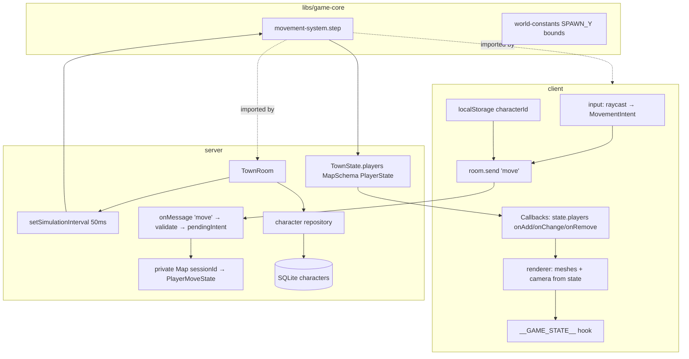
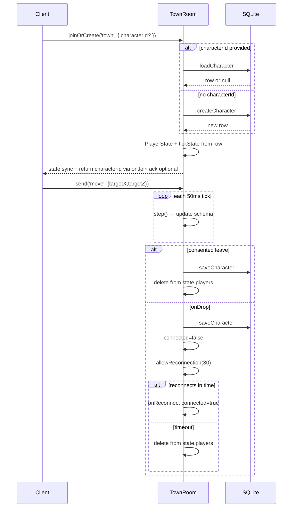

# Phase 3 — Authoritative Server + Multiplayer Design

**Spec**: `.specs/features/phase-3-authoritative-server/spec.md`
**Status**: Draft

---

## Architecture Overview

Phase 3 implements AD-008's migration boundary mechanically: **input stays
client**, **movement `step()` lifts verbatim to `TownRoom` tick**, **rendering
reads authoritative `playerState` from room sync**. A new `characters` table
provides SQLite persistence; Colyseus reconnection APIs handle session-level
resume; `characterId` in join options handles new-session resume.



### AD-008 migration boundary (this phase)

| Layer | Phase 2 (before) | Phase 3 (after) |
| ----- | ---------------- | --------------- |
| **Input** (raycast → intent) | Client | **Client** — intent becomes `room.send('move', …)` |
| **Movement** `step(state, intent, dt)` | Client render loop | **`TownRoom` tick** — verbatim function from `libs/game-core` |
| **Rendering + camera** | Client reads local `playerState` | **Client** reads `room.state.players.get(sessionId)` |

The renderer already consumes a single `playerState` object; Phase 3 changes
the producer from local `step()` to Colyseus state callbacks.

---

## Server vs Client Split

| Concern | Server | Client |
| ------- | ------ | ------ |
| Click raycast | — | ✓ |
| Movement intent emission | — | ✓ (`room.send`) |
| Intent validation (bounds, finite) | ✓ | — |
| `step()` simulation | ✓ (tick) | — (removed) |
| Position broadcast | ✓ (`PlayerState` schema) | — |
| HP/MP/XP/level authority | ✓ (stored, persisted; unchanged this phase) | render only (future HUD) |
| Character create/load/save | ✓ | stores `characterId` only |
| Reconnection policy | ✓ (`onDrop`/`allowReconnection`/`onReconnect`) | SDK reconnect handler |
| Remote player meshes | — | ✓ |
| Local player mesh + camera | — | ✓ (from synced state) |
| `window.__GAME_STATE__` | — | ✓ |

---

## Components

### `libs/game-core` (new Nx library)

- **Purpose**: Share pure game logic between server and client without
  cross-project relative imports.
- **Location**: `libs/game-core/src/`
- **Exports**:
  - `movement-system.ts` — lifted verbatim from
    `client/src/movement/movement-system.ts` (interfaces, `step`,
    `createInitialMoveState`, constants).
  - `world-constants.ts` — `SPAWN_X`, `SPAWN_Z`, `SPAWN_Y`, `WORLD_MIN`,
    `WORLD_MAX`, `TERRAIN_SEED` (SPAWN_Y computed to match client terrain at
    origin).
  - `validate-move-intent.ts` — `isValidMoveIntent(targetX, targetZ): boolean`.
- **Dependencies**: none (plain TS).
- **Reuses**: Phase-2 movement unit tests move to or re-export from this lib.

### TownRoom simulation tick (server)

- **Purpose**: Authoritative game loop for all joined players.
- **Location**: `server/src/rooms/TownRoom.ts`
- **Interfaces**:

```typescript
// onCreate
this.setSimulationInterval((deltaTimeMs) => this.simulate(deltaTimeMs), 50);

// simulate (private)
// For each sessionId in state.players:
//   intent = pendingIntents.get(sessionId) ?? null; clear after read
//   tickState = tickStates.get(sessionId)  // PlayerMoveState
//   next = step(tickState, intent, deltaTimeMs / 1000)
//   sync next → PlayerState schema (x,y,z) + tickStates
//   maybe schedule debounced save
```

- **Private room fields**:
  - `pendingIntents: Map<string, MovementIntent>`
  - `tickStates: Map<string, PlayerMoveState>`
  - `characterIds: Map<string, string>` (sessionId → characterId)
  - `saveTimers` / last-save tracking for debounce
- **Dependencies**: `libs/game-core`, character repository, Drizzle DB handle.
- **Reuses**: existing `TownRoom` join/leave skeleton.

### Intent message handler (server)

```typescript
this.onMessage('move', (client, message: { targetX: number; targetZ: number }) => {
  if (!isValidMoveIntent(message.targetX, message.targetZ)) return;
  this.pendingIntents.set(client.sessionId, {
    targetX: message.targetX,
    targetZ: message.targetZ,
  });
});
```

Message type `"move"` is a string literal per Colyseus `room.send(type, payload)`.

### PlayerState schema extension (server)

**File**: `server/src/rooms/schema/TownState.ts`

```typescript
export class PlayerState extends Schema {
  @type('number') x = 0;
  @type('number') y = 0;
  @type('number') z = 0;
  @type('number') hp = 100;
  @type('number') mp = 50;
  @type('number') xp = 0;
  @type('number') level = 1;
  @type('boolean') connected = true;
}
```

`targetX`/`targetZ` remain in private `tickStates` only (not on wire).

### Character persistence (server)

**Schema** (`server/src/db/schema.ts`):

```typescript
export const characters = sqliteTable('characters', {
  id: text('id').primaryKey(),           // UUID
  name: text('name').notNull(),
  level: integer('level').notNull(),
  xp: integer('xp').notNull(),
  hp: real('hp').notNull(),
  mp: real('mp').notNull(),
  x: real('x').notNull(),
  y: real('y').notNull(),
  z: real('z').notNull(),
  updatedAt: integer('updated_at').notNull(),
});
```

**Repository** (`server/src/db/character-repository.ts`):

| Method | Behavior |
| ------ | -------- |
| `createCharacter(db)` | Insert starter row at spawn; return row |
| `loadCharacter(db, id)` | Select by id or `null` |
| `saveCharacter(db, row)` | Upsert position + stats + `updated_at` |

`applySchema()` in `client.ts` gains matching `CREATE TABLE IF NOT EXISTS`.

**DB injection into TownRoom**: pass `getDb` path via room `onCreate` options
or module-level factory used by `app.config.ts` and tests (in-memory temp DB
for room-integration tests per AD-011).

### Join / leave / reconnect lifecycle (server)



**`onJoin(client, options)`**:
1. Resolve character row (load or create).
2. Store `characterId` in `client.userData` and `characterIds` map.
3. Populate `PlayerState` + `tickStates` from row.
4. Optionally `client.send('characterId', id)` so client can persist to
   `localStorage` if new.

**`onLeave(client, consented)`** (consented):
- Save character.
- Delete from `state.players`, `tickStates`, maps.

**`onDrop(client, code)`**:
- Save character.
- Set `player.connected = false`.
- `await this.allowReconnection(client, 30)` (Colyseus 0.17 API).

**`onReconnect(client)`**:
- Set `player.connected = true`.

### Client network layer (client)

**File**: `client/src/net/room.ts` (extended)

- Accept `characterId` from `localStorage`.
- `client.joinOrCreate('town', { characterId })`.
- Return `Room` to `main.ts` (no longer discarded).
- Register `room.onMessage('characterId', …)` to persist new ids.
- Export `wireRoom(room, game)` to attach state callbacks.

**State callbacks** (`@colyseus/sdk` `Callbacks.get(room)`):

```typescript
const $ = Callbacks.get(room);
$.onAdd('players', (player, sessionId) => { /* add/update remote or local */ });
$.onRemove('players', (player, sessionId) => { /* remove remote mesh */ });
// listen to local player position changes for camera + hook
```

### Client renderer changes (client)

**File**: `client/src/scene/renderer.ts`

- Remove local `step()` call and `pendingIntent` consumption.
- `handleClick` calls `onMoveIntent(intent)` callback provided by net layer
  (which sends `room.send`).
- `syncPlayerFromState(sessionId, playerState)` updates mesh + camera for local
  player; remote players managed in `Map<sessionId, THREE.Mesh>`.
- Local player mesh: blue (`0x3366cc`); remote: orange (`0xcc6633`) or similar.

### Test hook extension (client)

**File**: `client/src/test-hook.ts`

```typescript
interface GameState {
  connected: boolean;
  ready: boolean;
  player: { x: number; y: number; z: number };
  target: { x: number | null; z: number | null };
  others: { id: string; x: number; y: number; z: number }[];
  characterId: string | null;
}
```

`setOthers()` called from state callback layer whenever remote players change.

---

## Data Flow: Click to Visible Movement

1. User clicks canvas → raycast → `{ targetX, targetZ }`.
2. Client `room.send('move', { targetX, targetZ })`; `setTarget()` for hook.
3. Server validates → `pendingIntents.set(sessionId, intent)`.
4. Next tick: `step(tickState, intent, 0.05)` → update schema `x,z`.
5. Colyseus patches state → all clients receive update.
6. Local client `Callbacks` fires → update mesh position + `setPlayer()`.
7. Remote clients update `others` array + remote meshes.

---

## Code Reuse

| Existing | Reuse |
| -------- | ----- |
| `client/src/movement/movement-system.ts` | Move to `libs/game-core` verbatim |
| `client/src/movement/movement-system.spec.ts` | Move alongside lib |
| `server/src/rooms/TownRoom.ts` | Extend with tick, messages, persistence |
| `server/src/rooms/TownRoom.spec.ts` | Extend with movement + reconnect cases |
| `client/src/scene/renderer.ts` | Swap state producer; add remote meshes |
| `client/src/test-hook.ts` | Extend shape |
| `server/src/db/client.ts` | Add `characters` table to `applySchema` |
| `@colyseus/testing` `boot()` pattern | Same isolation model as Phase 1 |

---

## Risks & Concerns

| Risk | Mitigation |
| ---- | ---------- |
| **AD-008 drift** — server `step()` diverges from client copy | Single shared lib; same unit tests; Verifier discrimination sensor on speed constant |
| **Spawn Y mismatch** — server `y=0` today vs client terrain height | Shared `SPAWN_Y` constant; tested in unit test |
| **Schema null targets** — `@colyseus/schema` lacks nullable number | Keep targets in private `tickStates`, not on wire |
| **Room DB coupling** — TownRoom needs DB in tests | Inject `getDb(':memory:')` via room `onCreate` options; temp file per AD-011 |
| **Two-browser E2E flakiness** | Assert `__GAME_STATE__.others` with generous timeout; room-integration proves logic first |
| **Reconnect race** — save vs load | Always save before `allowReconnection`; load only on fresh join with `characterId` |
| **No shared lib precedent in monorepo** | First Nx lib; follow `@nx/js` generator pattern; task T1 isolates scaffolding |
| **Colyseus `deltaTime` units** | Document ms→s conversion; unit test tick integration with known dt |

---

## Nx / Gate Commands

| Gate | Command |
| ---- | ------- |
| Quick (server tasks) | `nx test server` |
| Quick (client/lib tasks) | `nx test client` + `nx test game-core` |
| Full (phase complete) | `nx run-many -t build lint test` + `nx e2e client-e2e` |
| Verifier | `nx affected -t test lint` (+ e2e if client touched) |
