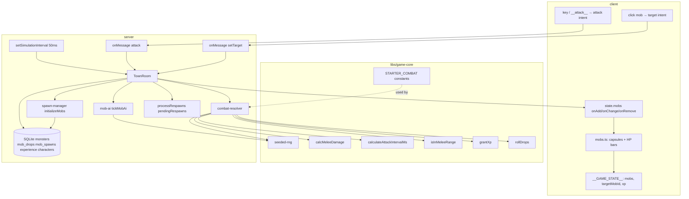

# Phase 4 — Combat on the Server Design

**Spec**: `.specs/features/phase-4-server-combat/spec.md`
**Status**: Done (implemented + verified)

---

## Architecture Overview

Phase 4 extends the Phase 3 `TownRoom` tick with a full combat pipeline:
**client sends target/attack intents only**; **server owns mob HP, damage, XP,
drops, AI, and respawn** (AD-001). Pure combat formulas live in
`libs/game-core`; room code orchestrates tick order, persistence, and Colyseus
schema sync. Randomness flows through an injectable per-room `SeededRng`
(AD-010).



### Tick order (`TownRoom.simulate`)

Each 50 ms tick (Phase 3 rate unchanged):

1. **Player movement** — apply pending `"move"` intents via shared `step()`.
2. **Mob AI** — for each alive mob: `tickMobAi` (aggro / retaliate / wander);
   sync `MobRuntime` → `MobState` schema.
3. **Player attacks** — for each session with `attackPending`: `resolvePlayerAttack`
   (range, interval, damage, kill detection); sync HP; on kill → rewards +
   remove mob + schedule respawn.
4. **Mob attacks** — for each mob with `targetSessionId`: `resolveMobAttack`;
   apply damage to target `PlayerState.hp`.
5. **Respawns** — `processRespawns` restores mobs whose `respawnAtMs` has passed.

Injectable `nowMs` (default `Date.now`) drives attack cooldowns and respawn
timers. Injectable `combatRng` (default `createSeededRng(hashRoomId(roomId))`)
drives damage variance and drop rolls.

---

## Server vs Client Split

| Concern | Server | Client |
| ------- | ------ | ------ |
| Click-to-target raycast | — | ✓ (sends `setTarget { mobId }`) |
| Attack input | — | ✓ (sends `attack`; key / `__attack__` hook) |
| Target lock state (`targetMobId`) | private `PlayerCombatState` | mirrored in `__GAME_STATE__` for tests only |
| Melee damage formula | ✓ (`combat-resolver` + game-core) | — |
| Attack interval enforcement | ✓ | — |
| Range validation | ✓ | — |
| Mob HP authority | ✓ (`MobState` + `MobRuntime`) | render only |
| Mob position (AI wander/chase) | ✓ | render from schema |
| Aggro / retaliate / wander | ✓ (`mob-ai`) | — |
| XP / level on kill | ✓ | render from `PlayerState` |
| Drop rolls | ✓ (`KillEvent.drops`, server-private) | — (no loot UI) |
| Respawn scheduling | ✓ (`pendingRespawns`, 27 s) | observe mob reappear in schema |
| Mob meshes + HP bars | — | ✓ (`client/src/scene/mobs.ts`) |
| `window.__GAME_STATE__` combat fields | — | ✓ (AD-009) |

---

## Components

### `libs/game-core` — pure combat modules

| Module | Purpose |
| ------ | ------- |
| `seeded-rng.ts` | LCG `createSeededRng(seed)`; `nextFloat`, `nextInt`, `nextDamageOffset(±randomDamage)` |
| `combat/starter-combat.ts` | `STARTER_COMBAT` (Human Fighter L1), `GREMLIN_COMBAT.pDef` anchor |
| `combat/melee-damage.ts` | `calcMeleeDamage` — `floor(77*pAtk*randomMod/pDef)`, min 1 |
| `combat/attack-timing.ts` | `calculateAttackIntervalMs` — `max(50, floor(500000/attackSpeed))` |
| `combat/combat-range.ts` | `horizontalDistance`, `isInMeleeRange` (XZ plane) |
| `experience.ts` | `grantXp` — cumulative XP + `levelFromCumulativeXp` over curve rows |
| `drop-roll.ts` | `rollDrops(dropRows, rng)` — L2J percentage chance + count range |

All exported from `libs/game-core/src/index.ts`.

### `server/src/db/schema.ts` — combat tables

**`monsters`** (extended): combat columns `pAtk`, `pDef`, `attackSpeed`, `random`,
`critical`, `accuracy`, `attackRange`, `aggroRange`, `isAggressive`, `respawnSec`.

**`mob_drops`**: `npcId`, `itemId`, `minCount`, `maxCount`, `chance` (no `items`
FK — Phase 7).

**`mob_spawns`**: `npcId`, local `x/y/z`, `respawnSec` (default 27).

### `server/src/seed/` — parsers + seeders

| Piece | Role |
| ----- | ---- |
| `parsers/monsters.parser.ts` | Parse L2J combat stats; default `respawnSec=27`; aggro from `<ai>` |
| `parsers/drops.parser.ts` | Parse drop groups from fixture XML |
| `parsers/spawns.parser.ts` | Load hand-authored `mob_spawns.json`; default `respawnSec=27` |
| `seeders/monsters.seeder.ts` | Upsert combat monster rows |
| `seeders/drops.seeder.ts` | Upsert `mob_drops` |
| `seeders/spawns.seeder.ts` | Upsert `mob_spawns` (11 TI field instances) |
| `seed/cli.ts` | CLI entry: `runSeed` → `data/game.db` for e2e webServer |
| `__fixtures__/mob_spawns.json` | 11 spawn points (Gremlins, Goblins, Keltirs, Wolves) |

Idempotent `runSeed` resets seeded tables per AD-011; seed tests use temp DB +
fixture `dataDir` per AD-012.

### `server/src/rooms/schema/MobState.ts`

Synced fields: `id`, `npcId`, `x`, `y`, `z`, `hp`, `maxHp`.

Held in `TownState.mobs` `MapSchema<MobState>`.

### `server/src/rooms/spawn-manager.ts`

- `l2RangeToWorld(units) => units / 10` (AD-013).
- `initializeMobs(db, state)` — reads `mob_spawns` + `monsters`; creates
  `MobState` entries and `MobRuntime` private map (combat stats, AI fields,
  spawn anchor).
- `syncMobState`, `respawnMobRuntime`, `loadMobSpawnRow`, `loadMonsterTemplate`.

**`MobRuntime`** (server-private, not on wire): full combat + AI state including
`targetSessionId`, `lastAttackerSessionId`, `nextAttackAtMs`, `wasDamaged`,
wander targets, `aggroRangeWorld`, `attackRangeWorld`, etc.

### `server/src/rooms/mob-ai.ts`

- **Aggressive** (`isAggressive`): nearest player within `aggroRangeWorld` →
  `targetSessionId`.
- **Passive retaliate**: if `wasDamaged` and no target → target `lastAttackerSessionId`.
- **Chase**: `moveToward` at 50% `DEFAULT_MOVE_SPEED`.
- **Wander**: random point within `WANDER_RADIUS` (5) of spawn every 3 s at 30%
  move speed; uses `SeededRng` for angle/radius.

### `server/src/rooms/combat-resolver.ts`

- `PlayerCombatState`: `targetMobId`, `nextAttackAtMs`, `attackPending`.
- `resolvePlayerAttack` — validates pending flag, interval, range; applies
  `calcMeleeDamage` with `STARTER_COMBAT`; sets `wasDamaged` / `lastAttackerSessionId`.
- `resolveMobAttack` — mob strikes targeted player with mob template stats vs
  `STARTER_COMBAT.pDef`.
- `applyKillRewards` — `grantXp` + optional `rollDrops` onto `KillEvent.drops`.
- `KillEvent` — server-private kill record (not schema-synced).

### `server/src/rooms/TownRoom.ts` — integration

**Options** (`TownRoomOptions`):

- `combatSeed?: number` / `combatRng?: SeededRng` — injectable RNG (tests).
- `nowMs?: () => number` — injectable clock (tests).

**Messages**:

- `setTarget { mobId }` — ignores unknown/dead mobs; sets `PlayerCombatState.targetMobId`.
- `attack` — sets `attackPending` if target exists.

**onCreate**: `loadCombatData()` (experience curve + drops map), `initializeMobs`,
register handlers.

**onKill path**: `applyKillRewards` → `persistCharacter` → remove from
`state.mobs` / `mobRuntime` → `pendingRespawns` with `respawnAtMs = now + respawnSec*1000`.

---

## Client Components

### `client/src/scene/mobs.ts`

Procedural capsule mob mesh (AD-005) + billboard HP bar (`hpBarFillRatio`,
`updateHpBarFill`). `syncMobVisual` / `removeMob` driven by room callbacks.

### `client/src/scene/renderer.ts`

Integrates mob map with terrain scene; `faceHpBarsToCamera`; click routing for
mob target vs ground move.

### `client/src/net/room.ts`

Subscribes to `state.mobs` `onAdd`/`onChange`/`onRemove`; publishes mob snapshots
to `setMobs` / `__GAME_STATE__`.

### `client/src/main.ts` + `test-hook.ts`

- `__handleMobTarget__` → `setTargetMobId` + `room.send('setTarget')`.
- `__attack__` → `room.send('attack')`.
- `__GAME_STATE__` fields: `mobs[]`, `targetMobId`, `player.xp`, `player.level`.

### `client-e2e/src/combat.spec.ts`

Serial describe; move near mob via `__sendMoveIntent__`, target via
`__handleMobTarget__`, kill loop via `__attack__`, assert `player.xp > 0`.

Playwright `webServer` seeds DB via `server/src/seed/cli.ts` before `nx serve server`.

---

## Data Flow: Kill → XP → Persist

```
attack intent → resolvePlayerAttack → mob.hp -= damage
  → hp <= 0 → handleMobKill
    → KillEvent { exp, drops: [] }
    → applyKillRewards (grantXp + rollDrops)
    → player.xp/level updated in PlayerState
    → persistCharacter → characters table
    → state.mobs.delete + pendingRespawns[id]
  → (27s later) processRespawns → full HP at spawn
```

Drops populate `KillEvent.drops` only — not written to DB or broadcast this phase.

---

## Testing Strategy (AD-010)

| Layer | Scope | Key files |
| ----- | ----- | --------- |
| Unit (game-core) | Formulas, RNG, XP, drops | `libs/game-core/src/**/*.spec.ts` |
| Unit (server) | Resolver, AI, spawn-manager | `server/src/rooms/*.spec.ts` |
| Room-integration | Full combat in `TownRoom` | `server/src/rooms/TownRoom.spec.ts` |
| Seed/data | Parser + seeder Classic values | `server/src/seed/**/*.spec.ts` |
| E2E | Kill grants XP via hook | `client-e2e/src/combat.spec.ts` |

Gate: `nx affected -t test lint` + `nx e2e client-e2e` when client/e2e touched.

Discrimination sensor targets: `calcMeleeDamage`, `nextDamageOffset`, `grantXp`,
`rollDrops`, range gate, aggro, retaliate, `processRespawns`, `persistCharacter`.

---

## Known Implementation Notes (post-verify)

| Topic | As built |
| ----- | -------- |
| Drop loot visibility | `KillEvent.drops` only; no room loot map or client sync |
| E2E XP assertion | `xp > 0` (not exact 44) — acceptable at e2e layer |
| Edge-case intents | Dead target, no target, invalid mob id — handled in code, not room-tested |
| `others` filter | `connected === false` excluded (Phase 3 deviation carried forward) |
| Re-seed idempotency tests | Compare drop/spawn rows without autoincrement `id` column |
