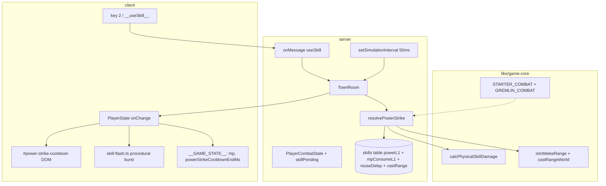

# Phase 5 — Power Strike Design

**Spec**: `.specs/features/phase-5-power-strike/spec.md`
**Status**: Draft

---

## Architecture Overview

Phase 5 extends the Phase 4 combat pipeline with a single skill path. The client
sends a **`useSkill`** intent; the server validates and resolves everything
(AD-001). Pure damage math stays in `libs/game-core`; `combat-resolver` gains
`resolvePowerStrike`; `TownRoom` loads the seeded skill row and tracks per-player
cooldown in private state + broadcasts `powerStrikeCooldownEndMs` on
`PlayerState`.



### Tick order (`TownRoom.simulate`) — Phase 5 delta

Unchanged Phases 1–4 steps, with skill resolution inserted **after mob AI,
alongside player attacks**:

1. Player movement (`move` intents).
2. Mob AI (`tickMobAi`).
3. **Player skills** — for each session with `skillPending`: `resolvePowerStrike`
   (MP, cooldown, range, damage, kill); sync `MobState` / `PlayerState.mp` /
   `powerStrikeCooldownEndMs`; on kill → existing `handleMobKill`.
4. Player basic attacks (`attackPending` → `resolvePlayerAttack`).
5. Mob attacks.
6. Respawns.

Injectable `nowMs` drives cooldown comparisons and `powerStrikeCooldownEndMs`.
Injectable `combatRng` drives damage variance (AD-010).

---

## Server vs Client Split

| Concern | Server | Client |
| ------- | ------ | ------ |
| `useSkill { skillId: 3 }` intent | ✓ `onMessage` sets `skillPending` | ✓ sends via `room.send` |
| MP validation / deduction | ✓ | — |
| Reuse cooldown enforcement | ✓ (`lastPowerStrikeAtMs` private + schema end ms) | — |
| Cast range check (`castRange/10` = 4.0 m) | ✓ | — |
| Physical-skill damage | ✓ (`calcPhysicalSkillDamage`) | — |
| Target validation (`setTarget` lock) | ✓ | — |
| `PlayerState.mp` authority | ✓ | render from schema |
| `powerStrikeCooldownEndMs` | ✓ | DOM countdown + flash trigger |
| Hotkey binding (key `2`) | — | ✓ |
| Cooldown bar DOM | — | ✓ (`#power-strike-cooldown`) |
| Procedural skill flash | — | ✓ (Three.js primitives, AD-005) |
| `__GAME_STATE__` mp / cooldown | — | ✓ (AD-009) |
| `__useSkill__` test hook | — | ✓ |

---

## Components

### `libs/game-core` — physical skill damage

**New export** `calcPhysicalSkillDamage` in `combat/melee-damage.ts` (or sibling
`physical-skill-damage.ts`):

```typescript
// L2J PhysicalDamage melee: 77 * ((pAtk * lvlMod) + power) / pDef * randomMod
// MVP: lvlMod = 1
max(1, floor(77 * (pAtk + power) / pDef * randomMod))
```

Reuses `MeleeAttacker` / `MeleeDefender` / `MeleeDamageOptions` and
`SeededRng.nextDamageOffset` from Phase 4. **L-001**: export via `index.ts`;
vitest resolves from source (`resolve.alias`).

Optional helper `l2CastRangeToWorld(castRange: number): number` → `castRange / 10`
(colocated with `combat-range.ts` or inline in resolver).

### Seed — extend Power Strike row

| Column (new) | Value | Source |
| ------------ | ----- | ------ |
| `powerL1` | 30 | `skills.xml` → `effects/PhysicalDamage/power` level 1 |

Extend `skills.parser.ts`, `schema.ts`, `db/client.ts` migration SQL,
`skills.seeder.spec.ts`. Idempotent seed unchanged (AD-011).

### `server` — combat resolver

Extend `PlayerCombatState`:

```typescript
interface PlayerCombatState {
  targetMobId: string | null;
  nextAttackAtMs: number;
  attackPending: boolean;
  skillPending: boolean;           // NEW
  powerStrikeCooldownEndMs: number;  // NEW — private mirror; also written to schema
}
```

**New** `resolvePowerStrike(params)`:

| Check | Fail result |
| ----- | ----------- |
| `!skillPending` or wrong target / dead mob | `{ damage: 0, mpCost: 0 }` |
| `nowMs < powerStrikeCooldownEndMs` | reject |
| `player.mp < mpConsumeL1` | reject |
| out of `castRangeWorld` | reject |
| pass | compute damage, `mp -= 9`, set cooldown end, clear `skillPending` |

Loads skill constants from DB row at room boot (`skillId=3`); passes
`powerL1`, `mpConsumeL1`, `reuseDelay`, `castRange` into resolver.

Kill / XP path: reuse `handleMobKill` from Phase 4 unchanged.

### `server` — schema

`PlayerState` addition:

```typescript
@type('number') powerStrikeCooldownEndMs = 0;
```

`mp` already exists. Cooldown end is absolute server ms (from injectable `nowMs`).

### `server` — TownRoom messages

```typescript
this.onMessage('useSkill', (client, message: { skillId: number }) => {
  if (message.skillId !== 3) return;
  const combat = this.playerCombat.get(client.sessionId);
  const player = this.state.players.get(client.sessionId);
  if (!combat || !player || !combat.targetMobId) return;
  combat.skillPending = true;
});
```

Resolution in tick calls `resolvePowerStrike`; on success calls
`scheduleDebouncedSave(sessionId)` for MP persistence.

### `client` — input + presentation

| File | Change |
| ---- | ------ |
| `main.ts` | Key `2` → `room.send('useSkill', { skillId: 3 })`; expose `__useSkill__` |
| `test-hook.ts` | Add `player.mp`, `powerStrikeCooldownEndMs`, `powerStrikeCooldownRemainingMs` |
| `net/room.ts` | `onChange` sync mp + cooldown to hook |
| `hud/power-strike-cooldown.ts` | DOM bar `#power-strike-cooldown`, `data-remaining-ms` attribute |
| `scene/skill-flash.ts` | Short-lived emissive sphere/plane burst at player→target vector (AD-005) |
| `scene/renderer.ts` | `triggerSkillFlash()` hook called from room wire |
| `index.html` | HUD container for cooldown bar (positioned overlay, not canvas) |

E2E uses `__useSkill__` + `__handleMobTarget__` + `__sendMoveIntent__` (same
pattern as `combat.spec.ts`).

---

## Data Flow — successful cast

```
1. Client: key 2 → room.send('useSkill', { skillId: 3 })
2. Server onMessage: skillPending = true (requires targetMobId)
3. Next tick: resolvePowerStrike
   - mp: 50 → 41
   - mob hp -= 69
   - powerStrikeCooldownEndMs = now + 3000
4. Schema broadcasts → client onChange
5. Client: update HUD data-remaining-ms; triggerSkillFlash()
6. E2E: assert __GAME_STATE__.player.mp === 41
```

---

## Colyseus / Schema notes (Context7)

- **Messages**: `room.send('useSkill', payload)` / `this.onMessage('useSkill', ...)`
  per Colyseus 0.17 SDK (`/colyseus/docs`).
- **State sync**: `@type('number')` on `PlayerState` auto-replicates to clients;
  use `Callbacks.onChange` (already in `wireRoom`) for HUD/flash side effects.
- No separate server→client message required for cooldown if schema field suffices.

---

## L2J Reference

| Rule | Source |
| ---- | ------ |
| Physical skill damage | `PhysicalDamage.java` — `77 * ((pAtk * lvlMod) + power) / pDef * randomMod` |
| Power Strike L1 power | `skills.xml` id 3 — `power` level 1 = **30** |
| MP / reuse / range | Same XML — `mpConsume` L1=**9**, `reuseDelay=**3000**`, `castRange=**40**` |

Concrete anchors: damage **69** / **62** vs Gremlin; MP **9**; cooldown **3000** ms;
cast range **4.0** m world.
