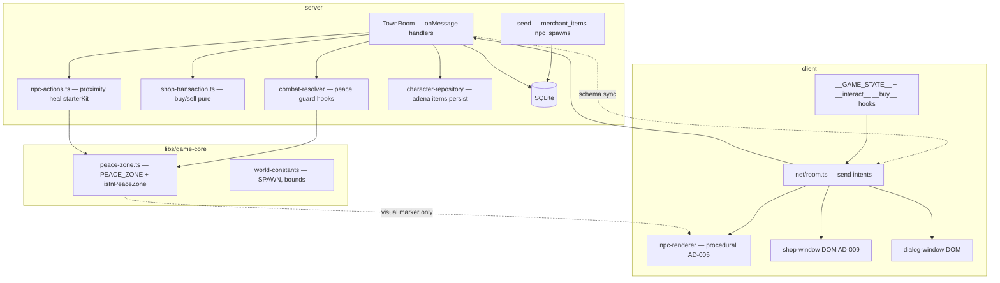

# Phase 6 — NPCs & Functional Town Design

**Spec**: `.specs/features/phase-6-npcs-town/spec.md`
**Status**: Draft

---

## Architecture Overview

Phase 6 layers **town services** on the existing authoritative `TownRoom` tick
without duplicating combat logic. Pure rules (peace zone, shop math, proximity)
live in testable modules; `game-core` owns the shared peace-zone geometry;
the server owns all transactions; the client renders NPCs and DOM UI (AD-009).



---

## Peace Zone

### Constant (shared `game-core`)

```ts
export const PEACE_ZONE = {
  minX: -20,
  maxX: 20,
  minZ: -20,
  maxZ: 20,
} as const;

export function isInPeaceZone(x: number, z: number): boolean {
  return (
    x >= PEACE_ZONE.minX &&
    x <= PEACE_ZONE.maxX &&
    z >= PEACE_ZONE.minZ &&
    z <= PEACE_ZONE.maxZ
  );
}
```

| Property | Value | Source |
| -------- | ----- | ------ |
| Shape | Axis-aligned rectangle | Village ground 40×40 m at origin (`client/src/scene/village.ts`) |
| L2J reference | `talking_island_town_peace_zone1..4` in `zones/peace.xml` | Placement reference only; not imported as polygon |
| Client marker | Existing `peace-zone` spec at `(0,0)` | Visual hint; server enforces region |

### Enforcement points (server only)

| Path | Guard |
| ---- | ----- |
| `resolvePlayerAttack` | Return `{ damage: 0 }` if `isInPeaceZone(playerX, playerZ)` |
| `resolvePowerStrike` | Return reject if caster in peace zone |
| `resolveMobAttack` | Return `{ damage: 0 }` if `isInPeaceZone(targetX, targetZ)` |
| `tickMobAi` (or post-AI hook) | Clear `targetSessionId` when target enters peace zone; skip acquiring players in zone |

Early rejection in `TownRoom` `onMessage('attack'|'useSkill')` is optional;
resolver guards are the test boundary (discrimination sensor target).

---

## NPC Model

### Seed tables

**`npc_spawns`** (new):

| Column | Type | Notes |
| ------ | ---- | ----- |
| `npc_id` | INTEGER PK | 30004, 30006 |
| `x`, `y`, `z` | REAL | Local coords; y from `SPAWN_Y` / terrain sample |
| `heading` | REAL | Optional; client rotation only |

Fixture `npc_spawns.json`:

```json
[
  { "npcId": 30004, "x": -6, "z": -8 },
  { "npcId": 30006, "x": 4, "z": 10 }
]
```

**`merchant_items`** (new):

| Column | Type | Notes |
| ------ | ---- | ----- |
| `id` | INTEGER PK AUTO | |
| `npc_id` | INTEGER | 30004 (Katerina) |
| `item_id` | INTEGER | L2J item id |
| `name` | TEXT | Denormalized display name |
| `buy_price` | INTEGER | Adena |
| `sell_price` | INTEGER | `floor(buy/2)` |

Parsed from fixture `buylist_30004.xml` (subset of L2J `buylists/3000401.xml`).

### Room state — `NpcState`

```ts
export class NpcState extends Schema {
  @type('string') id = '';      // stable key e.g. "npc-30004"
  @type('number') npcId = 0;
  @type('string') name = '';
  @type('string') title = '';
  @type('string') type = '';   // Merchant | Teleporter (utility mapping client-side)
  @type('number') x = 0;
  @type('number') y = 0;
  @type('number') z = 0;
}
```

`TownState.npcs: MapSchema<NpcState>` populated in `onCreate` from DB join
`npcs` + `npc_spawns`.

### Proximity interaction

```
distance = horizontalDistance(player, npc)
canInteract = distance <= NPC_INTERACT_RADIUS (3.0 m)
```

| Message | Payload | Server behavior |
| ------- | ------- | --------------- |
| `interact` | `{ npcId: number }` | Validate proximity + known NPC; `client.send('interactResult', { npcId, type, name })` |
| `buy` | `{ npcId, itemId, quantity }` | Validate merchant + proximity + adena; apply via `shop-transaction` |
| `sell` | `{ npcId, itemId, quantity }` | Validate merchant + proximity + ownership |
| `npcAction` | `{ npcId, action: 'heal' \| 'starterKit' }` | Roxxy only; proximity; apply heal or starter kit |

Colyseus pattern: `this.onMessage('buy', …)` / `room.send('buy', …)` (0.17).

---

## Economy & Items (MVP)

### Adena

- `characters.adena INTEGER NOT NULL DEFAULT 1000`
- `PlayerState.adena` synced
- `createCharacter` sets **1000**

### Item counts (no equip)

**`character_items`**:

| Column | Type |
| ------ | ---- |
| `character_id` | TEXT FK |
| `item_id` | INTEGER |
| `count` | INTEGER |

Composite PK `(character_id, item_id)`.

**`PlayerState`**: `MapSchema<ItemStackState>` or `@type(['number']) itemCounts` —
prefer `MapSchema` with `{ itemId, count }` entries for schema clarity.

**`characters.starter_kit_granted`** BOOLEAN default false.

### Shop transaction (`shop-transaction.ts`)

Pure functions:

```ts
buyItem({ adena, itemCount, listing, quantity })
  → { ok, adena, itemCount, error? }

sellItem({ adena, itemCount, listing, quantity })
  → { ok, adena, itemCount, error? }
```

Listing row must match `merchant_items` for the NPC. No client-provided prices.

---

## Utility NPC (Roxxy 30006)

L2J type is `Teleporter`; MVP maps client dialog title **"Newbie Helper"**.

| Action | Effect |
| ------ | ------ |
| `heal` | `player.hp = 100` (starter max) |
| `starterKit` | If `!starterKitGranted`: add **3** to item **1060**, set flag |

Both require proximity and persist via `saveCharacter`.

---

## Server vs Client Split

| Concern | Server | Client |
| ------- | ------ | ------ |
| Peace zone combat block | `combat-resolver` + mob AI | Render marker only |
| Adena / item counts | Authoritative schema + DB | Display in shop DOM + `__GAME_STATE__` |
| Shop buy/sell | Validate + mutate | DOM buttons → `room.send` |
| Heal / starter kit | Validate + mutate | Dialog buttons → `room.send` |
| NPC positions | Seed → `NpcState` sync | Procedural meshes follow state |
| Proximity | Re-validate on every message | Local prompt for UX; server is gate |

---

## Persistence

Extend `character-repository`:

- Load/save `adena`, `starterKitGranted`
- Load/save `character_items` rows into in-memory map on join
- On buy/sell/heal/starterKit: update `characters` map + `scheduleDebouncedSave`

Reuse existing debounced save from movement/combat (Phase 3–5).

---

## Client Components

| Module | Responsibility |
| ------ | -------------- |
| `scene/npc-renderer.ts` | Procedural humanoid-ish figure (cylinder + box); distinct colors Merchant vs Helper |
| `ui/shop-window.ts` | DOM `#shop-window`; lists items; Buy/Sell controls |
| `ui/npc-dialog.ts` | DOM `#npc-dialog`; Heal / Starter Kit for Roxxy |
| `npc-interaction.ts` | Poll distance to `state.npcs`; show "Press E" prompt |
| `test-hook.ts` | Add `adena`, `items: Record<number,number>`, `nearbyNpcId`, hooks `__interact__`, `__buyItem__`, `__sellItem__`, `__npcAction__` |

E2E uses hooks (AD-009), not canvas reads.

---

## Code Reuse

| Existing | Reuse |
| -------- | ----- |
| `combat-resolver.ts` | Add peace-zone early returns; do not fork damage formulas |
| `character-repository.ts` | Extend save/load |
| `TownRoom.ts` | Add `onMessage` handlers; NPC init in `onCreate` |
| `horizontalDistance` / `isInMeleeRange` from game-core | Proximity checks |
| `mob-ai.ts` | Peace-zone target filtering |
| `village.ts` ground 40×40 | Peace-zone bounds source |
| `seed/runSeed` transaction reset | Add new tables to delete/insert cycle |
| Vitest `resolve.alias` for game-core | L-001 for new exports |

---

## Test Strategy (by layer)

| Layer | Focus |
| ----- | ----- |
| unit (game-core) | `isInPeaceZone` boundaries |
| unit (server) | `shop-transaction`, `npc-actions`, resolver peace guards |
| seed | `merchant_items`, `npc_spawns`, parser fixtures |
| room-integration | buy/sell/heal/starterKit/peace combat block; persistence |
| unit (client) | shop DOM, hook contracts, npc mesh |
| e2e | Full town loop: buy + peace zone |

---

## Risks

| Risk | Mitigation |
| ---- | ---------- |
| Roxxy L2J type ≠ utility behavior | Document in spec assumptions; dialog label "Newbie Helper" |
| Item schema deferred from Phase 4 | Denormalize names in `merchant_items`; no FK to `items` table |
| E2E flake on movement to NPC | Reuse Phase 5 `__sendMoveIntent__` poll pattern |
| Peace zone only rectangular | Matches village art; L2J polygon deferred post-MVP |
