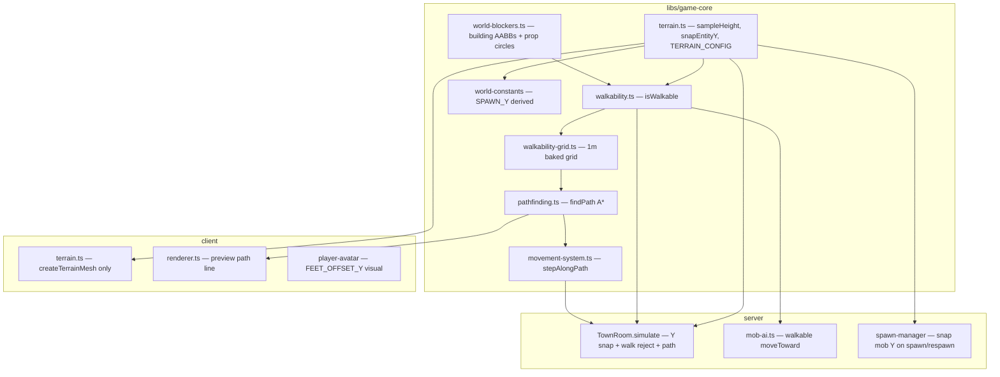

# Phase 9 — Terrain Walkability & Collision Design

**Spec**: `.specs/features/phase-9-terrain-walkability/spec.md`
**Status**: Draft

---

## Architecture Overview

Phase 9 centralises **terrain height**, **walkability rules**, and **grid
pathfinding** in `libs/game-core` so client and server share one truth (AD-001).
The client keeps Three.js mesh construction; the server applies rules inside
the existing `TownRoom.simulate()` tick (AD-008, AD-014). No new npm
dependencies.



---

## Code Reuse Analysis

### Existing Components to Leverage

| Component | Location | How to Use |
| --------- | -------- | ---------- |
| Terrain noise + `sampleHeight` | `client/src/scene/terrain.ts` | Lift pure functions into `game-core`; client keeps `createTerrainMesh` |
| World bounds / spawn | `libs/game-core/src/world-constants.ts` | Extend with derived `SPAWN_Y`; keep `WORLD_MIN`/`WORLD_MAX` |
| Movement tick | `libs/game-core/src/movement-system.ts` | Add `stepAlongPath`; preserve existing `step()` for zero-waypoint case |
| Move intent validation | `libs/game-core/src/validate-move-intent.ts` | Unchanged bounds check; path layer adds walkability |
| Village building layout | `client/src/scene/village.ts` `BUILDING_LAYOUT` | Move layout constant to `game-core/world-blockers.ts`; client imports for render |
| Scatter positions | `client/src/scene/scatter.ts` | Lift `scatterProps` (+ RNG) to `game-core/world-scatter.ts` |
| TownRoom tick | `server/src/rooms/TownRoom.ts` | Hook after `step()`: walkability + Y snap + path recompute on intent |
| Mob movement | `server/src/rooms/mob-ai.ts` `moveToward` | Guard proposed position with `isWalkable` |
| Mob spawn Y | `server/src/rooms/spawn-manager.ts` | `snapEntityY` on init + `respawnMobRuntime` |
| NPC init | `TownRoom.initializeNpcs` | Overwrite `y` with `snapEntityY` |
| Room test harness | `server/src/rooms/TownRoom.spec.ts` | `NJ_AUTOSIM=0`, `simulate()`, `deliver()` (AD-014) |
| E2E hooks | `__sendMoveIntent__`, `__GAME_STATE__` | Trail poll for pathing e2e (AD-009) |
| Player death spawn | `libs/game-core/src/player-death.ts` | Uses `SPAWN_Y` — automatically picks up derived value |

### Integration Points

| System | Integration Method |
| ------ | ------------------ |
| Colyseus `TownRoom` | Private `tickStates` gain optional `waypoints` + `waypointIndex`; recompute on `"move"` |
| Client renderer | Import `generateTerrain`/`sampleHeight` from `@nj/game-core`; optional `THREE.Line` preview |
| SQLite spawns | X/Z from DB unchanged; Y re-snapped at runtime (no migration) |
| `__GAME_STATE__` | E2e records position trail in test local array via polling (no new hook required) |

---

## Components

### `terrain.ts` (game-core)

- **Purpose**: Single source for heightmap sampling and entity Y placement.
- **Location**: `libs/game-core/src/terrain.ts`
- **Interfaces**:
  - `TERRAIN_CONFIG` — `{ seed, size, segments, heightScale }`
  - `sampleHeight(x, z, config?) → number`
  - `snapEntityY(x, z) → number` — `sampleHeight + FEET_OFFSET`
  - `generateTerrainData(config?) → { sampleHeight, heights, ... }` — no Three.js types
- **Dependencies**: `TERRAIN_SEED` from `world-constants`
- **Reuses**: Noise functions from `client/src/scene/terrain.ts` (verbatim lift)

### `world-blockers.ts` (game-core)

- **Purpose**: Static collision volumes aligned with rendered village + field props.
- **Location**: `libs/game-core/src/world-blockers.ts`
- **Interfaces**:
  - `BUILDING_AABBS: Aabb[]` — from layout table (centre x,z + halfW/halfD)
  - `getPropBlockers(seed) → Circle[]` — from shared scatter
  - `isBlocked(x, z) → boolean`
- **Reuses**: Building coords from `village.ts`; scatter from `world-scatter.ts`

### `walkability.ts` (game-core)

- **Purpose**: Authoritative step validation between two XZ points.
- **Location**: `libs/game-core/src/walkability.ts`
- **Interfaces**:
  - `isWalkable(from: Vec2, to: Vec2) → boolean`
  - Checks: bounds → blockers (segment vs AABB/circle) → subdivided slope/step-height
- **Constants**: `MAX_STEP_HEIGHT=0.75`, `MAX_SLOPE_TANGENT=0.55`, `WALK_CHECK_SUBDIVISIONS=4`

### `walkability-grid.ts` + `pathfinding.ts` (game-core)

- **Purpose**: Bake coarse navigability; A* for click-to-move paths.
- **Location**: `libs/game-core/src/walkability-grid.ts`, `pathfinding.ts`
- **Interfaces**:
  - `getWalkabilityGrid() → Uint8Array` (lazy singleton, 190×190)
  - `findPath(from, to) → {x,z}[]` — world coords; empty if no path
  - `snapToNearestWalkable(x, z, maxRadius=10) → Vec2 | null`
- **Dependencies**: `isWalkable` for local slope at cell centres; blockers for cell occupancy

### `movement-system.ts` extension

- **Purpose**: Follow waypoint list at `DEFAULT_MOVE_SPEED`.
- **Location**: `libs/game-core/src/movement-system.ts`
- **Interfaces**:
  - `PathMoveState` extends `PlayerMoveState` with `waypoints`, `waypointIndex`
  - `stepAlongPath(state, intent, dt) → PathMoveState` — new intent replaces path via caller
  - `createPathMoveState(x,y,z) → PathMoveState`
- **Reuses**: Existing `ARRIVAL_EPSILON`, speed constants

### `TownRoom` integration

- **Purpose**: Apply terrain + walkability + pathing in authoritative tick.
- **Location**: `server/src/rooms/TownRoom.ts`
- **Flow**:
  1. On `"move"`: validate bounds → snap goal → `findPath` → store waypoints
  2. Each tick: `stepAlongPath` → if new pos unwalkable, revert xz → `snapEntityY` → schema
  3. `initializeNpcs` / mob spawn: `snapEntityY`

### Client integration

- **Purpose**: Visual parity + path preview; no authority.
- **Location**: `client/src/scene/terrain.ts`, `renderer.ts`, `village.ts`, `scatter.ts`
- **Changes**: Import shared modules; optional preview polyline cleared on new click

---

## Data Models

### `Aabb`

```typescript
interface Aabb {
  cx: number;
  cz: number;
  halfW: number;
  halfD: number;
}
```

### `CircleBlocker`

```typescript
interface CircleBlocker {
  x: number;
  z: number;
  radius: number;
}
```

### `PathMoveState`

```typescript
interface PathMoveState extends PlayerMoveState {
  waypoints: ReadonlyArray<{ x: number; z: number }>;
  waypointIndex: number;
}
```

**Relationships**: Stored only in server-private `tickStates` map (not Colyseus schema).

---

## Error Handling Strategy

| Error Scenario | Handling | User Impact |
| -------------- | -------- | ----------- |
| Unwalkable step after `step()` | Revert to previous `x,z` | Character stops at obstacle |
| No path to target | Ignore intent; clear waypoints | Click appears to do nothing |
| Goal in blocker | `snapToNearestWalkable` then path | Minor target shift |
| Non-finite / OOB intent | `isValidMoveIntent` rejects (existing) | No movement |
| Mob wander target unwalkable | Skip move; repick on cooldown | Mob pauses briefly |

---

## Risks & Concerns

| Concern | Location | Impact | Mitigation |
| ------- | -------- | ------ | ---------- |
| Duplicated terrain noise if lift incomplete | `client/src/scene/terrain.ts` | Client/server Y drift | Single `game-core` module; delete duplicate noise; shared unit anchors |
| `SPAWN_Y` hard-coded today | `world-constants.ts` | Drift on terrain tweak | Derive from `snapEntityY`; spec pins anchor |
| Grid bake cost at cold start | `walkability-grid.ts` | ~36k cell evals once | Lazy singleton; acceptable for MVP (<50 ms target) |
| Path preview vs server path mismatch | Client renderer | UX confusion only | Same `findPath`; preview labeled non-authoritative in code comment |
| Existing room tests assume free movement | `TownRoom.spec.ts` | Breakage when walkability lands | Update placements to open field coords; use `OUT_OF_PEACE` pattern from Phase 6 |
| Mob tests pin positions for range | Combat room tests | Mobs can't reach if blocked | Tests use known walkable coords |
| E2E building path timing | New e2e spec | Flake if poll too short | `expect.poll` with movement threshold; AD-014 isolated room |

---

## Tech Decisions

| Decision | Choice | Rationale |
| -------- | ------ | --------- |
| Collision model | Heightmap slope + hand blockers, not mesh collision | Matches AD-006 Level-1 semantic map |
| Reject vs slide | Reject illegal steps | Testable; sliding adds ambiguity |
| Grid size | 1 m | ROADMAP; aligns with `DEFAULT_MOVE_SPEED` (8 m/s) |
| Slope limit | `MAX_SLOPE_TANGENT=0.55` | Pins real steep anchor on seed-42 terrain |
| Path storage | Server-private tick state | Bandwidth; reconnect only needs position |
| Scatter in game-core | Lift `scatterProps` | Prop blockers must match rendered positions |
| New AD-018 | Amend AD-006: MVP heightmap walkability in scope; L2J geodata still out | Implementer appends to `STATE.md` on merge |

> **Project-level:** Implementer SHALL append **AD-018** to `.specs/STATE.md` when
> Tier 2 lands — documents partial supersede of AD-006 “no collision” trade-off.
