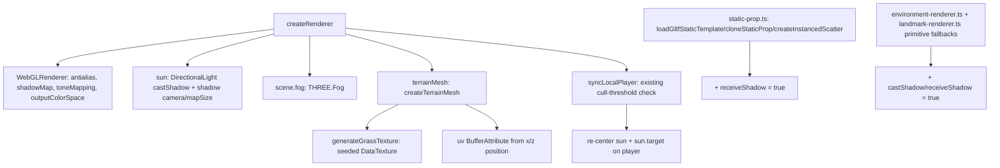

# Visual Fidelity Upgrade Design

**Spec**: `.specs/features/visual-fidelity-upgrade/spec.md`
**Status**: Draft

---

## STATE.md Decisions Reviewed

Read `.specs/STATE.md` `## Decisions` in full before designing. Relevant active
decisions this design must conform to:

- **AD-005** (superseded by AD-017, but only *for character/creature assets* —
  its "no external asset files" spirit still governs terrain/ground materials,
  which AD-017 never touched): this design adds **zero** external texture/asset
  files — the ground texture is generated procedurally in code. Conforms.
- **AD-009**: client behavior must be observable/testable without a real
  browser/WebGL context (jsdom + `window.__GAME_STATE__` + mocked
  `WebGLRenderer`). Conforms — see "Why `DataTexture`, not Canvas 2D" below.
- **AD-010**: randomness runs through an injected seeded RNG; tests must be
  deterministic. Conforms — reuses `createSeededRng` from `@nj/game-core`
  (already used by `world-scatter.ts`/`scatter.ts`).
- **AD-016/AD-017**: characters/creatures already carry a render-only
  `castShadow = true` from `mesh-character.ts`; this design does not touch
  that file and does not add `receiveShadow` to animated entities (see Tech
  Decisions).

No conflicts requiring a new/superseding AD for the *character* pipeline. One
new project-level convention **is** established (procedural `DataTexture`
detail texturing without Canvas 2D or external files) — recorded as **AD-019**
at the end of this document, to be appended to `STATE.md` on approval.

---

## Approaches Considered

### Approach A — Minimal-diff: renderer/light/scene config + `DataTexture` (RECOMMENDED)

Enable `renderer.shadowMap`, `sun.castShadow`, `scene.fog`, tonemapping/color
space/antialiasing directly on existing objects in `renderer.ts`; add
`receiveShadow = true` to the existing static-prop/primitive-fallback helpers
(which already set `castShadow`); generate the ground texture as a
`THREE.DataTexture` from a small seeded pixel buffer (no Canvas 2D, no new
UV-less geometry gap — add a `uv` attribute).

- **Reuses**: 100% of the `castShadow = true` scaffolding already shipped in
  Phases 8–24 (`mesh-character.ts`, `static-prop.ts`). Zero new dependencies.
- **Trade-off**: single shadow cascade only (no cascaded shadow maps for very
  long view distances) — acceptable, `MOB_RENDER_DISTANCE` already bounds the
  visible world to 80 m. Frustum-follow adds a small per-tick check (reuses an
  existing threshold pattern, see below).

### Approach B — Canvas 2D texture + `EffectComposer` pipeline

Same shadow/fog work, but draw the ground texture with real Canvas 2D
(`fillRect`/`arc`) for richer patterns, and stand up an
`EffectComposer`/`RenderPass`/`OutputPass` pipeline now, even with zero passes
beyond output, to "future-proof" for later bloom/FXAA.

- **Rejected**: Canvas 2D needs either a `canvas` native npm dependency (jsdom
  has no real 2D context) or per-test `getContext` mocking — new test-infra
  surface for no visual gain, since the ground texture doesn't need real
  vector drawing. `EffectComposer` changes the render path
  (`composer.render()` vs `renderer.render()`, touching `render()`/`dispose()`)
  for a pipeline this feature explicitly doesn't use (bloom is deferred by the
  "subtle" ambition decision). Over-engineered for what was asked.

### Approach C — External CC0 ground texture asset

Skip procedural generation; source/bundle a real CC0 tiled grass texture
(same policy as Phase 15's GLB props) under `client/public/textures/` +
`TextureLoader` + a `LICENSE.txt` entry.

- **Rejected**: the user explicitly chose the procedural-texture option during
  discuss (`context.md`), not external-asset. Also reintroduces an
  async-loader-with-fallback surface for a single texture, which is more
  machinery than Approach A's synchronous `DataTexture`.

**Recommendation: Approach A.** It matches all four discuss decisions exactly
(subtle ambition, procedural texture, neutral mood, barely-there fog), adds no
dependencies, and every piece is unit-testable with patterns already in the
codebase.

---

## Architecture Overview

---

## Code Reuse Analysis

### Existing Components to Leverage

| Component | Location | How to Use |
| --------- | -------- | ---------- |
| `castShadow = true` scaffolding | `client/src/scene/creature/mesh-character.ts:86`, `client/src/scene/static-prop.ts:41,72,114` | Already present — do not touch `mesh-character.ts`; extend `static-prop.ts` with matching `receiveShadow` |
| `createSeededRng` | `libs/game-core/src/seeded-rng.ts` | Drive the deterministic per-pixel grass-texture noise |
| `MOB_RENDER_DISTANCE` | `libs/game-core/src/world-constants.ts` | Anchor fog `near` and the shadow-frustum size to the same render-distance budget already governing mob culling |
| Cull-refresh move-threshold pattern | `client/src/scene/renderer.ts:255-303` (`lastCullX/lastCullZ`, `CULL_MOVE_THRESHOLD_SQ`, `refreshMobCulling`) | Reuse the same distance check inside `syncLocalPlayer` to re-center the sun's shadow frustum on the player — no duplicate distance math |
| `WebGLRenderer` mock | `client/src/scene/renderer.spec.ts:13-25` | Extend with a `shadowMap` stub object so the new config doesn't throw under test |

### Integration Points

| System | Integration Method |
| ------ | ------------------- |
| `@nj/game-core` (`MOB_RENDER_DISTANCE`, `createSeededRng`, `TERRAIN_CONFIG`) | Already imported by `renderer.ts`/`terrain.ts`; add the two new named imports |
| Existing GLB/primitive-fallback render paths (`static-prop.ts`, `environment-renderer.ts`, `landmark-renderer.ts`) | Add `receiveShadow`/`castShadow` flags at the same sites that already set `renderKind`/material — no new call sites |

---

## Components

### `renderer.ts` (modify)

- **Purpose**: Enable the shadow map, configure the sun as a shadow caster,
  attach fog, set the color/AA pipeline, and re-center the shadow frustum as
  the player roams.
- **Location**: `client/src/scene/renderer.ts`
- **Interfaces** (new, in addition to existing `GameRenderer`):
  - Exported constants: `FOG_NEAR_M`, `FOG_FAR_M`, `SUN_SHADOW_MAP_SIZE`,
    `SUN_SHADOW_FRUSTUM_M` (named, not magic-numbered in tests).
  - No public `GameRenderer` interface changes — this is internal wiring.
- **Dependencies**: `MOB_RENDER_DISTANCE` from `@nj/game-core`.
- **Reuses**: existing `sun`/`scene` locals; existing cull-threshold block in
  `syncLocalPlayer`.

### `terrain.ts` (modify)

- **Purpose**: Generate a deterministic, seeded, tileable grass `DataTexture`;
  add a `uv` attribute to the terrain geometry; apply the texture + wrapping;
  set `receiveShadow = true`.
- **Location**: `client/src/scene/terrain.ts`
- **Interfaces**:
  - `generateGrassTextureData(seed: number, size: number): Uint8ClampedArray` —
    pure, deterministic pixel buffer (exported for direct unit testing).
  - `createTerrainMesh(...)` (existing signature, unchanged) — now also builds
    the `uv` attribute and assigns `material.map`.
- **Dependencies**: `createSeededRng` from `@nj/game-core`.
- **Reuses**: existing `TerrainData.vertices` (x, z) to derive UVs — no new
  geometry data needed from `game-core`.

### `static-prop.ts` (modify)

- **Purpose**: Mirror every existing `castShadow = true` assignment with a
  `receiveShadow = true` assignment on the same node(s).
- **Location**: `client/src/scene/static-prop.ts`
- **Interfaces**: unchanged (`loadGltfStaticTemplate`, `cloneStaticProp`,
  `createInstancedScatter`).
- **Reuses**: the exact traversal/assignment sites that already set
  `castShadow`.

### `environment-renderer.ts` + `landmark-renderer.ts` (modify)

- **Purpose**: Give the *primitive-fallback* meshes (used only when a GLB
  fails to load: `addBoxPrimitive`, `addTreePrimitive`, `addRockPrimitive`,
  `addLandmarkPrimitive`) the same `castShadow`/`receiveShadow = true` the
  mesh path already has via `static-prop.ts`, so the fallback path isn't a
  silent visual regression.
- **Location**: `client/src/scene/environment-renderer.ts`,
  `client/src/scene/landmark-renderer.ts`
- **Interfaces**: unchanged.

### `renderer.spec.ts` (modify — test infra)

- **Purpose**: Extend `MockWebGLRenderer` with a `shadowMap = { enabled: false, type: 0 }`
  stub so `renderer.shadowMap.enabled = true` doesn't throw under the existing
  full-mock pattern; add new assertions for shadow/fog/tonemapping/color-space
  config and the frustum-follow behavior.
- **Location**: `client/src/scene/renderer.spec.ts`

---

## Why `DataTexture`, not Canvas 2D (Tech Decision Detail)

jsdom (the client's Vitest environment per AD-009) does not implement a real
`<canvas>` 2D rendering context — `getContext('2d')` returns `null` without the
native `canvas` npm package, which is not in the locked stack (AD-007) and
would be a new native-module dependency (like `better-sqlite3`, but for zero
functional benefit here). `THREE.DataTexture` is a pure typed-array texture —
it needs no DOM canvas at all, works identically in jsdom and real browsers,
and lets the noise generator be a plain, directly-unit-testable pure function
(`generateGrassTextureData`), consistent with AD-010's seeded-RNG-for-
determinism rule. This sidesteps the entire "mock the browser API" question
that `WebGLRenderer` needed a class mock for.

---

## Error Handling Strategy

| Error Scenario | Handling | User Impact |
| --------------- | -------- | ------------ |
| GLB prop fails to load, primitive fallback used | Fallback primitives get the same `castShadow`/`receiveShadow` flags as the mesh path | No visual regression vs. the normal path |
| Renderer factory runs in jsdom/test mock (no real WebGL) | `shadowMap`/`toneMapping`/`outputColorSpace` are plain property assignments on the (extended) mock; no real GPU work happens | Tests stay green, no behavior change in production |
| Player near the world edge (±315 m) | Shadow frustum re-centers on the player (not fixed at origin) | Shadows remain visible anywhere in the 640 m world |

---

## Risks & Concerns

| Concern | Location | Impact | Mitigation |
| ------- | -------- | ------ | ---------- |
| Enabling `ACESFilmicToneMapping` shifts the rendered color of *every* material, including already-tuned VFX colors (Phase 13/29) | `client/src/scene/vfx/*` (not modified by this feature) | Some VFX may look slightly different post-merge (desaturated highlights, etc.) | Explicitly out of scope (see spec.md); no VFX color constants are touched here. If a specific VFX looks wrong after this ships, that's a small, isolated follow-up task on that VFX's color constant — not a reason to block this feature |
| A fixed-at-origin shadow camera would only cover the village, not the 80 m mob-render radius when the player is out in the field | `client/src/scene/renderer.ts` (new code) | Shadows would silently disappear far from town — a real regression risk if missed | Addressed directly in this design: frustum-follow re-centers the sun + `sun.target` on the player via the existing cull-threshold check; covered by a new unit test asserting `sun.position`/`sun.target.position` track `localPosition` after a large `syncLocalPlayer` move |
| Terrain geometry currently has no `uv` attribute; adding one incorrectly (e.g., mismatched vertex count) would silently break texture tiling with no thrown error | `client/src/scene/terrain.ts:23-27` | Texture could appear stretched/garbled with no test failure unless explicitly asserted | Unit test asserts `geometry.attributes.uv.count === geometry.attributes.position.count` |
| `createInstancedScatter` currently has no dedicated test file at all (pre-existing gap, not introduced by this feature) | `client/src/scene/static-prop.ts` | The new `receiveShadow` addition to this function would ship with weaker coverage than the rest of the file | This feature adds the first direct unit test for `createInstancedScatter`'s shadow flags (narrow scope: flags only, not a full retroactive audit of its matrix-baking logic, which is out of this feature's boundary) |

---

## Tech Decisions (only non-obvious ones)

| Decision | Choice | Rationale |
| -------- | ------ | --------- |
| Shadow map type/size | `PCFSoftShadowMap`, `2048×2048` | Soft, reasonably cheap edges for a single directional caster; matches typical Three.js defaults for one shadow-casting light |
| Shadow camera frustum | ortho `±100 m`, `near=1`, `far=220` | `±100` comfortably exceeds `MOB_RENDER_DISTANCE` (80 m) with margin; `far=220` covers the light's offset distance from the player plus depth range |
| Shadow frustum re-center trigger | Reuse the existing `CULL_MOVE_THRESHOLD_SQ` check already in `syncLocalPlayer` | Avoids a second distance computation per tick; keeps the light's original (30, 50, 20) relative offset, just re-based on the player instead of the origin |
| Fog type/values | `THREE.Fog` (linear), color `0x87ceeb` (matches `scene.background` exactly), `FOG_NEAR_M = 120` (`1.5×` render distance), `FOG_FAR_M = 240` (`3×` render distance) | Linear fog is simplest to reason about/test (`near`/`far` are exact numbers, unlike `FogExp2`'s density curve); values keep fog fully outside the 80 m gameplay-visible radius, satisfying "barely-there" |
| Ground texture generation | `THREE.DataTexture`, `64×64` px, 3 base green shades speckle-blended per-pixel via `createSeededRng(TERRAIN_SEED)` | Deterministic, zero-asset, zero-Canvas-2D (see dedicated section above); `64×64` is enough grain detail at low-poly viewing distance without being expensive to generate or tile |
| Texture tiling | `RepeatWrapping`, UV derived from world `(x, z)` divided by an `8 m` tile size | `RepeatWrapping` means UVs don't need clamping to `[0,1]` — any magnitude tiles correctly; `8 m` tiles are visible as texture detail without being so fine they alias at typical camera distance |
| Characters/creatures | No change — cast-only, never `receiveShadow` | Low-poly rigged meshes self-shadow poorly at this fidelity (already an implicit convention from Phase 8+; made explicit here) |

> **Project-level decision to append to `STATE.md` as AD-019** (on approval):
> "Procedural texture detail on top of flat-shaded low-poly geometry uses
> `THREE.DataTexture` from a seeded pixel buffer — never Canvas 2D, never an
> external texture file — because jsdom (AD-009) has no real 2D canvas context
> and AD-010 requires deterministic seeded randomness. Shadow-casting lights
> that must cover a world larger than their fixed shadow-camera frustum
> re-center on the local player using the existing render-distance-based
> move-culling threshold, rather than a fixed-at-origin frustum or expensive
> per-frame cascades." Scope: client rendering, all future terrain/prop
> texture and shadow-casting-light work.
