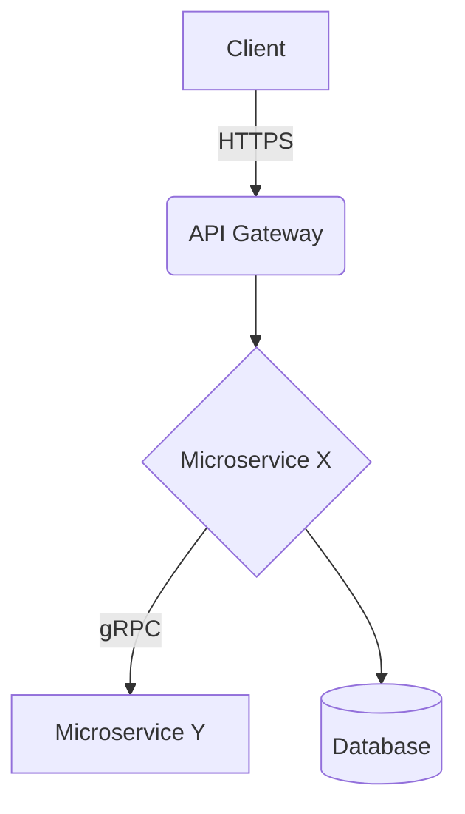

# Documento de Decisão Arquitetural (ADR)

## 1. Título e Contexto
**Título:** [Nome curto da decisão].
**Data:** [Data de criação].
**Status:** [Proposto | Aceito | Rejeitado | Obsoleto].

**Contexto:**
*Qual é a força motriz ou problema que precisamos resolver? Qual o contexto técnico e de negócios?*

## 2. Decisão Proposta
*O que vamos fazer exatamente? Qual arquitetura, padrão ou tecnologia escolhemos adotar?*

## 3. Consequências e Impactos
- **Positivas:**
  - [Benefício 1]
  - [Benefício 2]
- **Negativas/Trade-offs:**
  - [Complexidade extra, custo, curva de aprendizado, etc.]
  
## 4. Alternativas Consideradas
*Quais outras opções avaliamos antes de chegar a essa conclusão?*
1. **[Alternativa 1]:** Por que foi descartada?
2. **[Alternativa 2]:** Por que foi descartada?

## 5. Diagrama de Arquitetura (Opcional)
*C4 Model, Fluxograma de Dados ou Arquitetura de Componentes.*

## 6. Plano de Migração / Rollout
*Como saímos do estado atual para o novo estado proposto por esta arquitetura?*
1. [Passo 1].
2. [Passo 2].
