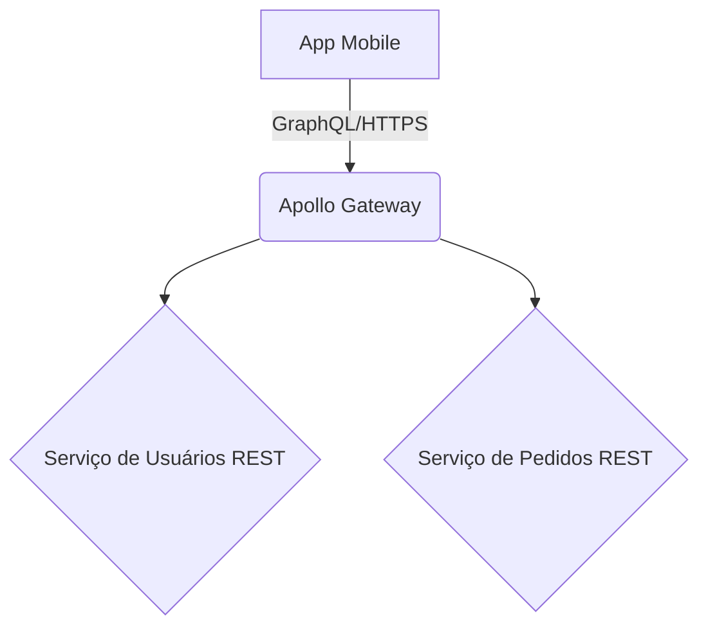

# Template: Documento de Decisão Arquitetural (ADR)

## 📌 Ótica: O que é este documento e por que ele existe?
Um Architecture Decision Record (ADR) é um documento curto que captura uma **decisão de arquitetura importante** tomada pelo time, junto com seu contexto e suas consequências. 
Ele existe para preservar a "memória muscular" técnica do projeto. No futuro, quando novos engenheiros olharem para o código e perguntarem *"Por que diabos não usamos o banco X em vez do Y?"*, a resposta estará documentada no ADR, prevenindo discussões redundantes e refatorações cegas.

---

## 🛡️ Guard Rails (Limites e Direcionamentos)
- **Foque nas "Decisões Fortes":** Não crie ADRs para escolhas triviais (ex: nome de variáveis ou bibliotecas menores de UI). Crie ADRs para: adoção de novos frameworks, padrões estruturais, escolhas de banco de dados, mudanças em protocolos de API, etc.
- **Seja Honesto com Trade-offs:** Nenhuma arquitetura é perfeita. Se escolhemos microserviços, ganhamos escala mas perdemos simplicidade e adicionamos latência de rede. O ADR deve evidenciar isso.
- **Imutabilidade Relativa:** Depois que uma decisão é "Aceita" e implementada, o ADR não deve ser reescrito para mudar a decisão. Se mudarmos de ideia no futuro, cria-se um *novo* ADR que "torna obsoleto" o anterior.

---

## 🚫 Políticas Não Negociáveis
1. **Aprovação Obrigatória:** ADRs de alto impacto devem ser lidos e aprovados pelo Tech Lead / Staff Engineer.
2. **Registro de Alternativas:** O documento deve listar no mínimo duas alternativas viáveis que foram consideradas e descartadas, justificando o porquê.

---

## 1. Metadados
- **Título:** [Um nome descritivo. Ex: "Adotar GraphQL para a API pública do aplicativo Mobile"]
- **Status:** [Proposto | Aceito | Rejeitado | Obsoleto]
- **Data:** [Data da decisão]

## 2. Contexto
*Qual o cenário atual? O que nos forçou a tomar essa decisão? Qual o problema técnico que estamos enfrentando?*
> Ex: Atualmente o app mobile faz 6 requisições REST sequenciais para montar a tela inicial, gerando sobrecarga na rede e latência.

## 3. Decisão
*O que escolhemos fazer de fato?*
> Ex: Vamos adotar GraphQL como camada de gateway agregadora sobre os serviços REST atuais, implementada usando Apollo Server.

## 4. Consequências (Trade-offs)
*Impactos da decisão pós-implementação.*
- **Impactos Positivos (Ganhos):**
  - Redução do payload na rede (clientes pedem apenas os campos que precisam).
  - Diminuição do número de roundtrips (1 única requisição).
- **Impactos Negativos / Riscos:**
  - Curva de aprendizado da equipe no novo ecossistema GraphQL.
  - Caching HTTP nativo não funcionará mais tão facilmente; precisaremos gerenciar cache no Apollo.

## 5. Alternativas Consideradas e Descartadas
1. **BFF (Backend for Frontend) via REST Exclusivo:** Descartado porque ainda requeria a criação de novos endpoints manualmente a cada nova versão do App, engessando o backend.
2. **gRPC Web:** Descartado devido à falta de familiaridade do time mobile atual.

## 6. Diagrama de Contexto (Opcional)

